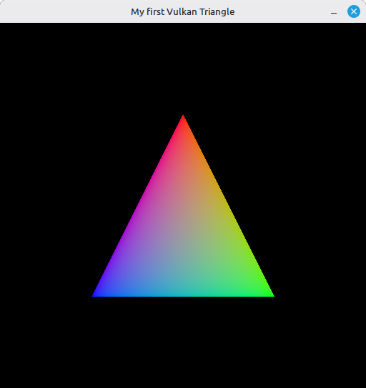

# 14 – Presentation and First Triangle

This is the step where everything finally pays off. Until now we've been assembling pieces - instance, device, swapchain, views, shaders, pipeline, command buffers - and the window has stayed stubbornly blank. Time to wire the main loop: acquire a swapchain image, submit the recorded command buffer, present the result, and repeat every frame. The triangle appears.

The new pieces are all about **synchronization**. The CPU and the GPU run in parallel, and so do the GPU and the presentation engine. Without something to coordinate them, you'd submit a frame before the previous one finished drawing, or try to present an image the GPU hasn't finished writing. Vulkan doesn't guess for you here - you tell it, with semaphores and fences, exactly what waits on what.

The full source for this step lives in [src/14_presentation_first_triangle/main.odin](https://github.com/Hilderin/OdinVulkan/blob/main/src/14_presentation_first_triangle/main.odin).

The corresponding chapters in the Vulkan Tutorial are:
- Khronos version: <https://docs.vulkan.org/tutorial/latest/03_Drawing_a_triangle/03_Drawing/02_Rendering_and_presentation.html>
- vulkan-tutorial.com version: <https://vulkan-tutorial.com/Drawing_a_triangle/Drawing/Rendering_and_presentation>

I'd also suggest reading these before writing your own loop:
- Swapchain Semaphore Reuse: <https://docs.vulkan.org/guide/latest/swapchain_semaphore_reuse.html>
- Understanding Vulkan Synchronization: <https://www.khronos.org/blog/understanding-vulkan-synchronization>

---

## What's new, in one glance

- `create_semaphore` / `create_fence` - the two synchronization primitives a frame needs, with their matching `vk.Destroy*` calls in cleanup.
- `wait_for_fence` / `reset_fence` - thin wrappers over `vk.WaitForFences` / `vk.ResetFences`. Fences don't reset themselves.
- `acquire_next_image` - waits on the previous frame, resets the fence, calls `vk.AcquireNextImageKHR`, and tolerates the two non-fatal results (`SUBOPTIMAL_KHR`, `ERROR_OUT_OF_DATE_KHR`).
- `submit_command_buffer` - builds a `vk.SubmitInfo` that waits on the acquire semaphore, sends the command buffer, signals a render-finished semaphore, and ties the whole submit to the draw fence.
- `queue_present` - `vk.QueuePresentKHR`, waiting on the render-finished semaphore before actually putting the image on screen.
- `wait_idle_device` - `vk.DeviceWaitIdle`, called once after the loop exits so cleanup doesn't tear down objects the GPU is still using.
- `main` stops discarding the graphics queue from `create_logical_device` - we need it both to submit and to present.

---

## Semaphores vs fences, the short version

Both are synchronization objects you signal and wait on. The distinction is who sees them:

- **Semaphores** are GPU-side. They coordinate work between queues, or between a queue and the presentation engine. The CPU can't query them.
- **Fences** are CPU-visible. The CPU waits on a fence to know the GPU has finished something. That's how we know "the previous frame is done, safe to record into the command buffer again".

A frame uses both: a semaphore to make the GPU wait for the acquired image before drawing, another to make presentation wait for the draw to finish, and a fence so the CPU knows when it's safe to reuse the command buffer for the next frame.

This is also why the draw fence is created with `{.SIGNALED}`. On the very first iteration there's no previous frame to signal it, so without the flag `vk.WaitForFences` would block forever on frame one. Pre-signaling it makes "wait for the last frame" a no-op the first time through, which is exactly what we want.

---

## One acquire semaphore, one submit semaphore per swapchain image

Most Vulkan tutorials show two semaphores total - one for acquire, one for render finished - reused across frames. That works for a "one frame in flight" loop like ours, but the Khronos guide on swapchain semaphore reuse explains why it's a footgun the moment you add a second frame in flight: a semaphore waited on by `vk.QueuePresent` has to be unique per swapchain image, otherwise you can deadlock on a stale signal.

I followed that guide here even though we only run one frame at a time, because it costs nothing and it's the shape we'll need next step. So:

```c
acquire_semaphore := create_semaphore(device)
// ...
submit_semaphores := make([]vk.Semaphore, len(swap_chain_images))
defer delete(submit_semaphores)
for i in 0 ..< len(submit_semaphores) {
	submit_semaphores[i] = create_semaphore(device)
}
```

The acquire semaphore stays single (it's waited on inside `submit_command_buffer`, on the GPU, before any present), while the per-image submit semaphores are indexed by the image we're about to show. The slice is `defer delete`d for its backing storage, and each handle gets its own `vk.DestroySemaphore` in the cleanup loop - the same own-handles-then-free-storage pattern as the image views back in step 09.

---

## The Odin-specific bit: local_foo := foo everywhere

If you've been reading the code, you've noticed a lot of this:

```c
local_fence := fence
vk_check(vk.WaitForFences(device, 1, &local_fence, true, max(u64)), "Failed to wait for fence!")
```

Vulkan's pointer-taking calls want a `^T` to a value, and Odin is strict about taking the address of a procedure parameter - directly writing `&fence` where `fence` is a parameter produces a pointer the compiler considers potentially aliased in ways it can't prove safe. The conventional workaround is to copy the parameter into a local and take the address of that. It looks redundant, but I think it's a standard in Odin world, and once you've written it twice you stop noticing.

The same trick shows up for `command_buffer`, `swap_chain`, `acquire_semaphore`, `render_finish_semaphore` and the image index inside `queue_present`. They're all single values that need to be passed to Vulkan as a pointer-to-one. The `array of one` alternative (`[1]vk.Semaphore{fence}`) also works, but a named local reads better.

---

## Acquire, submit, present: the loop body

Three calls per iteration, in this exact order:

1. **`acquire_next_image`** - wait on the draw fence (previous frame done), reset it, then `vk.AcquireNextImageKHR`. This hands us an index into the swapchain image slice and signals `acquire_semaphore` once the image is actually available - the image isn't yours to write to until that semaphore fires.
2. **`record_command_buffer`** - same proc as step 13, now called every frame with the image and view for the index we just got. The buffer was allocated with `.RESET_COMMAND_BUFFER`, so re-recording over the previous frame's content is allowed.
3. **`submit_command_buffer`** - `vk.QueueSubmit` with a `SubmitInfo` that says "wait on `acquire_semaphore` at the `COLOR_ATTACHMENT_OUTPUT` stage, run this command buffer, signal `submit_semaphores[index]` when done, and set `draw_fence` when the whole submit is finished".
4. **`queue_present`** - `vk.QueuePresentKHR`, waiting on `submit_semaphores[index]` so the image only goes on screen once the GPU is done writing it.

The `waitDstStageMask = .COLOR_ATTACHMENT_OUTPUT` is not random. It says "the GPU can do everything up to the start of color output without waiting, but must block at color output until the acquire semaphore is signaled". That lets the vertex processing of this frame overlap with the presentation of the previous one, which is the whole point of the pipelining.

---

## Tolerating `SUBOPTIMAL_KHR` and `ERROR_OUT_OF_DATE_KHR`

`vk.AcquireNextImageKHR` and `vk.QueuePresentKHR` are the two calls in the loop that can come back with these instead of `.SUCCESS`:

- `SUBOPTIMAL_KHR` - the swapchain still works but no longer matches the surface perfectly (a slight resize, usually). Keep going, recreate when you can.
- `ERROR_OUT_OF_DATE_KHR` - the swapchain is now invalid. Stop drawing with it and recreate.

We currently don't recreate the swapchain, so we just tolerate both: a frame may render to a slightly-off surface, and that's fine for a tutorial. Step 16 (Swap Chain Recreation) is where we come back and actually act on them by rebuilding the swapchain. For now, the important part is to **not** pass them through `vk_check` as errors - they're expected, and crashing on a window resize would be a poor first-triangle experience.

`acquire_next_image` filters them out before calling `vk_check`. `queue_present` currently uses `vk_check` straight; it'll be relaxed in the same step 16 pass.

---

## `vk.DeviceWaitIdle` before teardown

```c
wait_idle_device(device)
```

One line, easy to miss. After the event loop exits, the GPU is very likely mid-frame: a command buffer is executing, a fence is unsignaled, the presentation engine is holding an image. If we started destroying the command pool or the semaphores right then, validation layers would scream and the driver could crash. `vk.DeviceWaitIdle` blocks the CPU until the GPU has no pending work. It's the sledgehammer version - `vk.QueueWaitIdle` per queue is finer, and waiting on the specific draw fence is finer still - but for cleanup it's the right tool. Cheap to call once at the end but a bad idea to call every frame.

---

## Cleanup order

Synchronization objects are created from the device, so they go before the device in cleanup - same rule as everything else. Order is the reverse of creation:

```c
if draw_fence != 0 {
	vk.DestroyFence(device, draw_fence, nil)
}
if acquire_semaphore != 0 {
	vk.DestroySemaphore(device, acquire_semaphore, nil)
}
for submit_semaphore in submit_semaphores {
	if submit_semaphore != 0 {
		vk.DestroySemaphore(device, submit_semaphore, nil)
	}
}
```

The `0` guards are the same defensive habit as in every other step. The submit-semaphore loop mirrors the creation loop - one destroy per handle, then the slice's backing storage is freed by the `defer delete` in `main`.

---

## Test it

Run the executable from the `src/14_presentation_first_triangle` directory. The usual setup chain prints as before, with three new lines after the command buffer:

```
Acquire complete semaphore... OK
Submit finish semaphores (3)... OK
Draw fence... OK
```

the `(3)` being the swapchain image count your surface reported. Then `Vulkan initialization completed with success!` and the window opens.

And this time, the window isn't blank. After all those steps of plumbing, here it is:



A single colored triangle on a black background, the vertex positions and colors hardcoded in the shader from step 10. Resize the window and the triangle stays the same size - we don't rebuild the swapchain yet, so the rendered area no longer matches the window. That's step 16.

If validation prints something about a semaphore being in use at destroy time, double-check the `wait_idle_device` call: it has to run before any `vk.Destroy*` on the synchronization objects, otherwise the GPU may still be referencing them.

---

## What's next

We have a triangle - but the loop only keeps one frame in flight, which means the GPU is idle most of the time while the CPU records the next buffer. The next step introduces multiple frames in flight: more command buffers, more fences, more semaphores, so the GPU always has work queued up while the CPU prepares the next frame. That's [15 - Frames In Flight](./15_frames_in_flight.md).