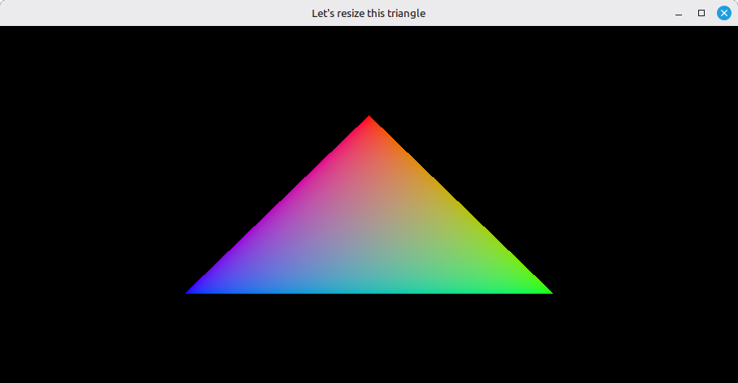

# 16 - Swap Chain Recreation

Until now the swapchain was created once at startup and left alone. That works as long as the window never changes size, which is I locked the window size with `glfw.WindowHint(glfw.RESIZABLE, 0)`. This step unlocks the window and teaches the loop to rebuild the swapchain whenever the surface stops matching it - on resize, minimize, and on the two `vk.AcquireNextImageKHR` / `vk.QueuePresentKHR` result codes we've been ignoring since step 14.

The full source for this step lives in [src/16_swap_chain_recreation/main.odin](https://github.com/Hilderin/OdinVulkan/blob/main/src/16_swap_chain_recreation/main.odin).

The corresponding chapters in the Vulkan Tutorial are:
- Khronos version: <https://docs.vulkan.org/tutorial/latest/03_Drawing_a_triangle/04_Swap_chain_recreation.html>
- vulkan-tutorial.com version: <https://vulkan-tutorial.com/Drawing_a_triangle/Swap_chain_recreation>

---

## What's new, in one glance

- `glfw.WindowHint(glfw.RESIZABLE, 1)` - the window can now be resized, which is the whole reason this step exists.
- `framebuffer_resized: bool` - a global flag set by a GLFW framebuffer size callback; lets us trigger a recreation even when Vulkan itself hasn't reported the swapchain as out of date yet.
- `acquire_next_image` and `queue_present` now return a `bool` saying "recreation needed", by treating `SUBOPTIMAL_KHR` and `ERROR_OUT_OF_DATE_KHR` as signals to rebuild instead of as errors.
- `destroy_swap_chain`, `destroy_swap_chain_images`, `destroy_swap_chain_image_views` - small helpers that factor the teardown we already did in cleanup, because we now need to do the same teardown mid-loop.
- A recreation block in `main` that pauses on minimized windows, waits for the device to go idle, tears the old swapchain down, and rebuilds a fresh one.

---

## Three signals, one reaction

A swapchain recreation can be asked for in three different ways:

1. `vk.AcquireNextImageKHR` comes back with `SUBOPTIMAL_KHR` or `ERROR_OUT_OF_DATE_KHR`. The swapchain still kind of works, or doesn't, but in both cases the surface and the swapchain no longer agree.
2. `vk.QueuePresentKHR` returns the same codes. Same meaning, just detected at the other end of the frame.
3. The GLFW framebuffer size callback fires and sets `framebuffer_resized`. This matters because on some platforms Vulkan won't report anything wrong even though the window just jumped to a new size - we'd rather not wait for a stale frame to show up.

Both `acquire_next_image` and `queue_present` got an extra `bool` return value to carry the first two:

```c
acquire_next_image :: proc(...) -> (u32, bool) {
	// ...
	result := vk.AcquireNextImageKHR(...)
	if result == .SUBOPTIMAL_KHR || result == .ERROR_OUT_OF_DATE_KHR {
		return swapchain_image_index, true
	} else if result != .SUCCESS {
		vk_check(result, "Failed to acquire next image!")
	}
	// ...
	return swapchain_image_index, false
}
```

Same shape in `queue_present`. The point is that those two results are not errors - they're the driver telling us "the swapchain you have is done, make a new one". Pushing them through `vk_check` (as we did in step 14) would crash on the first resize; here they flow back up as a plain flag.

---

## The fence reset moved, on purpose

This one's easy to miss. In step 15 the fence was reset right after waiting on it, before the acquire call. In this step the reset got pushed down to **after** a successful acquire. The reason is that if `AcquireNextImageKHR` comes back out of date, we're not going to submit this frame at all - we're going to skip straight to recreation. The fence was waited on (so the previous frame is done) but it was never attached to a new submit, so resetting it would leave it in the unsignaled state with nothing coming to signal it. The next iteration's `wait_for_fence` would then block forever.

Before: 
```c
wait_for_fence(device, draw_fence)
reset_fence(device, draw_fence)
result := vk.AcquireNextImageKHR(...)
```

After:
```c
wait_for_fence(device, draw_fence)
result := vk.AcquireNextImageKHR(...)
if result == .SUBOPTIMAL_KHR || result == .ERROR_OUT_OF_DATE_KHR {
    // Swap chain needs recreation needed
    return swapchain_image_index, true
} else if result != .SUCCESS {
    vk_check(result, "Failed to acquire next image!")
}
reset_fence(device, draw_fence)
```

By only resetting on the success path, the fence stays in the state its last submit left it in (signaled), and the next iteration's wait is a no-op against that. Small reorder, big difference.

---

## Pausing on a minimized window

There's an annoying edge case on minimization: GLFW reports a framebuffer size of `0x0`, and trying to create a swapchain against a zero-extent surface fails the validation layers. The fix is the lazy one - just wait until the window has a real size again:

```c
width, height := glfw.GetFramebufferSize(window)
for width == 0 && height == 0 {
	glfw.WaitEvents()
	width, height = glfw.GetFramebufferSize(window)
}
```

`glfw.WaitEvents` blocks the thread until something happens (the window is restored, usually). We poll in a loop because a single event might not be the restore we're waiting for. While the window is minimized we don't render anything, which is fine - there's nothing to look at anyway.

---

## Teardown and rebuild

The actual recreation is mechanical: wait for the device to be idle (so the GPU isn't holding any of the old swapchain objects), destroy the old swapchain pieces in reverse creation order, then call the same `create_*` procs we used at startup:

```c
wait_idle_device(device)

destroy_swap_chain_image_views(device, swap_chain_image_views)
destroy_swap_chain_images(device, swap_chain_images)
destroy_swap_chain(device, swap_chain)

swap_chain, swap_chain_extent, swap_chain_format = create_swap_chain(physical_device, device, surface, window)
swap_chain_images = get_swap_chain_images(device, swap_chain)
swap_chain_image_views = create_image_views(device, swap_chain_images, swap_chain_format)
```

A few things worth pointing out:

- `wait_idle_device` is the sledgehammer from step 14. Calling it every frame would be a performance mistake, but here we're about to invalidate objects the GPU may still be referencing, so blocking until it's done is the safe call.
- The `destroy_swap_chain_*` procs are the same code that used to live in cleanup, just pulled out so cleanup and the recreation block share it. Both keep their `0` / `nil` guards so they're safe to call on a half-built state.
- The graphics pipeline and shader module are **not** recreated. The pipeline was built against `swap_chain_format`, which rarely changes on a resize, and our viewport is fed dynamically through `swap_chain_extent` at record time.
- `swap_chain_images` no longer has a `defer delete`. The slice's lifetime is now tied to the swapchain: it gets freed either inside the recreation block or in cleanup, and a `defer` would double-free on the recreation path.

---

## Cleanup is now the helpers

Because the teardown logic lives in `destroy_swap_chain_*`, cleanup at the end of `main` is just three calls:

```c
destroy_swap_chain_image_views(device, swap_chain_image_views)
destroy_swap_chain_images(device, swap_chain_images)
destroy_swap_chain(device, swap_chain)
```

The fences and semaphores are untouched by recreation (they're per-frame, not per-swapchain-image, except `submit_semaphores` which is per-image but survives a swapchain rebuild because we just reuse whatever indices still match - if the image count changed, that's a bug we're not handling yet), so their destroy loops are the same as step 15.

---

## Test it

Run the executable from the `src/16_swap_chain_recreation` directory. The startup output is identical to step 15, the only difference is what happens while the window is open: grab an edge and drag it around, maximize and restore, minimize and bring it back. The triangle should keep showing, sized to the current window, and the console should print a `Swap chain recreation...` / `Swap chain recreation... OK` pair each time the swapchain actually gets rebuilt.



Minimizing should not crash anything - the loop just blocks on `glfw.WaitEvents` until the window comes back.

If validation complains about a swapchain being destroyed while still in use, double-check that `wait_idle_device` is the first thing called inside the recreation block, before any of the `destroy_swap_chain_*` calls.

---

## What's next

The triangle is cute and all, but if we want to keep moving toward a real 3D model on screen, we have to stop hardcoding its coordinates inside the shader and start feeding them from data that could eventually come from a file. The next step is to feed vertex data from the application side, by describing the vertex input layout in the pipeline and reading positions and colors from a vertex buffer. That's [17 - Vertex Input](./17_vertex_input.md).