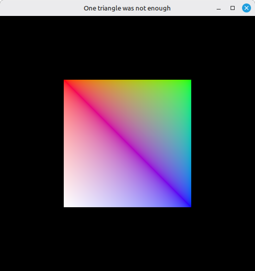

# 19 - Index Buffer

Step 18 put our vertex data in GPU-local memory through a staging buffer. We had three vertices and drew a triangle. Real meshes are not made of disconnected triangles: a quad is two triangles that share an edge, a cube is twelve triangles that share edges all over the place. If we store every triangle as three separate vertices we duplicate the shared ones, and that's wasted memory and wasted upload bandwidth. The standard fix is the *index buffer*: store each unique vertex once, then store a list of indices that says which vertices each triangle uses.

This step turns the triangle into a square (two triangles, four vertices, six indices) without changing the staging logic. The index buffer is just another `DEVICE_LOCAL` buffer uploaded through `transfer_to_buffer`, with a different usage flag and a different draw command.

The full source for this step lives in [src/19_index_buffer/main.odin](https://github.com/Hilderin/OdinVulkan/blob/main/src/19_index_buffer/main.odin).

The corresponding chapters in the Vulkan Tutorial are:
- Khronos version: <https://docs.vulkan.org/tutorial/latest/04_Vertex_buffers/03_Index_buffer.html>
- vulkan-tutorial.com version: <https://vulkan-tutorial.com/Vertex_buffers/Index_buffer>

---

## What's new, in one glance

- A second buffer, the *index buffer*, created with `{.INDEX_BUFFER, .TRANSFER_DST}` usage and `.DEVICE_LOCAL` memory, uploaded through the same `transfer_to_buffer` proc as the vertices.
- `vk.CmdBindIndexBuffer` binds the index buffer to the command buffer, with an explicit index type (`.UINT16` here). The bound index buffer stays bound until you bind another one, just like the bound vertex buffer.
- `vk.CmdDrawIndexed` replaces `vk.CmdDraw` in `record_command_buffer`. It pulls indices from the bound index buffer and resolves them to vertices at draw time.
- The vertex list grew from 3 to 4 points (a quad's corners) and we now have an `indices := []u16{0, 1, 2, 2, 3, 0}` slice describing the two triangles.

---

## From a triangle to a square

The vertices are now the four corners of a square centered on the origin:

```c
vertices := []Vertex{
	{pos = {-0.5, -0.5}, color = {1.0, 0.0, 0.0}},
	{pos = {0.5, -0.5}, color = {0.0, 1.0, 0.0}},
	{pos = {0.5, 0.5}, color = {0.0, 0.0, 1.0}},
	{pos = {-0.5, 0.5}, color = {1.0, 1.0, 1.0}},
}
```

And the indices, in `u16`:

```c
indices := []u16{0, 1, 2, 2, 3, 0}
```

Two triangles, sharing the diagonal between vertex 2 and vertex 0. Without an index buffer we'd have to write vertex 2 and vertex 0 out twice - once per triangle that uses them. With one, those two vertices live in the vertex buffer exactly once, and the index buffer tells the GPU "for this triangle, use these existing vertices".

Here is how the six index entries pick vertices from the four stored in the vertex buffer:

| Index buffer entry | Vertex pulled | Position | Color |
|---|---|---|---|
| 0 | vertex 0 | (-0.5, -0.5) | (1, 0, 0) |
| 1 | vertex 1 | (0.5, -0.5) | (0, 1, 0) |
| 2 | vertex 2 | (0.5, 0.5) | (0, 0, 1) |
| 3 | vertex 2 | (0.5, 0.5) | (0, 0, 1) |
| 4 | vertex 3 | (-0.5, 0.5) | (1, 1, 1) |
| 5 | vertex 0 | (-0.5, -0.5) | (1, 0, 0) |

Vertex 2 and vertex 0 show up twice in the "Vertex pulled" column - that's the duplication the index buffer avoids in the vertex buffer. Four vertices stored, six read.

It looks tiny on a quad, so let's put numbers on it. In a real application a vertex almost always carries more than a position: position (3 floats), color (4 floats), UV coordinates (2 floats), normal (3 floats) - that's already 12 floats per vertex, so 48 bytes each, and real meshes often add tangents, bone weights, you name it.

Take our square again, two triangles, six vertices to draw without indexing: 6 x 48 = 288 bytes in the vertex buffer. With an index buffer we only store the four corners - 4 x 48 = 192 bytes - plus six `u16` indices - 6 x 2 = 12 bytes - for a total of 204 bytes. That's 84 bytes saved on a shape made of two triangles. Now scale that to a mesh with thousands or millions of triangles, where vertices get shared by many of them, and the saving becomes substantial: fewer bytes to store, fewer bytes to upload through the staging buffer, less memory traffic on every draw. The index buffer pays its own way almost immediately.

> Why `u16` and not `u32`? Indices are unsigned integers and Vulkan accepts `.UINT16` or `.UINT32`. `u16` covers up to 65535 vertices, which is plenty for a quad and costs half the memory of `u32`. For a big mesh you'd switch to `u32`. The choice is told to the GPU at bind time, not stored in the buffer itself.

We pick `u16` here, which is what the Vulkan Tutorial does for the same reason: small meshes don't need 32-bit indices. The choice has a direct consequence in the `vk.CmdBindIndexBuffer` call, see below.

---

## The index buffer, all over again

The buffer creation looks exactly like the vertex buffer's, only the usage flag changed:

```c
index_buffer, index_buffer_memory := create_buffer(
	physical_device, device,
	u64(size_of(u16) * len(indices)),
	{.INDEX_BUFFER, .TRANSFER_DST},
	{.DEVICE_LOCAL},
)
fmt.println("Index buffer... OK")

transfer_to_buffer(physical_device, device, graphics_queue, indices, index_buffer)
fmt.println("Indices copied to buffer using staging buffer... OK")
```

Same staging, same `DEVICE_LOCAL` memory, same `ONE_TIME_SUBMIT` copy. The only difference is the usage: `.INDEX_BUFFER` tells Vulkan "this buffer will be bound as an index source by `vk.CmdBindIndexBuffer`", and `.TRANSFER_DST` is what allows `vk.CmdCopyBuffer` to write into it during the staging copy. Forget either one and validation will tell you.

---

## Binding and drawing with indices

Two lines change in `record_command_buffer` - we bind the index buffer and we draw through it:

```c
vk.CmdBindVertexBuffers(command_buffer, 0, 1, &local_vertex_buffer, &offsets)

vk.CmdBindIndexBuffer(command_buffer, index_buffer, 0, .UINT16)

vk.CmdDrawIndexed(command_buffer, index_count, 1, 0, 0, 0)
```

`vk.CmdBindIndexBuffer` is the single-bind counterpart to `vk.CmdBindVertexBuffers`: one index buffer at a time. Its last argument is the index type, and it has to match what's actually in the buffer - `.UINT16` for `u16` indices, `.UINT32` for `u32`. Get that wrong and either validation yells or the GPU reads garbage. The second argument (`0`) is a byte offset into the index buffer, the same way `srcOffset` worked for the staging copy: useful if you pack several index ranges into one buffer, unused here.

`vk.CmdDrawIndexed` takes five arguments instead of `vk.CmdDraw`'s four, and they trip people up because three of them look like they're doing the same thing:

```c
vk.CmdDrawIndexed(command_buffer, index_count, instance_count, first_index, vertex_offset, first_instance)
```

- `index_count` - how many indices to read from the index buffer. We pass `u32(len(indices))`, so 6 for the quad.
- `instance_count` - how many times to draw the same indexed geometry. We draw it once.
- `first_index` - offset into the index buffer to start reading indices from, in *indices* (not bytes). Starts at 0.
- `vertex_offset` - a value *added to every index* before it's used to look up a vertex in the vertex buffer. Useful when you pack several meshes into one big vertex buffer and draw them one after another: instead of renumbering your index lists, you leave each mesh's indices starting at 0 and add the mesh's base offset here. We pass 0.
- `first_instance` - the minimum `gl_InstanceIndex` the shader sees. We pass 0.

---

## Test it

Run the executable from the `src/19_index_buffer` directory. The startup log mirrors step 18's up to the vertex copy line, then prints two new lines - `Index buffer... OK` and `Indices copied to buffer using staging buffer... OK` - before the usual `Vulkan initialization completed with success!`.

The window now shows a square filling the center of the viewport instead of a triangle, built from four vertices and six indices: the two triangles `(0, 1, 2)` and `(2, 3, 0)` share the diagonal.



Resize still works. If the picture is a triangle instead of a square, or if validation complains about a missing `.INDEX_BUFFER` usage, check the usage flags and the index type passed to `vk.CmdBindIndexBuffer`.

---

## What's next

We now have vertex and index data living in GPU-local memory but every mesh we draw uses the same hardcoded fullscreen-ish position, because there's no way yet to move it. The next step introduces uniform buffers and descriptor sets so the shader can read per-frame data like a model-view-projection matrix. That's [20 - Uniform Buffers](./20_uniform_buffers.md).