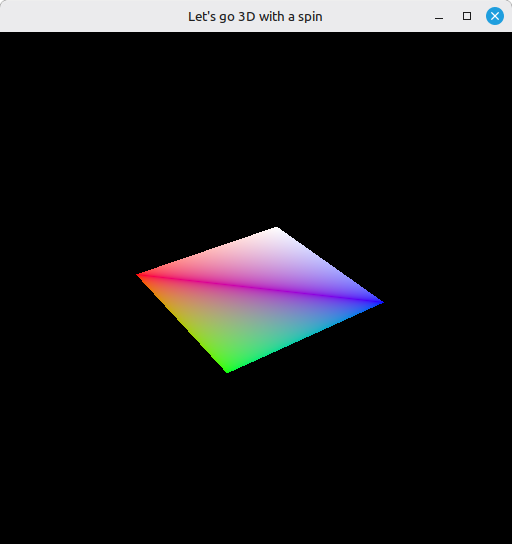

# 20 - Uniform Buffers

Until now our vertices were taken straight from the vertex buffer and rendered in 2D on screen. It doesn't feel very 3D yet, because there's no perspective and no motion. We'll use a uniform buffer to pass three matrices to our shader, letting us fake 3D perspective on a 2D screen. These matrices are known as the **model**, **view** and **projection** matrices.

If "model, view, projection" isn't familiar, every vertex gets multiplied by three matrices in turn: *model* places the mesh in the world, *view* moves the world in front of the camera, *projection* turns that 3D view into 2D clip-space. LearnOpenGL's [Coordinate Systems](https://learnopengl.com/Getting-Started/Coordinate-Systems) walks through each with pictures - the clearest explanation I know of the MVP pipeline.

The uniform buffer is one way to easily change information that shifts often and that the shader can read. Here, to show how it works, we'll make our quad spin on screen by setting a rotation frame by frame.

The full source for this step lives in [src/20_uniform_buffers/main.odin](https://github.com/Hilderin/OdinVulkan/blob/main/src/20_uniform_buffer/main.odin).

The corresponding chapters in the Vulkan Tutorial are:
- Khronos version:
  - <https://docs.vulkan.org/tutorial/latest/05_Uniform_buffers/00_Descriptor_set_layout_and_buffer.html>
  - <https://docs.vulkan.org/tutorial/latest/05_Uniform_buffers/01_Descriptor_pool_and_sets.html>
- vulkan-tutorial.com version:
  - <https://vulkan-tutorial.com/Uniform_buffers/Descriptor_set_layout_and_buffer>
  - <https://vulkan-tutorial.com/Uniform_buffers/Descriptor_pool_and_sets>

I merged both tutorial chapters into a single step on purpose. Doing only the first one (layout + uniform buffer) leaves the app in a broken state: the shader has been changed to expect a `ubo`, the pipeline layout declares a descriptor set, but no descriptor set has been allocated or bound, so the shader reads nothing meaningful and nothing draws correctly. Finishing the second one (pool + sets + binding) is what actually makes the picture show up.

---

## What's new, in one glance

- `Uniform_Buffer_Object` - a struct holding three `mat4` matrices (`model`, `view`, `proj`), the per-frame data the shader reads. `mat4` is `matrix[4, 4]f32`, Odin's built-in column-major matrix type from `core:math/linalg`.
- `create_descriptor_set_layout` - declares the *shape* of a descriptor set: one binding, of type `UNIFORM_BUFFER`, visible to the vertex shader, used by the pipeline layout.
- `create_descriptor_pool` - a pool we allocate descriptor sets from, sized for `NB_FRAMES_IN_FLIGHT` sets of `UNIFORM_BUFFER` descriptors.
- `create_descriptor_set` - allocates one descriptor set per frame in flight from the pool, all sharing the same layout.
- `update_descriptor_set` - calls `vk.UpdateDescriptorSets` to bind a uniform buffer to a descriptor set, telling the set that binding 0 refers to `ubo_buffers[i]` covering the whole `Uniform_Buffer_Object` range.
- One uniform buffer per frame in flight, created with `HOST_VISIBLE | HOST_COHERENT` memory and *persistently mapped* with `vk.MapMemory` so we don't pay for a map/unmap every frame.
- `update_uniform_buffer` - runs every frame, builds the three matrices with `core:math/linalg`, copies them into the mapped pointer, and flips the projection's Y axis to match Vulkan's coordinate convention.
- `vk.CmdBindDescriptorSets` in `record_command_buffer` so the GPU knows which descriptor set to read for this frame.
- The shader now multiplies the vertex position by `proj * view * model` instead of passing the raw position through.
- `frontFace` flipped from `.CLOCKWISE` to `.COUNTER_CLOCKWISE` as a direct consequence of the Y-flip below: mirroring the Y axis reverses the winding order of every triangle as the GPU sees it, so what used to be clockwise is now counter-clockwise.

---

## The three descriptor objects, in plain terms

This is the part that took me a while to internalize, so let's get it out of the way first.

### DescriptorSetLayout - the shape

The descriptor set layout only defines the layout/structure of the descriptor set.

It's used at pipeline creation and never changes. It holds no data, and it doesn't say which buffer will be connected to a descriptor set.

In our example, we simply declared that binding 0 is of type `UNIFORM_BUFFER` and will be used in the vertex shader.


### DescriptorPool - the allocator

Simply the pool used to create descriptor sets.

When creating the descriptor pool you have to tell it how many of each descriptor type you expect, and how many descriptor sets total. The pool is an arena: you say up front "I'll need up to N descriptors of type T, and up to M sets total", and every allocation afterwards is cheap.

### DescriptorSet - the instance

The descriptor set glues the real resource (buffer, image, sampler, etc.) that holds the value to pass to the shader, to the binding in the shader that corresponds to a parameter (a `ConstantBuffer` in our Slang shader).

A freshly created descriptor set references no resource, so you have to bind the resource to a binding with `vk.UpdateDescriptorSets`.

For the data to actually reach the shader, you have to bind the right descriptor set(s) into the command buffer with `vk.CmdBindDescriptorSets`.

### Summary
So the pipeline is built against the *layout* (it only needs the shape), the set is *allocated* from the pool, *filled* with a real buffer, and *bound* at record time. Three objects, three jobs:

| Object | Built when | Knows | Doesn't know |
|---|---|---|---|
| DescriptorSetLayout | Once at startup | The shape of the bindings | Which buffer, which frame |
| DescriptorPool | Once at startup | How many sets/descriptors to allow | The contents |
| DescriptorSet | Once per frame in flight | The actual buffer bound at each slot | (nothing, it's the concrete object) |

---

## The uniform buffer, per frame, persistently mapped

We need one uniform buffer per frame in flight, for the same reason we need one command buffer per frame in flight: the frame currently being drawn by the GPU reads "its" uniform buffer, while the CPU is already writing the next frame's into a different one. If we shared one buffer, the CPU's update would race the GPU's read.

```c
ubo_buffers: [NB_FRAMES_IN_FLIGHT]vk.Buffer
ubo_buffer_memories: [NB_FRAMES_IN_FLIGHT]vk.DeviceMemory
ubo_map_memory_ptrs: [NB_FRAMES_IN_FLIGHT]rawptr
for i in 0 ..< NB_FRAMES_IN_FLIGHT {
	size := u64(size_of(Uniform_Buffer_Object))
	ubo_buffers[i], ubo_buffer_memories[i] = create_buffer(physical_device, device, size, {.UNIFORM_BUFFER}, {.HOST_VISIBLE, .HOST_COHERENT})
	vk_check(vk.MapMemory(device, ubo_buffer_memories[i], 0, vk.DeviceSize(size), {}, &ubo_map_memory_ptrs[i]), "Failed to map memory!")
}
```

Two things to notice. First, this buffer is `HOST_VISIBLE | HOST_COHERENT`, not `DEVICE_LOCAL`. The uniform buffer is tiny (192 bytes for three `mat4`) and written every frame, so the "upload through a staging buffer" dance from step 18 would cost more than it saves. Letting the CPU write straight into a host-visible buffer is the right call here, and it's what the timeline of `update_uniform_buffer` needs: we map once, write every frame, unmap at shutdown.

Second, we call `vk.MapMemory` once at startup and keep the pointer for the life of the program. The classic tutorial maps every frame around the write; that works too but it's wasteful. Persistent mapping is fine because the memory is `HOST_COHERENT` - writes are visible to the GPU without an explicit flush - and because we never unmap until cleanup. The mapped pointer just becomes a mailbox we drop the new matrices into each frame.

---

## Updating the uniform buffer each frame

```c
ubo := Uniform_Buffer_Object {
	model = la.matrix4_rotate(angle, vec3{0.0, 0.0, 1.0}),
	view  = la.matrix4_look_at(vec3{2.0, 2.0, 2.0}, vec3{0.0, 0.0, 0.0}, vec3{0.0, 0.0, 1.0}),
	proj  = la.matrix4_perspective(math.to_radians_f32(45.0), aspect, 0.1, 10.0),
}

// Fix Vulkan : Y axis is inverted compared to OpenGL.
ubo.proj[1, 1] *= -1

mapped_ubo := cast(^Uniform_Buffer_Object)ubo_map_memory_ptr
mapped_ubo^ = ubo
```

Most of this is just the math, and it's not Vulkan-specific - `core:math/linalg` builds the matrices, the angles come from `time.tick_since(start_time)` so the model spins over time. The two bits worth pointing out:

The `ubo.proj[1, 1] *= -1` line is the Vulkan Y-flip. OpenGL's clip space has Y pointing up, Vulkan's has Y pointing down. The projection matrices in math libraries are usually written for OpenGL, so flipping the `[1][1]` element negates the Y component of the clip-space output and puts us back in Vulkan's coordinate system. Mirroring Y also reverses the winding order of every triangle as the GPU sees it - a clockwise-wound triangle comes out counter-clockwise once Y is flipped - which is exactly why `frontFace` had to change from `.CLOCKWISE` to `.COUNTER_CLOCKWISE` this step. Forget either the Y-flip or the `frontFace` change and the quad disappears, backface-culled because the GPU now considers its visible side to be the back.

The last two lines are the Odin-specific bit. `ubo_map_memory_ptr` is a `rawptr` into mapped memory, and Vulkan gives us bytes, not types. We cast it to a typed pointer `^Uniform_Buffer_Object` and then assign through it with `mapped_ubo^ = ubo`. Because `mat4` is a value type in Odin (a fixed-size matrix, no indirection), that assignment is a flat `memcpy` of `Uniform_Buffer_Object`'s 192 bytes into the mapped region. No manual `memcpy`, no element-by-element copy, no `size_of` argument.

---

## Wiring it into the pipeline

Two edits in the pipeline plumbing. The pipeline layout now declares that it carries a descriptor set:

```c
local_descriptor_set_layout := descriptor_set_layout
pipeline_layout_create_info := vk.PipelineLayoutCreateInfo {
	sType                  = .PIPELINE_LAYOUT_CREATE_INFO,
	setLayoutCount         = 1,
	pSetLayouts            = &local_descriptor_set_layout,
	// ...
}
```

`setLayoutCount` goes from 0 to 1 and `pSetLayouts` points at our layout. Note the `local_descriptor_set_layout := descriptor_set_layout` copy - same "Odin doesn't want you to take the address of a parameter directly" idiom we've been using since step 14 for every Vulkan call that wants a `^T` to a single value.

And at record time, the descriptor set is bound next to the vertex and index buffers:

```c
vk.CmdBindIndexBuffer(command_buffer, index_buffer, 0, .UINT16)

local_descriptor_set := descriptor_set
vk.CmdBindDescriptorSets(command_buffer, .GRAPHICS, pipeline_layout, 0, 1, &local_descriptor_set, 0, nil)

vk.CmdDrawIndexed(command_buffer, index_count, 1, 0, 0, 0)
```

The third argument to `vk.CmdBindDescriptorSets` is the set number (we only have set 0), the fourth is how many sets, the fifth is a pointer to the set(s). Same single-value-through-a-pointer trick with `local_descriptor_set`. Binding a descriptor set is, in effect, "from now on in this command buffer, binding 0 of set 0 reads from whatever resource the set says" - and what the set says is the uniform buffer we wired up in `update_descriptor_set`.

---

## Test it

Run the executable from the `src/20_uniform_buffers` directory. The startup log mirrors step 19's up to the index copy line, then prints five new lines - `UBO descriptor set layout... OK`, `Descriptor pool... OK`, `Descriptor sets... OK`, `Uniform buffer... OK`, `Descriptor sets updated... OK` - before the usual `Vulkan initialization completed with success!`.

The window now shows the same quad from step 19, but tilted in 3D and slowly rotating around the Z axis, viewed through a perspective camera positioned at `(2, 2, 2)` looking at the origin. It's no longer a flat, screen-space square - it has depth.



Resizing the window keeps the picture correct because `update_uniform_buffer` rebuilds the projection matrix from the current `swap_chain_extent` every frame, so the aspect ratio follows the window. If the quad is invisible (backface culled) the most likely culprit is the `frontFace` direction or the missing `ubo.proj[1, 1] *= -1` Y-flip; if validation complains about an unbound descriptor, the descriptor set wasn't bound in `record_command_buffer` or wasn't updated against the right buffer.

---

## What's next

The quad draws and rotates now, but it's flat-shaded vertex colors on a black background. Real scenes carry their own textures. The next step introduces images and how to get them onto the GPU. That's [21 - Images](./21_images.md).