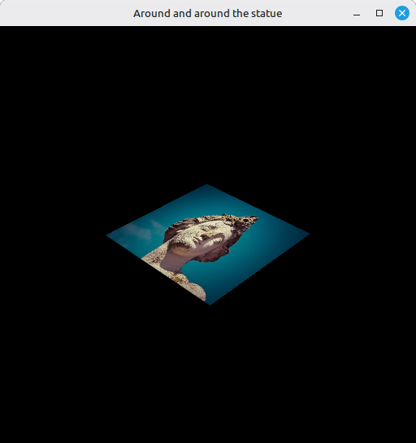

# 23 - Combined image sampler

Last step we loaded the statue into an image, created its view and a sampler, but left them sitting on the shelf. The shader still output vertex colors. This step finally wires the texture into the pipeline: a second descriptor binding for a combined image sampler, a new `texCoord` vertex attribute, and a shader that samples the texture. The quad now shows the statue.

The full source for this step lives in [src/23_combined_image_sampler/main.odin](https://github.com/Hilderin/OdinVulkan/blob/main/src/23_combined_image_sampler/main.odin).

The corresponding chapters in the Vulkan Tutorial are:
- Khronos version: <https://docs.vulkan.org/tutorial/latest/06_Texture_mapping/02_Combined_image_sampler.html>
- vulkan-tutorial.com version: <https://vulkan-tutorial.com/Texture_mapping/Combined_image_sampler>

---

## What's new, in one glance

- `Vertex` gains a `texCoord: vec2` field, and the vertices now carry UV coordinates.
- `create_descriptor_set_layout` declares two bindings instead of one: the UBO at binding 0 (vertex shader) and a combined image sampler at binding 1 (fragment shader).
- `create_descriptor_pool` is reworked to take a slice of pool sizes instead of a single type, since we now need both `UNIFORM_BUFFER` and `COMBINED_IMAGE_SAMPLER` descriptors in the same pool.
- `update_descriptor_set` now writes both the UBO and the image sampler into the set, using a `DescriptorImageInfo` that bundles the image view, sampler and expected layout.
- The shader adds a `Sampler2D texture`, passes UVs from vertex to fragment, and the fragment shader samples the texture instead of returning the vertex color.

---

## Texture coordinates on the vertices

Each vertex now carries a UV coordinate in addition to position and color:

```c
Vertex :: struct {
	pos:      vec2,
	color:    vec3,
	texCoord: vec2,
}
```

The quad is defined in the `[-0.5, 0.5]` range, but UVs go from `[0, 1]` - that's how the sampler knows which texel to fetch for each corner. The mapping here is:

```c
vertices := []Vertex{
	{pos = {-0.5, -0.5}, color = {1.0, 0.0, 0.0}, texCoord = {1.0, 0.0}},
	{pos = {0.5, -0.5}, color = {0.0, 1.0, 0.0}, texCoord = {0.0, 0.0}},
	{pos = {0.5, 0.5}, color = {0.0, 0.0, 1.0}, texCoord = {0.0, 1.0}},
	{pos = {-0.5, 0.5}, color = {1.0, 1.0, 1.0}, texCoord = {1.0, 1.0}},
}
```

A third attribute description is added to the pipeline:

```c
vertex_attributes_description := []vk.VertexInputAttributeDescription {
	{binding = 0, location = 0, format = .R32G32_SFLOAT, offset = u32(offset_of(Vertex, pos))},
	{binding = 0, location = 1, format = .R32G32B32_SFLOAT, offset = u32(offset_of(Vertex, color))},
	{binding = 0, location = 2, format = .R32G32_SFLOAT, offset = u32(offset_of(Vertex, texCoord))},
}
```

`location = 2` matches the `inTexCoord` field in the shader's `VSInput`, and `R32G32_SFLOAT` matches `float2`. Forget that attribute description and the shader silently gets zeros for UVs - the texture will sample its top-left corner everywhere, which makes the quad a solid color.

---

## The shader samples the texture

The shader finally changes. Two new bits on the input side:

```c
struct VSInput {
	float2 inPosition;
	float3 inColor;
	float2 inTexCoord;
};

struct VSOutput {
	float4 pos : SV_Position;
	float3 color;
	float2 fragTexCoord;
};
```

The vertex shader passes `inTexCoord` through to `fragTexCoord` unchanged - UVs don't get transformed by the matrices, they just ride along the pipeline. The fragment shader is where the magic happens:

```c
Sampler2D texture;
// ...
float4 fragMain(VSOutput vertIn) : SV_Target {
	return texture.Sample(vertIn.fragTexCoord);
}
```

`Sampler2D texture` is a global resource - in Slang, a `Sampler2D` bundles a texture and a sampler together, which lines up perfectly with Vulkan's `COMBINED_IMAGE_SAMPLER` descriptor type. The `.Sample(uv)` call fetches a filtered texel at the given UV. The `color` field in `VSOutput` is now dead weight - it's carried through but never used by the fragment shader. We keep it around because removing it would mean another round of vertex struct / attribute / shader edits, and it doesn't cost anything on the GPU side.

The order of the global resource declarations in the shader matters. Slang assigns binding slots in declaration order - the `ConstantBuffer<UniformBuffer> ubo` is declared first, so it lands on binding 0; the `Sampler2D texture` is declared second, so it lands on binding 1. That has to line up with the `binding` field we set in `create_descriptor_set_layout` (UBO at 0, sampler at 1). Swap the two declarations in the shader and the sampler silently moves to binding 0, the UBO to binding 1, and suddenly the shader reads matrices from a texture and samples from a buffer - validation will yell, and nothing renders. There's no `layout(binding = 1)` annotation in Slang the way there is in GLSL, so the declaration order *is* the binding assignment.

---

## Two descriptor bindings on the same set

The descriptor set layout now declares two bindings:

```c
ubo_binding := vk.DescriptorSetLayoutBinding {
	binding         = 0,
	descriptorType  = .UNIFORM_BUFFER,
	descriptorCount = 1,
	stageFlags      = {.VERTEX},
}

sampler_binding := vk.DescriptorSetLayoutBinding {
	binding         = 1,
	descriptorType  = .COMBINED_IMAGE_SAMPLER,
	descriptorCount = 1,
	stageFlags      = {.FRAGMENT},
}

layout_bindings := []vk.DescriptorSetLayoutBinding{ubo_binding, sampler_binding}

layout_info := vk.DescriptorSetLayoutCreateInfo {
	sType        = .DESCRIPTOR_SET_LAYOUT_CREATE_INFO,
	bindingCount = u32(len(layout_bindings)),
	pBindings    = raw_data(layout_bindings),
}
```

Binding 0 is the UBO, visible to the vertex shader (unchanged). Binding 1 is the combined image sampler, visible to the *fragment* shader - that's where the sampling happens. Both live on the same descriptor set, which is convenient but not required: we could have split them across two sets. One set is simpler, and the pipeline layout already only declares one.

The binding index in `DescriptorSetLayoutBinding` has to match the slot the shader expects. Slang assigns slots in declaration order for `ConstantBuffer` and `Sampler2D` globals - `ubo` gets binding 0, `texture` gets binding 1 - which is why we put them at 0 and 1 here.

---

## The descriptor pool, now multi-type

Until now the descriptor pool only held one type of descriptor (`UNIFORM_BUFFER`), sized for `NB_FRAMES_IN_FLIGHT` sets. Now we need a pool that can allocate both `UNIFORM_BUFFER` *and* `COMBINED_IMAGE_SAMPLER` descriptors. So `create_descriptor_pool` is reworked to take a slice of pool sizes:

```c
create_descriptor_pool :: proc(device: vk.Device, pool_sizes: []vk.DescriptorPoolSize, max_sets: u32) -> vk.DescriptorPool {
	local_pool_sizes := pool_sizes

	pool_info := vk.DescriptorPoolCreateInfo {
		sType         = .DESCRIPTOR_POOL_CREATE_INFO,
		poolSizeCount = u32(len(local_pool_sizes)),
		pPoolSizes    = raw_data(local_pool_sizes),
		maxSets       = max_sets,
	}
	// ...
}
```

The pool is still an arena - you tell it up front how many of each descriptor type you'll need and the max number of sets total - it just now accepts more than one type. The call in `main` passes both:


```c
descriptor_pool := create_descriptor_pool(
	device,
	{{type = .UNIFORM_BUFFER, descriptorCount = NB_FRAMES_IN_FLIGHT},
	 {type = .COMBINED_IMAGE_SAMPLER, descriptorCount = NB_FRAMES_IN_FLIGHT}},
	NB_FRAMES_IN_FLIGHT,
)
```


One UBO descriptor and one image sampler descriptor per frame in flight, and `NB_FRAMES_IN_FLIGHT` sets total. Run out of either and descriptor allocation fails.

---

## update_descriptor_set writes two descriptors

The proc now takes the image view and sampler in addition to the uniform buffer, and writes both into the set in a single `vk.UpdateDescriptorSets` call:

```c
update_descriptor_set :: proc(device: vk.Device, descriptor_set: vk.DescriptorSet, uniform_buffer: vk.Buffer, image_view: vk.ImageView, sampler: vk.Sampler) {
	buffer_info := vk.DescriptorBufferInfo {
		buffer = uniform_buffer,
		offset = 0,
		range  = size_of(Uniform_Buffer_Object),
	}

	image_info := vk.DescriptorImageInfo {
		imageLayout = .SHADER_READ_ONLY_OPTIMAL,
		imageView   = image_view,
		sampler     = sampler,
	}

	ubo_descriptor_write := vk.WriteDescriptorSet {
		sType           = .WRITE_DESCRIPTOR_SET,
		dstSet          = descriptor_set,
		dstBinding      = 0,
		dstArrayElement = 0,
		descriptorType  = .UNIFORM_BUFFER,
		descriptorCount = 1,
		pBufferInfo     = &buffer_info,
	}

	image_sampler_descriptor_write := vk.WriteDescriptorSet {
		sType           = .WRITE_DESCRIPTOR_SET,
		dstSet          = descriptor_set,
		dstBinding      = 1,
		dstArrayElement = 0,
		descriptorType  = .COMBINED_IMAGE_SAMPLER,
		descriptorCount = 1,
		pImageInfo      = &image_info,
	}

	descriptor_writes := []vk.WriteDescriptorSet{ubo_descriptor_write, image_sampler_descriptor_write}
	vk.UpdateDescriptorSets(device, u32(len(descriptor_writes)), raw_data(descriptor_writes), 0, nil)
}
```

The `DescriptorImageInfo` is what makes a "combined image sampler": it bundles the view, the sampler and the layout the image is expected to be in (`SHADER_READ_ONLY_OPTIMAL`), which is the layout `create_texture_image` left it in back in step 21. If those don't line up you get a validation error about the image not being in the right layout for sampling.

The rest of the plumbing - `vk.CmdBindDescriptorSets` in `record_command_buffer`, the descriptor set allocation in `create_descriptor_set` - doesn't change. There's still one descriptor set per frame in flight, each one now carrying both resources.

---

## Test it

The startup log is identical to step 22 up to the `Sampler... OK` line. The `Descriptor sets updated... OK` line is the same, but the work behind it is heavier - each set now holds a UBO and a combined image sampler.

The window shows the statue texture mapped onto the rotating quad. The statue rotates with the model matrix, viewed through the same perspective camera as step 20. If the statue appears sideways or upside down, check the UV values on the vertices - they're shuffled specifically so the statue comes out upright through the tilted-view-plus-Y-flipped-projection chain. Getting the UVs the "obvious" way puts the picture on sideways. The honest way to see what's happening is to make the fragment shader output `float4(fragTexCoord, 0.0, 1.0)` for a moment: red is U, green is V, and you can read exactly which corner maps where.



If the quad is a solid color instead of a texture, the most likely cause is a missing or mismatched vertex attribute description for `texCoord` - the shader then receives zeros for UVs and samples only one corner. If validation complains about the image not being in `SHADER_READ_ONLY_OPTIMAL` when sampling, check `image_info.imageLayout` in `update_descriptor_set` and make sure `create_texture_image` transitioned the image to that layout at the end of the upload.

---

## What's next

The quad finally shows the statue, rotating in 3D. The obvious missing piece is depth: right now we draw a single quad so it doesn't matter, but as soon as real geometry overlaps itself we need a depth buffer to occlude properly. That's [24 - Depth buffering](./24_depth_buffering.md).