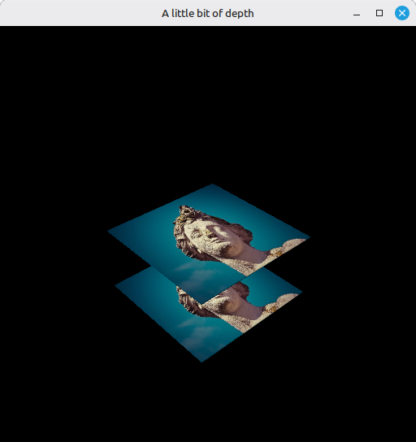

# 24 - Depth Buffering

Until now the quad was flat and alone, so depth wasn't a question - whatever we drew ended up on screen. This step brings in a real depth buffer and a second quad behind the first, so the GPU gets to decide what's in front of what. While we're at it, the projection matrix gets a cleanup: the `ubo.proj[1, 1] *= -1` hack from step 20 goes away, replaced by a small `matrix4_perspective_vulkan` proc that bakes the Vulkan Y flip and depth range in.

The full source for this step lives in [src/24_depth_buffering/main.odin](https://github.com/Hilderin/OdinVulkan/blob/main/src/24_depth_buffering/main.odin).

The corresponding chapters in the Vulkan Tutorial are:
- Khronos version: <https://docs.vulkan.org/tutorial/latest/07_Depth_buffering.html>
- vulkan-tutorial.com version: <https://vulkan-tutorial.com/Depth_buffering>

---

## What's new, in one glance

- `Vertex.pos` becomes a `vec3`, the vertices get z coordinates, and there are now two quads (z=0 and z=-0.5) so one is actually behind the other.
- `create_image_view` gets an `aspect_flags` parameter instead of hard-coding `.COLOR`; the depth view is created with `{.DEPTH}`.
- Three small helpers appear: `find_supported_format`, `find_depth_format`, `has_stencil_component`, to pick a depth format at runtime.
- `depth_format` is resolved once in `main` and passed to `create_depth_resources` and `create_graphics_pipeline`, instead of each proc re-querying it.
- `create_depth_resources` allocates the depth image, its memory and its view - same plumbing as the texture image from step 21, reusing `create_image` / `create_image_view`.
- The graphics pipeline finally gets a real `PipelineDepthStencilStateCreateInfo` (it was commented out until now), a `depthAttachmentFormat` on its `PipelineRenderingCreateInfo`, and `pDepthStencilState` wired up.
- `begin_rendering` passes a `RenderingAttachmentInfo` for depth with `loadOp = .CLEAR` and `storeOp = .DONT_CARE`, and `record_command_buffer` transitions the depth image to `DEPTH_STENCIL_ATTACHMENT_OPTIMAL` before rendering.
- `update_uniform_buffer` switches to a custom `matrix4_perspective_vulkan` proc; the `ubo.proj[1, 1] *= -1` flip is gone.

---

## Picking a depth format

Vulkan won't promise a single depth format. `D32_SFLOAT` (32-bit float) is the usual one on desktop, but some GPUs only have `D24_UNORM_S8_UINT` (24-bit depth + 8-bit stencil). So we ask the implementation, the same way the tutorial does, by walking a list of candidates:

```c
find_supported_format :: proc(physical_device: vk.PhysicalDevice, candidates: []vk.Format, tiling: vk.ImageTiling, features: vk.FormatFeatureFlags) -> vk.Format {
	for format in candidates {
		props: vk.FormatProperties
		vk.GetPhysicalDeviceFormatProperties(physical_device, format, &props)

		if tiling == .LINEAR && (props.linearTilingFeatures & features) == features {
			return format
		}

		if tiling == .OPTIMAL && (props.optimalTilingFeatures & features) == features {
			return format
		}
	}

	fmt.eprintln("Impossible to find format in candidates: %q", candidates)
	os.exit(1)
}

find_depth_format :: proc(physical_device: vk.PhysicalDevice) -> vk.Format {
	return find_supported_format(physical_device, {.D32_SFLOAT, .D32_SFLOAT_S8_UINT, .D24_UNORM_S8_UINT}, .OPTIMAL, {.DEPTH_STENCIL_ATTACHMENT})
}
```

The `{.D32_SFLOAT, .D32_SFLOAT_S8_UINT, .D24_UNORM_S8_UINT}` literal is an Odin array literal passed where a `[]vk.Format` is expected - Odin lets you initialize a slice (or any array-like) inline with a brace-enclosed list.

The bit-test `(props.optimalTilingFeatures & features) == features` is the usual Vulkan "do we have at least these features" check. It's `== features`, not `!= 0` - we want a format that has *all* the requested bits, not just *any* of them. If you've read step 18, you've seen the same idiom in `find_memory_type`.

`has_stencil_component` is there for later, to tell us whether a depth format also carries a stencil channel:

```c
has_stencil_component :: proc(format: vk.Format) -> bool {
	return format == .D32_SFLOAT_S8_UINT || format == .D32_SFLOAT_S8_UINT
}
```

---

## The depth resources

`create_depth_resources` is short because it leans on the image helpers we already wrote:

```c
create_depth_resources :: proc(
	physical_device: vk.PhysicalDevice,
	device: vk.Device,
	depth_format: vk.Format,
	swap_chain_extent: vk.Extent2D,
) -> (
	vk.Image,
	vk.DeviceMemory,
	vk.ImageView,
) {

	depth_image, depth_image_memory := create_image(
		physical_device,
		device,
		swap_chain_extent.width,
		swap_chain_extent.height,
		depth_format,
		{.DEPTH_STENCIL_ATTACHMENT},
		{.DEVICE_LOCAL},
	)
	depth_image_view := create_image_view(device, depth_image, depth_format, {.DEPTH})

	return depth_image, depth_image_memory, depth_image_view
}
```

Same shape as `create_texture_image`, minus the upload: a `DEVICE_LOCAL` image with `DEPTH_STENCIL_ATTACHMENT` usage, and a view over the `.DEPTH` aspect. The depth format is decided in `main` and passed in, not re-queried inside the proc - `main` also needs the same format for the graphics pipeline, and asking twice would be silly. That's the small refactor visible in the diff: `depth_format` is now a parameter.

The depth image lives as long as the swap chain: created right after it, recreated in `recreate_swap_chain` on resize, and torn down with a matching `destroy_depth_resources`. Forgetting the destroy on resize leaks an image, a view and a chunk of device memory per resize - validation won't necessarily catch it, your memory usage will.

`create_image_view` had to change for this to work. Up to step 23 it hard-coded `{.COLOR}` as the aspect:


```c
subresourceRange = {{.COLOR}, 0, 1, 0, 1},
```


Now it takes an `aspect_flags` parameter:

```c
create_image_view :: proc(device: vk.Device, image: vk.Image, format: vk.Format, aspect_flags: vk.ImageAspectFlags) -> vk.ImageView {
	create_info := vk.ImageViewCreateInfo {
		sType            = .IMAGE_VIEW_CREATE_INFO,
		viewType         = .D2,
		format           = format,
		subresourceRange = {aspect_flags, 0, 1, 0, 1},
		// ...
	}
```

Every existing call site gets `{.COLOR}` passed in explicitly, the depth view gets `{.DEPTH}`. Pass the wrong aspect and validation will tell you the image view's aspect doesn't match what's expected for the attachment.

---

## The graphics pipeline learns about depth

A few things change in `create_graphics_pipeline`. The depth/stencil state, which was commented out until now, gets filled in:

```c
depth_stencil := vk.PipelineDepthStencilStateCreateInfo {
	depthTestEnable       = true,
	depthWriteEnable      = true,
	depthCompareOp        = .LESS,
	depthBoundsTestEnable = false,
	stencilTestEnable     = false,
}
```

`depthTestEnable = true` makes the GPU compare each fragment's depth against the buffer. `depthWriteEnable = true` lets it write the new depth back when the test passes. `depthCompareOp = .LESS` means "keep the fragment if it's closer than what's already there", so depth = 1.0 has to mean "far away" - which lines up with the clear value used in `begin_rendering`. `depthBoundsTestEnable` is a niche feature for restricting depth to a sub-range, we don't use it. `stencilTestEnable` stays false, we have no stencil channel.

Then the `PipelineRenderingCreateInfo` (the `pNext` we use because we do dynamic rendering instead of a `VkRenderPass`) gets `depthAttachmentFormat`:

```c
pipeline_rendering_create_info := vk.PipelineRenderingCreateInfo {
	sType                   = .PIPELINE_RENDERING_CREATE_INFO,
	colorAttachmentCount    = 1,
	pColorAttachmentFormats = &format,
	depthAttachmentFormat   = depth_format,
}
```

With dynamic rendering the pipeline doesn't inherit attachment formats from a render pass, so it has to be told what the depth attachment looks like. Mismatch this and pipeline creation fails - the driver has to know whether to expect `D32_SFLOAT`, `D24_UNORM`, etc.

And `pDepthStencilState` finally gets wired up:

```c
graphics_pipeline_create_info := vk.GraphicsPipelineCreateInfo {
	// ...
	pDepthStencilState = &depth_stencil,
	// ...
}
```

`depthAttachmentFormat` and `pDepthStencilState` go in pairs - set one without the other and pipeline creation fails. `create_graphics_pipeline` now takes `depth_format` as a parameter, threaded down from `main` where `find_depth_format` was called once.

---

## begin_rendering adds a depth attachment

`begin_rendering` builds a second `RenderingAttachmentInfo` for depth and hooks it onto `RenderingInfo`:

```c
depth_attachment_info := vk.RenderingAttachmentInfo {
	sType = .RENDERING_ATTACHMENT_INFO,
	imageView = depth_image_view,
	imageLayout = .DEPTH_STENCIL_ATTACHMENT_OPTIMAL,
	loadOp = .CLEAR,
	storeOp = .DONT_CARE,
	clearValue = {depthStencil = {1.0, 0}},
}

render_info := vk.RenderingInfo {
	sType = .RENDERING_INFO,
	renderArea = {extent = swap_chain_extent},
	pColorAttachments = &attachment_info,
	colorAttachmentCount = 1,
	pDepthAttachment = &depth_attachment_info,
}
```

`loadOp = .CLEAR` clears the attachment at the start of the pass, so the depth buffer starts at the clear value on every frame. `storeOp = .DONT_CARE` means we don't care about the contents after rendering - we never read the depth buffer back, never sample from it, never copy it anywhere. The Vulkan Tutorial notes this *"may allow the hardware to perform additional optimizations"*: the driver is free to skip persisting the depth attachment to memory between frames. Reach for `.STORE` only if you actually need the depth buffer after the pass ends (sampling from it in a later pass, copying it to a host-visible buffer, etc.).

`clearValue = {depthStencil = {1.0, 0}}` clears depth to 1.0 (the farthest, since our compare is `.LESS`) and stencil to 0 (unused). With `D32_SFLOAT` you write a float, with `D24_UNORM_S8_UINT` you'd write a normalized integer - use `1.0` in both cases, the driver converts.

`imageLayout = .DEPTH_STENCIL_ATTACHMENT_OPTIMAL` is the layout `record_command_buffer` transitions the depth image into before `CmdBeginRendering` (see below). If the layout you declare here doesn't match what the image is actually in at `CmdBeginRendering` time, validation complains loudly.

---

## Layout transition for the depth image

`record_command_buffer` now does two layout transitions before `CmdBeginRendering`. The color one you already know. The depth one is similar, it just uses depth-specific masks and stages:

```c
transition_image_layout(
	command_buffer,
	depth_image,
	.UNDEFINED, // old_layout
	.DEPTH_STENCIL_ATTACHMENT_OPTIMAL, // new_layout
	{.DEPTH_STENCIL_ATTACHMENT_WRITE}, // src_access_mask
	{.DEPTH_STENCIL_ATTACHMENT_WRITE}, // dst_access_mask
	{.EARLY_FRAGMENT_TESTS, .LATE_FRAGMENT_TESTS}, // src_stage
	{.EARLY_FRAGMENT_TESTS, .LATE_FRAGMENT_TESTS}, // dst_stage
	{.DEPTH}, //image_aspect_flags
)
```

The access masks look symmetric, and that's normal for an "I just want to transition into this layout" barrier: previous depth-stencil writes are done before the transition, future depth-stencil writes can start after. The stages are the ones that touch depth - depth testing happens around the early/late fragment test stages, so the barrier waits on those and unblocks those.

The old layout is `.UNDEFINED` because we don't care what was there before - we're going to clear it. Using `.UNDEFINED` as the source is a free "discard previous contents", the standard pattern for color and depth attachments at the start of a frame.

The image aspect is `{.DEPTH}` and not `{.DEPTH | .STENCIL}` because our chosen format (`D32_SFLOAT`) has no stencil channel. If you switch to a format with stencil later, you'll need `{.DEPTH, .STENCIL}`.

---

## A custom perspective matrix

I'd like to take a few minutes to explain a change that isn't always easy for those of us who aren't graphics math wizards (myself included). Until now we've been using `matrix4_perspective` from `core:math/linalg` to build the projection matrix. We were already doing a small hack by flipping Y, so our screen coordinates would match Vulkan's convention.

Another important difference between OpenGL and Vulkan is how depth is handled. In OpenGL, depth goes from -1 (near plane) to +1 (far plane). In Vulkan it goes from 0 (near) to +1 (far). In the Vulkan Tutorial, the author uses GLM, which has the `GLM_FORCE_DEPTH_ZERO_TO_ONE` compile flag that does exactly what we need for Vulkan. Odin's `core:math/linalg` doesn't have anything similar. So I had to write a custom proc that gives us, in Odin, the matrix we actually need. As a bonus, I baked the Y flip directly into the new proc that returns the perspective matrix, so the old `ubo.proj[1, 1] *= -1` line is gone.


Let's quickly look at the difference between our proc and the one from `core:math/linalg`.

From `core:math/linalg`:

```c
matrix4_perspective_f32 :: proc "contextless" (fovy, aspect, near, far: f32, flip_z_axis := true) -> (m: Matrix4f32) {
	tan_half_fovy := math.tan(0.5 * fovy)
	m[0, 0] = 1 / (aspect * tan_half_fovy)
	m[1, 1] = 1 / (tan_half_fovy)
	m[2, 2] = (far + near) / (far - near)
	m[3, 2] = 1
	m[2, 3] = -2 * far * near / (far - near)

	if flip_z_axis {
		m[2] = -m[2]
	}

	return
}
```

And ours:

```c
matrix4_perspective_vulkan :: proc(fovy, aspect, near, far: f32) -> (m: mat4) {
	tan_half_fovy := math.tan(0.5 * fovy)
	m[0, 0] = 1 / (aspect * tan_half_fovy)
	m[1, 1] = -1 / (tan_half_fovy)
	m[2, 2] = -far / (far - near)
	m[3, 2] = -1
	m[2, 3] = -(far * near) / (far - near)

	return
}
```

You can see the difference in how Z is handled: linalg uses `m[3, 2] = 1` and `m[2, 3] = -2 * far * near / (far - near)`, ours uses `m[3, 2] = -1` and `m[2, 3] = -(far * near) / (far - near)`. Those are what make sure Z stays in [0, 1] for Vulkan instead of [-1, 1] for OpenGL.

The negative sign added on `m[1, 1] = -1 / (tan_half_fovy)` (linalg has `1 / (tan_half_fovy)` positive) is the same thing as the old `ubo.proj[1, 1] *= -1` line: it flips Y so Vulkan's down-pointing Y ends up rendering the right way up.

---

## Vertices are now 3D

`Vertex.pos` becomes a `vec3`:

```c
Vertex :: struct {
	pos:      vec3,
	color:    vec3,
	texCoord: vec2,
}
```

The vertices get z coordinates - two quads, one at z=0 and one at z=-0.5:

```c
vertices := []Vertex{
	{pos = {-0.5, -0.5, 0.0}, color = {1.0, 0.0, 0.0}, texCoord = {1.0, 0.0}},
	{pos = {0.5, -0.5, 0.0}, color = {0.0, 1.0, 0.0}, texCoord = {0.0, 0.0}},
	{pos = {0.5, 0.5, 0.0}, color = {0.0, 0.0, 1.0}, texCoord = {0.0, 1.0}},
	{pos = {-0.5, 0.5, 0.0}, color = {1.0, 1.0, 1.0}, texCoord = {1.0, 1.0}},
	{pos = {-0.5, -0.5, -0.5}, color = {1.0, 0.0, 0.0}, texCoord = {1.0, 0.0}},
	{pos = {0.5, -0.5, -0.5}, color = {0.0, 1.0, 0.0}, texCoord = {0.0, 0.0}},
	{pos = {0.5, 0.5, -0.5}, color = {0.0, 0.0, 1.0}, texCoord = {0.0, 1.0}},
	{pos = {-0.5, 0.5, -0.5}, color = {1.0, 1.0, 1.0}, texCoord = {1.0, 1.0}},
}
```

The back quad is at z=-0.5, which (because of the `view = matrix4_look_at(..., vec3{0.0, 0.0, 0.0}, ...)` setup) sits away from the camera. That's what makes depth matter at all: without depth testing, draw order wins and the back quad could end up painted on top of the front one. With depth testing, the GPU compares z and keeps the closer one.

The vertex attribute description gets `R32G32B32_SFLOAT` for position:

```c
{binding = 0, location = 0, format = .R32G32B32_SFLOAT, offset = u32(offset_of(Vertex, pos))},
{binding = 0, location = 1, format = .R32G32B32_SFLOAT, offset = u32(offset_of(Vertex, color))},
{binding = 0, location = 2, format = .R32G32_SFLOAT, offset = u32(offset_of(Vertex, texCoord))},
```

`offset_of(Vertex, pos)` reflects that `pos` is now 12 bytes (3 floats). `offset_of` recomputes this at compile time, which is exactly why you want to use it instead of writing `0`, `12`, `24`, ... by hand: changing `pos` from `vec2` to `vec3` shifts every subsequent field, and `offset_of` adjusts without you thinking about it.

The shader now expects 3 floats for position and uses `float4(input.inPosition, 1.0)` instead of `float4(input.inPosition, 0.0, 1.0)`:

```c
struct VSInput {
    float3 inPosition;
    // ...
};

VSOutput vertMain(VSInput input) {
    // ...
    output.pos = mul(ubo.proj, mul(ubo.view, mul(ubo.model, float4(input.inPosition, 1.0))));
    // ...
}
```

In step 23 the same line was `float4(input.inPosition, 0.0, 1.0)` but with `inPosition` a `float2`, so it expanded to `(x, y, 0.0, 1.0)` - z hardcoded to 0, w already 1. Here `inPosition` is a `float3`, so `float4(input.inPosition, 1.0)` is `(x, y, z, 1.0)`: z now comes from the vertex data, w is still 1. The homogeneous w stayed at 1 the whole time; what changed is that z is no longer padding.

The indices are now two quads instead of one:

```c
indices := []u16{0, 1, 2, 2, 3, 0, 4, 5, 6, 6, 7, 4}
```

Same winding (front quad, then back quad). Keep an eye on the winding if you ever enable backface culling - these indices all use the same winding as the original quad, so both quads are visible from the same side.

---

## Test it

The startup log is the same as step 23 up to the `Descriptor sets... OK` line. A new `Depth resource... OK` line appears after the swap chain image views.

The window now shows two quads at different depths. As the model matrix rotates the whole thing around the z axis, the rear quad peeks out from behind the front quad and disappears back behind it. Without depth testing the back quad would just paint over the front one half the time. With depth testing, the closer fragments always win.



A few validation errors you might hit:

- *"Image layout X doesn't match expected layout Y"* when `CmdBeginRendering` runs: usually the `imageLayout` in `depth_attachment_info` doesn't match the layout `transition_image_layout` actually transitioned the depth image to. Both must be `DEPTH_STENCIL_ATTACHMENT_OPTIMAL`.
- *"Pipeline layout format doesn't match render pass format"* at pipeline creation (or the equivalent for dynamic rendering): your `depthAttachmentFormat` and the actual depth image format don't agree. Both come from `depth_format` in `main`, so they should - unless you hard-coded one of them somewhere.
- The depth buffer not actually occluding anything: if the back quad always ends up on top of the front quad regardless of rotation, `depthTestEnable` or `depthWriteEnable` is probably false, `pDepthStencilState` is nil, or you forgot to wire up `pDepthAttachment` in `render_info`.

If the picture looks the same as step 23 (no second quad, no sense of depth), make sure you actually passed the new vertices/indices to the buffers and updated to a float3 everywhere - it's easy to forget a `transfer_to_buffer` call or to leave the index count at 6 instead of 12.

---

## What's next

We now have a working depth buffer with two quads to demonstrate occlusion. The geometry is still hand-rolled, though, and the camera is fixed. The next step, [25 - Loading models](./25_loading_models.md), finally lets us load a real 3D model from a file instead of typing vertices by hand.