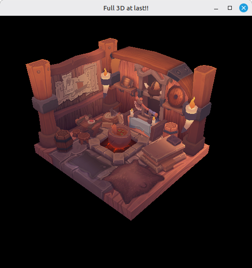

# 25 - Loading Models

We've been hand-typing vertices since step 17 - two quads, twelve indices, a couple of z values. That chapter is closed. This step loads the viking room mesh from a `.obj` file and feeds it straight into the buffers we already have.

The full source for this step lives in [src/25_loading_models/main.odin](https://github.com/Hilderin/OdinVulkan/blob/main/src/25_loading_models/main.odin).

The corresponding chapters in the Vulkan Tutorial are:
- Khronos version: <https://docs.vulkan.org/tutorial/latest/08_Loading_models.html>
- vulkan-tutorial.com version: <https://vulkan-tutorial.com/Loading_models>

---

## What's new, in one glance

- An OBJ loader under `libs/tinyobj`, imported with `import tinyobj "../../libs/tinyobj"`. A port of `tinyobjloader-c`, no official Odin port exists.
- `load_model` reads the `.obj` and builds our `[]Vertex` and `[]u16` directly from `obj.attrib.vertices` and `obj.attrib.faces`.
- The hardcoded `vertices` and `indices` slices are gone. `main` calls `load_model("../../assets/models/viking_room/viking_room.obj")` and feeds the result into the unchanged buffer code.
- No vertex deduplication. More on that below.
- Texture coords get a Y flip on the way in.
- Texture switches from JPEG to PNG and now lives next to the model under `assets/models/viking_room/`.

---

## An OBJ loader for Odin

The Vulkan Tutorial relies on the C++ `tinyobjloader`. Odin has no official equivalent. I grabbed a community port, adapted it to what I needed here, and put it under `libs/tinyobj` ([libs/tinyobj/tinyobj_loader.odin](https://github.com/Hilderin/OdinVulkan/blob/main/libs/tinyobj/tinyobj_loader.odin)). It's a port of `tinyobjloader-c`, itself a C port of `tinyobjloader`. Same parsing logic, in Odin.

The relative import works because Odin resolves it against the file's own directory:

```c
import tinyobj "../../libs/tinyobj"
```

The API we care about is small:

```c
FLAG_TRIANGULATE :: 1 << 0

Vertex_Index :: struct {
    v_idx:  int,
    vt_idx: int,
    vn_idx: int,
}

Attrib :: struct {
    vertices:       [dynamic]f32, // 3 floats per vertex
    normals:        [dynamic]f32,
    texcoords:      [dynamic]f32, // 2 floats per texcoord
    faces:          [dynamic]Vertex_Index,
    // ...
}

parse_obj :: proc(buf: string, base_dir: string = "", flags: u32 = 0) -> (o: OBJ)
```

`parse_obj` takes the file content as a string (we read the file ourselves), a `base_dir` to resolve anything the `.obj` references by name, and a flags field. We pass `FLAG_TRIANGULATE` so n-gons get fan-triangulated into triangles. The viking room is already made of triangles, but triangulate-by-default is the right reflex for arbitrary OBJ files.

The returned `OBJ` owns `[dynamic]` arrays that won't go away on their own. We `defer tinyobj.destroy(&obj)` right after the parse:

```c
obj := tinyobj.parse_obj(string(data), current_dir, tinyobj.FLAG_TRIANGULATE)
if !obj.success {
    fmt.eprintln("Failed to read obj file:", path)
    os.exit(1)
}
defer tinyobj.destroy(&obj)
```

By the time the `defer` runs we've already copied what we need into our own `Vertex` and index slices. Forget the `destroy` and those dynamic arrays leak - not catastrophic for a single load, but in a loop that reloads meshes you'll watch memory climb.

---

## Reading the OBJ

```c
load_model :: proc(path: string) -> (vertices: []Vertex, indices: []u16) {

    data, err := os.read_entire_file(path, context.allocator)
    if err != nil {
        fmt.eprintfln("Failed to read obj file: %v, error: %v", path, err)
        os.exit(1)
    }
    defer delete(data)

    current_dir := slashpath.dir(path)
    defer delete(current_dir)
    obj := tinyobj.parse_obj(string(data), current_dir, tinyobj.FLAG_TRIANGULATE)
    if !obj.success {
        fmt.eprintln("Failed to read obj file:", path)
        os.exit(1)
    }
    defer tinyobj.destroy(&obj)
```

`current_dir` is the directory part of the path. The tinyobj loader uses it to resolve `mtllib` references inside the `.obj` (more on the `.mtl` below).

---

## No vertex deduplication

This is where I part ways with the Vulkan Tutorial. The tutorial walks `shapes`, and for every face vertex looks up a `(pos, texCoord, normal)` triple in a map - reuse it if it already exists, push a new vertex otherwise. That dedup is needed *in that code path*, because each face vertex of a shape is reconstructed fresh.

This loader exposes `attrib.vertices` and `attrib.faces` directly. Each `Vertex_Index` in `faces` already references a vertex by `v_idx`. The natural way to consume that is one `Vertex` per `v` entry, with indices pointing into that array:

```c
vertices = make([]Vertex, len(obj.attrib.vertices) / 3)
for f_index in 0 ..< len(vertices) {
    v := Vertex {
        pos   = {obj.attrib.vertices[f_index * 3], obj.attrib.vertices[(f_index * 3) + 1], obj.attrib.vertices[(f_index * 3) + 2]},
        color = {1.0, 1.0, 1.0},
    }
    vertices[f_index] = v
}

indices_list: [dynamic]u16
for &vertex_index in obj.attrib.faces {
    append(&indices_list, u16(vertex_index.v_idx))

    texCoord := vec2{obj.attrib.texcoords[vertex_index.vt_idx * 2], 1.0 - obj.attrib.texcoords[(vertex_index.vt_idx * 2) + 1]}
    vertices[vertex_index.v_idx].texCoord = texCoord
}

indices = indices_list[:]
return
```

Vertices are filled straight from `attrib.vertices`: three floats per position, `len(attrib.vertices) / 3` of them. Color is white - the texture provides it now.

Then we walk `attrib.faces`. With `FLAG_TRIANGULATE` on, it's a flat list of `Vertex_Index` triples. Each `v_idx` is exactly what we want in the index buffer, so we just append `u16(vertex_index.v_idx)`. The texcoord is looked up through `vt_idx` and written back to the matching `Vertex`.

This works because the viking room - and most Blender exports with UV maps - has its `v` array already corner-deduplicated: a position shared by several UV islands gets multiple `v` entries, one per distinct UV. When the same `v_idx` shows up in several faces, those faces all agree on the texcoord, so writing it back to `vertices[v_idx].texCoord` more than once is harmless. If a model violated that assumption (same `v_idx` reused with different `vt_idx`), the last write would win and you'd get smears on the seams. For those models you'd switch to the deduplicating approach from the tutorial. For the viking room it's fine, and it skips a map lookup per vertex.

Indices stay `u16`. The viking room has 4675 vertices and ~11k indices, well inside `u16` range. Switch to `u32` once you pass 65535 vertices - `CmdBindIndexBuffer` is told `.UINT16` in [src/25_loading_models/main.odin:1020](https://github.com/Hilderin/OdinVulkan/blob/main/src/25_loading_models/main.odin#L1020), and that has to track your index type.

The vertex and index buffer creation code, the staging upload, the descriptor set update - none of it changes. The only difference in `main` is where `vertices` and `indices` come from:

```c
vertices, indices := load_model("../../assets/models/viking_room/viking_room.obj")
```

That relative path resolves from the working directory `src/25_loading_models`. If you run the executable from somewhere else, adjust the path - the binary doesn't embed any assets.

---

## The Y flip on texture coordinates

That `1.0 - ...` on the texcoord V is not a typo:

```c
texCoord := vec2{obj.attrib.texcoords[vertex_index.vt_idx * 2], 1.0 - obj.attrib.texcoords[(vertex_index.vt_idx * 2) + 1]}
```

OBJ stores UVs with the origin at the top-left, V growing downward. Vulkan (and most graphics APIs) has the texture origin at the bottom-left, V growing upward. Copy `vt` straight through and the texture renders upside down. `1.0 - v` puts it where our sampler expects.

You sometimes see people flip the image instead, or flip in the shader. Flipping on load happens once per vertex, not per fragment, and keeps the shader untouched. The flip is baked into the vertex data though - if you reuse the same vertices with an API that expects top-left UVs you'd have to un-flip. Not a concern here.

---

## From JPEG to PNG

Two small changes follow the new texture. The import switches from `core:image/jpeg` to `core:image/png`:

```c
import img "core:image/png"
```

The matching `_ :: png` line at the top of the file (the one that keeps the "unused import" warning quiet while still registering the PNG decoder with `core:image`) flips with it. The texture path then points at the viking room PNG:

```c
image, image_memory := create_texture_image(physical_device, device, "../../assets/models/viking_room/viking_room.png", command_pool, graphics_queue)
```

Nothing else in `create_texture_image` changes. The proc doesn't care what file format the bytes came from - it gets pixels from `img.load`, assumes four channels, and uploads. We just switched because that's how the viking room texture ships.

A small detail worth mentioning since you'll see the file in the repo: the `.obj` from the vulkan-tutorial.com assets references a material library with `mtllib viking_room.mtl`, but the `.mtl` wasn't shipped with it. tinyobj prints `TINYOBJ: Error reading material file: ...` when it can't find an `mtllib` - harmless but noisy. I dropped a hand-written `viking_room.mtl` next to the `.obj` just to silence it. We don't read anything from it, the texture path is hardcoded in `main`, so feel free to ignore the `.mtl` entirely.

---

## Test it

The startup log mirrors step 24 up to `Draw fence... OK`, then a new `Model loaded... OK` line shows up between the fences and the buffer creation:

```
Model loaded... OK
Vertex buffer... OK
Vertex copied to buffer using staging buffer... OK
Index buffer... OK
Indices copied to buffer using staging buffer... OK
Image loaded 1024 x 1024, channels: 4
Texture image loaded... OK
```

The window title is now "Full 3D at last!!". Instead of two rotating quads you see the viking room, turning around the z axis, with the texture wrapped around it. Depth is still on, so the back wall is correctly occluded by the front. The texture should look the right way up - if it's flipped vertically, you forgot the `1.0 - ...` on the texcoord V.



Errors you might hit:

- *"Failed to read obj file"*: the `.obj` path doesn't resolve from where the executable runs. The working directory has to be `src/25_loading_models`.
- *"Failed to open image file"*: same path issue, the PNG has to sit at `assets/models/viking_room/viking_room.png` from the step's `src` folder.
- Garbled UVs on the seams, streaks across the model: the "same `v_idx` reused with different `vt_idx`" case, which shouldn't happen on the viking room but might on other meshes. Switch to the deduplicating approach from the tutorial.
- Validation errors about a buffer being too small or an index out of range: check that `len(indices)`, the `index_count` passed to `CmdDrawIndexed` ([src/25_loading_models/main.odin:1027](https://github.com/Hilderin/OdinVulkan/blob/main/src/25_loading_models/main.odin#L1027)) and the index buffer size all agree.

---

## What's next

We've gone from a hand-staged quad to a real textured mesh loaded from disk, all riding on the buffer/descriptor/depth plumbing built in the previous steps. The viking room texture is 1024x1024 and gets sampled once per fragment regardless of how far the surface is on screen - fine close up, noisy and bandwidth-heavy once the model shrinks in the distance. The next step, [26 - Mipmaps](./26_mipmaps.md), adds a mip chain to the texture image so the GPU can pick a lower-resolution level for distant fragments, cheaper to sample and easier on the eyes.