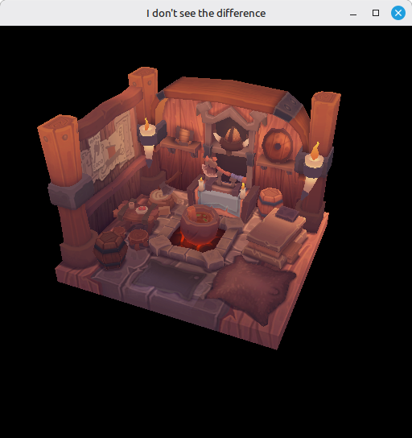

# 26 - Mipmaps

The viking room texture is 1024x1024. So far the sampler reads that full-resolution image for every fragment, whether the model fills the screen or shrinks to a speck in the distance. Up close that's fine. Far away you get the classic shimmering noise - high-frequency texel detail collapsing to a single sample per fragment.

Mipmaps fix that. A mip chain is a set of pre-filtered, progressively smaller copies of the image - 1024, 512, 256, down to 1x1. The sampler picks the level matching the fragment's on-screen coverage (or blends two with `mipmapMode = LINEAR`), so distant fragments read from a small, already-filtered image. Cheaper to fetch, gentler on the bandwidth, the texture stops sparkling.

This step generates that mip chain at load time, in the same command buffer we already use to upload the texture.

The full source for this step lives in [src/26_mipmaps/main.odin](https://github.com/Hilderin/OdinVulkan/blob/main/src/26_mipmaps/main.odin).

The corresponding chapters in the Vulkan Tutorial are:
- Khronos version: <https://docs.vulkan.org/tutorial/latest/09_Generating_Mipmaps.html>
- vulkan-tutorial.com version: <https://vulkan-tutorial.com/Generating_Mipmaps>

---

## What's new, in one glance

- `mip_levels` computed from the image dimensions: `floor(log2(max(width, height))) + 1`.
- `create_image` gains a `mip_levels` parameter. The texture passes the real count, and gets `.TRANSFER_SRC` in its usage flags so each level can be a blit source.
- `create_image_view` gains a `mip_levels` argument. Step 25 had `1` hardcoded inside.
- `transition_image_layout` now takes `mip_levels` and sets `levelCount` on its barrier.
- New `generate_mipmaps` proc - blits each level from the previous one, with pipeline barriers between blits.
- `generate_mipmaps` reuses the command buffer from `create_texture_image` instead of allocating its own.
- `create_texture_image` returns `mip_levels` so `main` can pass it to the texture image view.
- Sampler `maxLod` goes from `0.0` to `vk.LOD_CLAMP_NONE`.

---

## Counting mip levels

```c
mip_levels := u32(math.floor(math.log2(f32(max(width, height))))) + 1
```

`log2(1024) = 10`, plus one = 11 levels (level 0 is the original image). Each level halves both dimensions down to 1x1. The `+1` matters: without it you stop one level short.

---

## create_image

Gains a `mip_levels` parameter - step 25 had `mipLevels = 1` hardcoded inside. The texture now passes the real count:

```c
image, image_memory := create_image(physical_device, device, width, height, mip_levels, 1, .R8G8B8A8_SRGB, {.TRANSFER_SRC, .TRANSFER_DST, .SAMPLED}, {.DEVICE_LOCAL})
```

Two changes from step 25:

- `mip_levels` instead of `1` - `vkCreateImage` allocates storage for every level up front.
- `.TRANSFER_SRC` in the usage flags - each level (except the last) becomes the source of a blit. Without it, `CmdBlitImage` trips a validation error.

`.TRANSFER_DST` stays (where `CmdCopyBufferToImage` writes level 0), `.SAMPLED` stays (so the shader can read it).

---

## create_image_view

Gains a `mip_levels` argument that flows into `subresourceRange.levelCount`:

```c
subresourceRange = {aspect_flags, 0, mip_levels, 0, 1},
```

Set it to `1` and the view only sees level 0 - fine for swap chain and depth, not what we want here. Set it to `mip_levels` and the view sees the whole chain.

Step 25 passed nothing (it was hardcoded inside). Now the call sites split:

- swap chain images, depth image - pass `1`. Single-level.
- texture image view - passes the count returned by `create_texture_image`:

```c
image, image_memory, texture_mip_levels := create_texture_image(physical_device, device, "../../assets/models/viking_room/viking_room.png", command_pool, graphics_queue)
...
image_view := create_image_view(device, image, .R8G8B8A8_SRGB, {.COLOR}, texture_mip_levels)
```

That's why `create_texture_image` grew a third return value - `main` needs the count a second time when building the view.

---

## transition_image_layout

Gains a `mip_levels` argument that goes straight into the barrier's `subresourceRange.levelCount`:

```c
subresourceRange = vk.ImageSubresourceRange{aspectMask = image_aspect_flags, baseMipLevel = 0, levelCount = mip_levels, baseArrayLayer = 0, layerCount = 1},
```

The first transition in `create_texture_image` is `UNDEFINED -> TRANSFER_DST_OPTIMAL`, before `CmdCopyBufferToImage`. That barrier has to cover every level, otherwise levels 1..N-1 stay `UNDEFINED` and `CmdBlitImage` writing into them violates the layout it expects.

Every other call site - the two color transitions per frame in `record_command_buffer`, the depth transition in `create_depth_resources` - now passes `1` explicitly. No behaviour change, just the parameter flowing through.

`transfer_buffer_to_image` itself is unchanged. It copies only level 0 (`imageSubresource.mipLevel = 0`). The staging buffer holds the full-res image; the smaller levels don't exist in there - they're produced by blitting.

---

## One command buffer for everything

The tutorial's `generateMipmaps` allocates its own command buffer with `beginSingleTimeCommands` / `endSingleTimeCommands`. That works, but `create_texture_image` already has one open - the same buffer used for the layout transition and `CmdCopyBufferToImage`. Nothing about the blits needs a fresh buffer, so `generate_mipmaps` takes it as a parameter instead:

```c
command_buffer := begin_single_time_commands(device, command_pool)

transition_image_layout(command_buffer, image, .UNDEFINED, .TRANSFER_DST_OPTIMAL, ...)

transfer_buffer_to_image(command_buffer, staging_buffer, image, width, height)

// Generating mipmaps...
generate_mipmaps(physical_device, image, .R8G8B8A8_SRGB, width, height, mip_levels, command_buffer)

end_single_time_commands(device, command_pool, command_buffer, queue)
```

One `vkQueueSubmit` covers the transition, the staging copy, and every blit. The pipeline barriers inside `generate_mipmaps` keep the blits ordered - they enforce that the previous blit finishes before the next one reads from the same image. The sync comes from the barriers, not from splitting work across submissions.

---

## generate_mipmaps

### Format support check

```c
format_props: vk.FormatProperties
vk.GetPhysicalDeviceFormatProperties(physical_device, format, &format_props)

if ((format_props.optimalTilingFeatures & {.SAMPLED_IMAGE_FILTER_LINEAR}) != {.SAMPLED_IMAGE_FILTER_LINEAR}) {
    fmt.eprintln("Texture image format does not support linear blitting!")
    os.exit(1)
}
```

`CmdBlitImage` with `.LINEAR` filtering needs the format to support linear filtering on optimal tiling. `R8G8B8A8_SRGB` does on every desktop GPU, but the spec doesn't promise it. If it's missing you'd fall back to a staging buffer per level, or a different format, or skip mipmaps. Here we bail out.

### The barrier

```c
barrier := vk.ImageMemoryBarrier {
    sType               = .IMAGE_MEMORY_BARRIER,
    image               = image,
    srcQueueFamilyIndex = 0, //VK_QUEUE_FAMILY_IGNORED
    dstQueueFamilyIndex = 0, //VK_QUEUE_FAMILY_IGNORED
    subresourceRange    = {{.COLOR}, 0, 1, 0, 1},
}
```

One struct, reused for every transition. `levelCount = 1` because we transition one level per iteration, `baseMipLevel` gets rewritten each time.

### The loop

```c
for i in 1 ..< mip_levels {
    barrier.subresourceRange.baseMipLevel = i - 1
    barrier.oldLayout = .TRANSFER_DST_OPTIMAL
    barrier.newLayout = .TRANSFER_SRC_OPTIMAL
    barrier.srcAccessMask = {.TRANSFER_WRITE}
    barrier.dstAccessMask = {.TRANSFER_READ}

    vk.CmdPipelineBarrier(command_buffer, {.TRANSFER}, {.TRANSFER}, {}, 0, nil, 0, nil, 1, &barrier)
```

Level `i-1` was just written as a destination (by the staging copy for `i=1`, or the previous blit). Now it needs to become a source: `TRANSFER_DST_OPTIMAL -> TRANSFER_SRC_OPTIMAL`. Both stages are `.TRANSFER`, no shader involved yet.

```c
    blit := vk.ImageBlit {
        srcOffsets     = {{0, 0, 0}, {i32(mip_width), i32(mip_height), 1}},
        srcSubresource = {{.COLOR}, i - 1, 0, 1},
        dstOffsets     = {{0, 0, 0}, {i32(mip_width > 1 ? mip_width / 2 : 1), i32(mip_height > 1 ? mip_height / 2 : 1), 1}},
        dstSubresource = {{.COLOR}, i, 0, 1},
    }

    vk.CmdBlitImage(command_buffer, image, .TRANSFER_SRC_OPTIMAL, image, .TRANSFER_DST_OPTIMAL, 1, &blit, .LINEAR)
```

Same image is both source and destination - fine, the subresources are different levels. `srcOffsets[1]` is the extent of level `i-1`, `dstOffsets[1]` is half that (the extent of level `i`). The `> 1 ? ... / 2 : 1` guards stop a 1px side from halving to 0 at the bottom of the chain.

`.LINEAR` filtering is what gives smooth mip levels. The format check above is what makes it legal.

```c
    barrier.oldLayout = .TRANSFER_SRC_OPTIMAL
    barrier.newLayout = .SHADER_READ_ONLY_OPTIMAL
    barrier.srcAccessMask = {.TRANSFER_READ}
    barrier.dstAccessMask = {.SHADER_READ}

    vk.CmdPipelineBarrier(command_buffer, {.TRANSFER}, {.FRAGMENT_SHADER}, {}, 0, nil, 0, nil, 1, &barrier)
```

Level `i-1` is done being a source. Transition to `SHADER_READ_ONLY_OPTIMAL` - the layout the sampler will read from. Source stage `.TRANSFER` (blit just finished reading), destination `.FRAGMENT_SHADER` (sampler lives there).

```c
    if mip_width > 1 {
        mip_width /= 2
    }
    if mip_height > 1 {
        mip_height /= 2
    }
}
```

Halve the running dimensions for the next iteration, clamped at 1.

### The final barrier

```c
barrier.subresourceRange.baseMipLevel = mip_levels - 1
barrier.oldLayout = .TRANSFER_DST_OPTIMAL
barrier.newLayout = .SHADER_READ_ONLY_OPTIMAL
barrier.srcAccessMask = {.TRANSFER_WRITE}
barrier.dstAccessMask = {.SHADER_READ}

vk.CmdPipelineBarrier(command_buffer, {.TRANSFER}, {.FRAGMENT_SHADER}, {}, 0, nil, 0, nil, 1, &barrier)
```

The last level never became a source - the loop only handled `i-1` for `i` in `1..<mip_levels`, so level `mip_levels - 1` was only ever a blit destination. It exits the loop still in `TRANSFER_DST_OPTIMAL`. One final barrier transitions it to `SHADER_READ_ONLY_OPTIMAL` so the whole chain is sampler-ready.

Worth noting: the barriers inside `generate_mipmaps` use the old `vk.ImageMemoryBarrier` (`vkCmdPipelineBarrier` form), not the `vk.ImageMemoryBarrier2` we use in `transition_image_layout` (`vkCmdPipelineBarrier2` form). Both work; the tutorial uses the older one and I kept that here. Mixing the two within one command buffer is legal - `synchronization2` governs `CmdPipelineBarrier2`, the old `CmdPipelineBarrier` still runs alongside it.

---

## The sampler

One line changes in `create_sampler`:

```c
maxLod = vk.LOD_CLAMP_NONE,
```

`minLod` stays `0.0` (highest-detail level up close). `maxLod = LOD_CLAMP_NONE` is effectively infinity - sample any level you need. With `mipmapMode = .LINEAR` (already set) the sampler blends two adjacent levels when the ideal LOD falls between them, so mip transitions blend instead of popping.

Step 25 had `maxLod = 0.0`, which clamped sampling to level 0. Correct for a single-level image, but once the view exposes the whole chain the clamp has to move out of the way.

---

## Test it

The startup log looks identical to step 25:

```
Image loaded 1024 x 1024, channels: 4
Texture image loaded... OK
Texture image view... OK
Sampler... OK
```

The visual difference is in the distance. Without mipmaps the texture sparkles as it rotates - high-frequency texel detail picking different texels frame to frame. With mipmaps the distant surface stays smooth and the GPU does less memory work.



Hard to see in a static screenshot - move the camera or shrink the model and the difference with step 25 is immediate.

Errors you might hit:

- *"Texture image format does not support linear blitting!"*: your GPU doesn't expose `SAMPLED_IMAGE_FILTER_LINEAR` for `R8G8B8A8_SRGB` on optimal tiling. Switch the texture format.
- Validation error about `CmdBlitImage` with mismatched layouts: a barrier is missing or has the wrong `baseMipLevel`. Each level goes through `DST -> SRC` before it's blitted from.
- Validation error from the texture image view mentioning it only exposes 1 level: `mip_levels` didn't make it from `create_texture_image` to `create_image_view`. The view stays on `levelCount = 1` and `maxLod = LOD_CLAMP_NONE` on the sampler keeps selecting LODs the view can't satisfy.

---

## What's next

Mipmaps close out the texture side of this tutorial. The next step, [27 - Multisampling](./27_multisampling.md), tackles the edges of the geometry itself.