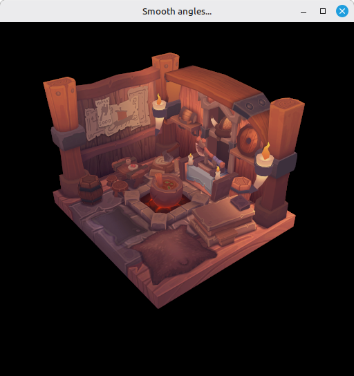

# 27 - Multisampling

Mipmaps in step 26 smoothed the texture out. The triangle edges of the model still look jagged at the silhouette - every pixel on a near-horizontal edge picks one color or another with no in between, so the edge staircase-shimmers as the model rotates.

MSAA fixes that. The rasterizer takes several coverage samples per pixel and averages them down to one color when the render ends. The fragment shader still runs once per pixel, so the cost stays mostly in memory - one multisampled color buffer - plus a small resolve at the end of the pass.

The full source for this step lives in [src/27_multisampling/main.odin](https://github.com/Hilderin/OdinVulkan/blob/main/src/27_multisampling/main.odin).

The corresponding chapters in the Vulkan Tutorial are:
- Khronos version: <https://docs.vulkan.org/tutorial/latest/10_Multisampling.html>
- vulkan-tutorial.com version: <https://vulkan-tutorial.com/Multisampling>

One heads up: the online tutorial still writes the MSAA setup with `VkRenderPass` and attachment descriptions. We're on dynamic rendering, so the subpass-related plumbing is gone. The last section below covers the difference, since the tutorial has nothing on it.

---

## What's new, in one glance

- `get_max_usable_sample_count` - queries the physical device limits and returns the highest sample count both color and depth support. Main caps at 64x if the GPU announces that.
- `create_color_resources` / `destroy_color_resources` - allocate and free a multisampled color image, its memory and its view. Same thing as `create_depth_resources`, with `samples` and `TRANSIENT_ATTACHMENT`.
- `create_image` gains a `samples: vk.SampleCountFlags` parameter. Every caller passes it explicitly - swap chain and texture stay `{._1}`, color and depth get the runtime `samples`.
- `create_depth_resources` also takes `samples`, so the depth buffer is multisampled too - depth tests need to see the same coverage samples as the color buffer.
- `create_graphics_pipeline` takes `samples` and wires it into `PipelineMultisampleStateCreateInfo.rasterizationSamples`.
- `begin_rendering` takes a `color_image_view` and a `resolve_image_view`. The color attachment renders into the MSAA image, resolves into the swapchain image view.
- `record_command_buffer` adds a transition `UNDEFINED -> COLOR_ATTACHMENT_OPTIMAL` for the MSAA image before `begin_rendering`.
- Cleanup and swap chain recreation both destroy and recreate the color resources next to the depth ones.

---

## Picking a sample count

GPU limits come in `VkPhysicalDeviceLimits`. The relevant ones are `framebufferColorSampleCounts` and `framebufferDepthSampleCounts`. They have to agree - if the color buffer takes 4x and the depth buffer 8x, the validation layers fire when the pipeline binds. So we AND them and walk down from 64x to 1x, returning on the first hit:

```c
counts := physical_device_props.limits.framebufferColorSampleCounts & physical_device_props.limits.framebufferDepthSampleCounts
if (counts & {._64}) == {._64} {return {._64}}
if (counts & {._32}) == {._32} {return {._32}}
...
return {._1}
```

`vk.SampleCountFlags` is an Odin bit_set, so `(counts & {._64}) == {._64}` is the bit_set way of asking "is the 64x bit set". Same idiom the tutorial uses with raw `VkSampleCountFlags` integers.

Most dedicated desktop GPUs will announce at least 8x, often 16x or 32x. Cost grows roughly linearly with the sample count, so 4x or 8x are usually the sweet spot - feel free to hardcode `{._4}` or `{._8}` here if you'd rather trade smoothness for FPS.

One thing MSAA won't help with: shader-level aliasing (sharp specular sparkles on normal-mapped surfaces). That's the fragment shader's job, not the rasterizer's - `sampleShadingEnable = true` would address it, at a cost we don't want to pay here. We keep `sampleShadingEnable = false`.

---

## create_image gets a samples parameter

`VkImageCreateInfo.samples` was hardcoded to `{._1}` so far. It now flows from the caller:

```c
image_info := vk.ImageCreateInfo {
    ...
    samples = samples,
}
```

The texture stays at 1x - the shader samples it directly, MSAA doesn't apply:

```c
// In create_texture_image
image, image_memory := create_image(physical_device, device, width, height, mip_levels, {._1}, 1, .R8G8B8A8_SRGB, {.TRANSFER_SRC, .TRANSFER_DST, .SAMPLED}, {.DEVICE_LOCAL})
```

The depth and color images take the runtime `samples`. `create_depth_resources` and `create_color_resources` forward `samples` to `create_image` internally - we'll see the color one in the next section.

The swap chain images are created by the driver with 1x, so they're untouched.

---

## create_color_resources

Same construction as `create_depth_resources`, with two details that change:

```c
color_image, color_image_memory := create_image(
    physical_device,
    device,
    swap_chain_extent.width,
    swap_chain_extent.height,
    1,
    samples,
    1,
    color_format,
    {.TRANSIENT_ATTACHMENT, .COLOR_ATTACHMENT},
    {.DEVICE_LOCAL},
)
color_image_view := create_image_view(device, color_image, color_format, {.COLOR}, 1)
```

Two flags are set on the usage:

- `.COLOR_ATTACHMENT` - we render into this image.
- `.TRANSIENT_ATTACHMENT` - the image can be thrown away once the render ends. On a tiled GPU, this lets the driver back it with lazily-allocated memory, so the multisampled samples stay in on-chip tile memory and never hit external DRAM - they get resolved on the way out. On desktop it's mostly a hint, but harmless. See the [Khronos MSAA performance sample](https://docs.vulkan.org/samples/latest/samples/performance/msaa/README.html) for the bandwidth difference it makes on tiler hardware.

The `levelCount = 1` on `create_image_view` is the same as for depth - one mip level, we just want it bigger.

If you forget `.COLOR_ATTACHMENT` you'll get a validation error at `begin_rendering`. If you forget `.TRANSIENT_ATTACHMENT` nothing breaks, you'd just be telling the driver it might want to keep the contents around.

---

## The pipeline's multisampling state

`PipelineMultisampleStateCreateInfo` already existed with `rasterizationSamples = {._1}`. Now it uses the runtime `samples`:

```c
multisampling_create_info := vk.PipelineMultisampleStateCreateInfo {
    sType                 = .PIPELINE_MULTISAMPLE_STATE_CREATE_INFO,
    sampleShadingEnable   = false,
    rasterizationSamples  = samples,
    ...
}
```

This number has to match the sample count of the image you actually render into. Mismatch is one of the most common MSAA bugs - the validation message is wordy but it boils down to "pipeline says N samples, framebuffer has M".

Nothing else in the pipeline needs to know. `PipelineRenderingCreateInfo.pColorAttachmentFormats` still points at the swapchain format - MSAA doesn't change the color format, just the sample count.

---

## begin_rendering: a color attachment that resolves

This is the main difference from the tutorial.

```c
attachment_info := vk.RenderingAttachmentInfo {
    sType              = .RENDERING_ATTACHMENT_INFO,
    imageView          = color_image_view,
    imageLayout         = .COLOR_ATTACHMENT_OPTIMAL,
    resolveMode        = {.AVERAGE},
    resolveImageView   = resolve_image_view,
    resolveImageLayout = .COLOR_ATTACHMENT_OPTIMAL,
    loadOp             = .CLEAR,
    storeOp            = .STORE,
    clearValue         = {color = {float32 = {0.0, 0.0, 0.0, 1.0}}},
}
```

`imageView` is the MSAA color image view - that's where the pipeline writes its per-sample colors during the draw. `resolveImageView` is the swapchain image view for this frame. When `CmdEndRendering` runs, the implementation averages the samples down to one color per pixel and writes it to the resolve image, atomically.

The resolve mode is what makes edges actually smooth. `{.AVERAGE}` is the standard MSAA resolve. The alternatives are `SAMPLE_ZERO` (just take sample 0, looks worse, slightly faster) and `MIN` / `MAX` (useful for shadow masks and similar, not for color).

`resolveImageLayout = .COLOR_ATTACHMENT_OPTIMAL` matters. The spec (`VUID-VkRenderingAttachmentInfo-imageView-06146`) explicitly forbids `PRESENT_SRC_KHR` for this field, so the resolve target has to be in a color-attachment-compatible layout. It is, because of the layout transition at the start of `record_command_buffer` (next section).

`storeOp` on the MSAA image stays `.STORE` to match the rest of the code, but with `resolveMode` set the bits that matter land in the resolve image - no one reads the MSAA image back, so on a tiler there's no point storing it. The sample linked above is explicit on this: multisampled attachments should use `STORE_OP_DONT_CARE` and `TRANSIENT_ATTACHMENT`, so the additional samples never hit external memory. The layers don't complain either way; I kept `STORE` to stay in lock-step with the tutorial, but in a real codebase `DONT_CARE` is the better default.

The depth attachment is the same as step 24 - `DEPTH_STENCIL_ATTACHMENT_OPTIMAL`, `loadOp = .CLEAR`, `storeOp = .DONT_CARE`. The only related change is the depth image itself now carries `samples` instead of 1x.

The `RenderingInfo` itself is unchanged from step 24, except for what `pColorAttachments` points at:

```c
vk.CmdBeginRendering(command_buffer, &render_info)
```

There's no separate "resolve attachment" slot here - the resolve target is an attribute of the color attachment it relates to, in the same struct.

---

## record_command_buffer: an extra transition

The MSAA color image starts each frame in `UNDEFINED` - between renders nobody promises us its contents, especially since we marked it transient. We need it in `COLOR_ATTACHMENT_OPTIMAL` before `CmdBeginRendering`, the same way we already do for the swapchain image and the depth image:

```c
// Transfert the multisampled color image to ColorAttachmentOptimal
transition_image_layout(
    command_buffer,
    color_image,
    .UNDEFINED,
    .COLOR_ATTACHMENT_OPTIMAL,
    {.COLOR_ATTACHMENT_WRITE},
    {.COLOR_ATTACHMENT_WRITE},
    {.COLOR_ATTACHMENT_OUTPUT},
    {.COLOR_ATTACHMENT_OUTPUT},
    {.COLOR},
    1,
)
```

`begin_rendering` now takes the MSAA `color_image_view` first, then the swapchain `image_view`:

```c
begin_rendering(command_buffer, color_image_view, image_view, swap_chain_extent, depth_image_view)
```

Step 24 had the swapchain view as the only color view. Now the MSAA view is what the pipeline renders into, the swapchain view is just what `resolveImageView` points at - where the resolved result lands.

The after-rendering transition on the swapchain image (`COLOR_ATTACHMENT_OPTIMAL -> PRESENT_SRC_KHR`) is unchanged. That's the swapchain image, not the MSAA image - by the time rendering ends the resolve is already done, the MSAA image can go away, the swapchain image is what we present.

---

## Cleanup and swap chain recreation

`destroy_color_resources` mirrors `destroy_depth_resources` - frees the view, memory and image in the right order:

```c
vk.DestroyImageView(device, color_image_view, nil)
vk.FreeMemory(device, color_image_memory, nil)
vk.DestroyImage(device, color_image, nil)
```

Swap chain recreation in `main` now also drops and recreates the color resources right next to the depth ones:

```c
destroy_depth_resources(device, depth_image, depth_image_memory, depth_image_view)
destroy_color_resources(device, color_image, color_image_memory, color_image_view)
...
color_image, color_image_memory, color_image_view = create_color_resources(physical_device, device, swap_chain_format, swap_chain_extent, samples)
depth_image, depth_image_memory, depth_image_view = create_depth_resources(physical_device, device, depth_format, swap_chain_extent, samples)
```

The new MSAA image has to track the new swap chain extent - if you reused the old one after a window resize, the resolve would land in a too-small buffer.

`samples` isn't recomputed here. The device limits don't change between resizes, so the value computed once at startup is fine.

---

## Dynamic rendering vs the tutorial's render pass

The online tutorial still describes MSAA with `VkRenderPass`. If you read those and try to map onto our dynamic-rendering code, here's the short translation.

With a render pass, MSAA lives in three places: `VkAttachmentDescription.samples` for the color and depth attachments, `VkSubpassDescription2.pResolveAttachments` paired by index with `pColorAttachments`, and `initialLayout` / `finalLayout` for the implicit layout transitions.

With dynamic rendering, all of that collapses into `VkRenderingAttachmentInfo`. The resolve target sits on the same struct as the color attachment (`resolveImageView` + `resolveMode` + `resolveImageLayout`), and the sample count lives on the image itself (`VkImageCreateInfo.samples`).

Three things to keep in mind:

- **No implicit final transition to `PRESENT_SRC_KHR`.** A render pass would handle that via `finalLayout`. With dynamic rendering you do it by hand - that's the barrier at the end of `record_command_buffer`. The MSAA image itself doesn't need an outgoing transition, because of `TRANSIENT_ATTACHMENT`.
- **No implicit initial transition either.** The render pass's initial transitions become three explicit `transition_image_layout` calls per frame - swapchain, depth, and now MSAA color. More typing, but explicit is easier to reason about.
- **The resolve target stays in `COLOR_ATTACHMENT_OPTIMAL` during the resolve, never `PRESENT_SRC_KHR`.** The spec (`VUID-VkRenderingAttachmentInfo-imageView-06146` in the [VkRenderingAttachmentInfo page](https://registry.khronos.org/vulkan/specs/latest/man/html/VkRenderingAttachmentInfo.html)) explicitly forbids `PRESENT_SRC_KHR` for `resolveImageLayout`. So we resolve into `COLOR_ATTACHMENT_OPTIMAL` and do our own barrier to present afterwards.

Net effect: one `RenderingAttachmentInfo` replaces several render-pass structs. Less surface area, more things to set by hand.

---

## Test it

The startup log gains one line - the color resource, right before the depth resource:

```
Swap chain images views... OK
Color resource... OK
Depth resource... OK
```

Visually, the silhouette edges of the viking room soften. The texture itself isn't clearer - MSAA only touches geometry coverage, not texture filtering - that's still mipmaps.



The difference is subtle in a static screenshot - the easiest tell is the silhouette border, where edges went from "one bit per pixel" to a soft gradient. Wiggle the window or rotate the model and the staircase shimmering from step 26 is gone.

Errors you might hit:

- Validation error mentioning `rasterizationSamples` not matching the framebuffer - the `samples` you passed to `create_graphics_pipeline` doesn't match the one on the color/depth image. All three have to agree.
- Validation error about `imageView` layout not compatible with `imageLayout` - you forgot the `UNDEFINED -> COLOR_ATTACHMENT_OPTIMAL` transition for the MSAA image in `record_command_buffer`.
- Validation error at `CmdEndRendering` complaining about resolve layout - you set `resolveImageLayout = .PRESENT_SRC_KHR`. Keep it `COLOR_ATTACHMENT_OPTIMAL`, transition to present afterwards.
- Model looks worse than step 26 - you're rendering into the swapchain image view, not the MSAA color view. The `imageView` on `RenderingAttachmentInfo` should be `color_image_view`, not `image_view`.

---

## What's next

With MSAA in place, we've covered the standard quality settings the Vulkan tutorial walks through. The tutorial itself stops here.