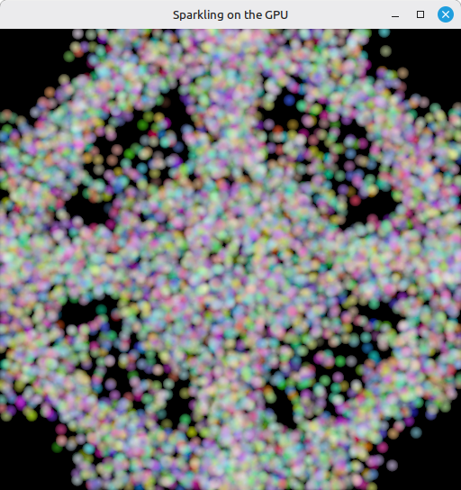

# 28 - Compute Shader

This step reuses everything we built (instance, device, swap chain, command buffers, dynamic rendering) and replaces the textured viking room with a GPU-driven particle system. Eight thousand particles get uploaded once at startup. A compute shader updates their positions on the GPU every frame, and the graphics pipeline reads that same buffer back as a vertex buffer.

The full source for this step lives in [src/28_compute_shader/main.odin](https://github.com/Hilderin/OdinVulkan/blob/main/src/28_compute_shader/main.odin).

The corresponding chapters in the Vulkan Tutorial are:
- Khronos version: <https://docs.vulkan.org/tutorial/latest/11_Compute_Shader.html>
- vulkan-tutorial.com version: <https://vulkan-tutorial.com/Compute_Shader>

---

## What's new, in one glance

- `Uniform_Buffer_Object` shrinks to a single `delta_time: f32` - no more matrices, we don't project particles.
- `Particle` struct - `position`, `velocity`, `color`. Lives on the GPU and is read by both the compute stage and the vertex stage.
- `find_queue_families` is now asked for `{.GRAPHICS, .COMPUTE}`. Vulkan guarantees at least one queue family has both, so we reuse the graphics queue for compute.
- `create_particles` seeds 8192 particles in a small disc on the CPU, once.
- Per-frame storage buffers (`storage_buffers`, `storage_buffer_memories`) created with `{.STORAGE_BUFFER, .VERTEX_BUFFER, .TRANSFER_DST}`. The same buffer is the compute shader's SSBO and the vertex shader's vertex buffer.
- `create_descriptor_set_layout` now has three bindings, all on `.COMPUTE`: UBO, "last frame" SSBO, "current frame" SSBO.
- `update_descriptor_set` binds the UBO plus the two SSBOs. The "last frame" buffer for frame `i` is `storage_buffers[(i + 1) % NB_FRAMES_IN_FLIGHT]` - frame `i`'s compute reads the previous frame's output.
- `create_compute_pipeline` / `record_compute_command_buffer` add a second pipeline and a second command buffer per frame, dedicated to compute.
- `submit_command_buffer` is generalized: it takes slices of wait/signal semaphores and a matching slice of wait destination stages, so both the compute and graphics submits can use it.
- `create_graphics_pipeline` no longer takes a descriptor set layout (the graphics pass no longer binds any), draws `POINT_LIST`, sets a fixed point size, disables depth test / depth write.
- `begin_rendering` goes back to a single color attachment with no resolve target - straight into the swapchain image, like step 26.
- `update_uniform_buffer` just writes `delta_time` instead of rebuilding MVP matrices.
- `record_command_buffer` drops index bind/draw and uses `CmdDraw` with `particle_count`.

---

## Compute queue family

Vulkan mandates that any implementation supporting graphics also has a queue family supporting both graphics and compute. We lean on that and ask `find_queue_families` for a single family that has both bits:

```c
// In create_logical_device
queue_index, ok := find_queue_families(physical_device, {.GRAPHICS, .COMPUTE}, surface)
```

That's the only change. We still create one queue and use the same `graphics_queue` handle to submit both compute and graphics command buffers. Dedicated async-compute queues exist and are great for hiding compute behind rendering, but they force you to deal with cross-queue synchronization. The tutorial skips them - so do we.

---

## Particle data, on the CPU side

The two structs at the top drive everything else:

```c
Uniform_Buffer_Object :: struct {
    delta_time: f32,
}

Particle :: struct {
    position: vec2,
    velocity: vec2,
    color:    vec4,
}
```

The UBO lost `model` / `view` / `proj` because we don't transform particles - they already live in clip-space-ish coordinates in `[-1, 1]`. The compute shader only needs the elapsed time to update particles position based on velocity.

`create_particles` lays 8192 particles out in a small disc using the classic `r = sqrt(rand)` trick - that gives a uniform distribution inside the disc instead of a denser center. Initial velocity points outward, scaled small:

```c
r := 0.25 * math.sqrt(rand.float32())
theta := rand.float32() * 2.0 * math.PI
x := r * math.cos(theta)
y := r * math.sin(theta)

particle.position = {x, y}
particle.velocity = la.normalize(vec2{x, y}) * 0.00025
particle.color = {rand.float32(), rand.float32(), rand.float32(), 1.0}
```

After this runs, `particles` is uploaded to the GPU and the host copy is deleted - we never touch it again.

---

## Storage buffers that are also vertex buffers

Where this step earns its keep is the buffer usage. We want one piece of GPU memory that:

- the compute shader writes to (so it's a `STORAGE_BUFFER`),
- the vertex shader reads from (so it's a `VERTEX_BUFFER`),
- we uploaded the initial data into (so it's a `TRANSFER_DST`).

Vulkan lets you have multiple usages for the same buffer, so:

```c
size_particles_buffer := u64(size_of(Particle) * len(particles))
storage_buffers: [NB_FRAMES_IN_FLIGHT]vk.Buffer
storage_buffer_memories: [NB_FRAMES_IN_FLIGHT]vk.DeviceMemory
for i in 0 ..< NB_FRAMES_IN_FLIGHT {
    storage_buffers[i], storage_buffer_memories[i] = create_buffer(
        physical_device,
        device,
        size_particles_buffer,
        {.STORAGE_BUFFER, .VERTEX_BUFFER, .TRANSFER_DST},
        {.DEVICE_LOCAL},
    )
    transfer_to_buffer(physical_device, device, command_pool, graphics_queue, particles, storage_buffers[i])
}
```

One buffer per frame in flight. Frame `i`'s compute reads `storage_buffers[(i + 1) % NB_FRAMES_IN_FLIGHT]` (the "previous frame" input) and writes `storage_buffers[i]` (the "current frame" output). Frame `i`'s graphics then binds `storage_buffers[frame_index]` - the very same buffer this frame's compute just wrote - as its vertex buffer. So the two buffers are not split between "compute side" and "graphics side"; they alternate between "the buffer being written this frame" and "the buffer being read this frame", and they swap roles next frame.

If we had one shared buffer for everything, two things would race. Inside a single dispatch, a compute invocation writing `particlesOut[k]` could clobber the value another invocation still needs to read from `particlesIn[k]` - Vulkan makes no ordering promises between invocations of the same dispatch. Across frames, the compute of frame `i` would write the buffer while the graphics of frame `i - NB_FRAMES_IN_FLIGHT` would still be reading it.

`.DEVICE_LOCAL` keeps the particles on the GPU side of the bus the whole time. Uploads happen once via `transfer_to_buffer` (the staging buffer path from step 18); after that, no CPU reads or writes them.

---

## Descriptors: three bindings, all compute

The layout has three bindings, all flagged `.COMPUTE` because the graphics pipeline doesn't touch any of them:

```c
ubo_binding := vk.DescriptorSetLayoutBinding {
    binding         = 0,
    descriptorType  = .UNIFORM_BUFFER,
    descriptorCount = 1,
    stageFlags      = {.COMPUTE},
}
storage_last_frame_binding := vk.DescriptorSetLayoutBinding {
    binding         = 1,
    descriptorType  = .STORAGE_BUFFER,
    descriptorCount = 1,
    stageFlags      = {.COMPUTE},
}
storage_current_frame_binding := vk.DescriptorSetLayoutBinding {
    binding         = 2,
    descriptorType  = .STORAGE_BUFFER,
    descriptorCount = 1,
    stageFlags      = {.COMPUTE},
}
```

The descriptor pool gets a `STORAGE_BUFFER` count of `NB_FRAMES_IN_FLIGHT * 2`, because each frame references two SSBOs (last + current):

```c
{
    {type = .UNIFORM_BUFFER, descriptorCount = NB_FRAMES_IN_FLIGHT},
    {type = .STORAGE_BUFFER, descriptorCount = NB_FRAMES_IN_FLIGHT * 2},
}
```

`update_descriptor_set`  wires the actual buffers into each set. The "last frame" buffer for set `i` is `storage_buffers[(i + 1) % NB_FRAMES_IN_FLIGHT]`, and the "current frame" buffer is `storage_buffers[i]`:

```c
for i in 0 ..< NB_FRAMES_IN_FLIGHT {
    update_descriptor_set(
        device,
        descriptor_sets[i],
        ubo_buffers[i],
        storage_buffers[(i + 1) % NB_FRAMES_IN_FLIGHT],
        storage_buffers[i],
        size_particles_buffer,
    )
}
```

The `[(i + 1) % NB_FRAMES_IN_FLIGHT]` trick looks backwards at first: for `NB_FRAMES_IN_FLIGHT = 2`, set 0's "last frame" is `storage_buffers[1]`, set 1's "last frame" is `storage_buffers[0]`. That works because last frame's "current" output is the buffer at the previous slot, which is exactly the one we want to read from this frame.

---

## The compute shader

The shader lives in `src/28_compute_shader/shader.slang`, below the vertex and fragment stages. The top half mirrors what's in Odin:

```c
struct Particle {
    float2 position;
    float2 velocity;
    float4 color;
};

struct UniformBuffer {
    float deltaTime;
};
ConstantBuffer<UniformBuffer> ubo;

struct ParticleSSBO {
    Particle particles;
};
StructuredBuffer<ParticleSSBO> particlesIn;
RWStructuredBuffer<ParticleSSBO> particlesOut;
```

`StructuredBuffer` is read-only, `RWStructuredBuffer` is read-write. Slang maps both to a Vulkan `STORAGE_BUFFER` descriptor, with the read/write split decided at the shader type level. The `ParticleSSBO` wrapper looks redundant (it just contains one `Particle`), but it's how the tutorial structures things so multi-field SSBOs read cleanly - we keep it for parity.

The shader entry point is:

```c
[shader("compute")]
[numthreads(256,1,1)]
void compMain(uint3 threadId : SV_DispatchThreadID)
{
    uint index = threadId.x;

    particlesOut[index].particles.position = particlesIn[index].particles.position + particlesIn[index].particles.velocity.xy * ubo.deltaTime;
    particlesOut[index].particles.velocity = particlesIn[index].particles.velocity;

    if ((particlesOut[index].particles.position.x <= -1.0) || (particlesOut[index].particles.position.x >= 1.0)) {
        particlesOut[index].particles.velocity.x = -particlesOut[index].particles.velocity.x;
    }
    if ((particlesOut[index].particles.position.y <= -1.0) || (particlesOut[index].particles.position.y >= 1.0)) {
        particlesOut[index].particles.velocity.y = -particlesOut[index].particles.velocity.y;
    }
}
```

`[numthreads(256,1,1)]` sets the local work group size: 256 invocations per work group along x. This is a shader-side constant, picked by the shader author. 256 is a common default - small enough to fit any GPU's `maxComputeWorkGroupInvocations`, big enough to keep the hardware fed.

`SV_DispatchThreadID` is the unique global invocation id across the whole dispatch. `threadId.x` indexes into our particle array - one invocation per particle, which is the cleanest mapping for a 1D array.

The body integrates position by `velocity * deltaTime` and bounces velocity off the `[-1, 1]` window border. The rows of 256 particles outside the border won't immediately come back this frame - they flip velocity and only return on the next frame's integration. With 8192 particles at small velocities you barely notice; if you want pixel-perfect clamping, add a clamp on `position` after the bounce.

---

## The compute pipeline

Compute pipelines are a lot thinner than graphics pipelines. No vertex input, no input assembly, no rasterizer, no blend, no multisample state - just one shader stage and a pipeline layout. `create_compute_pipeline` is the whole thing:

```c
shaders_create_info := vk.PipelineShaderStageCreateInfo {
    sType  = .PIPELINE_SHADER_STAGE_CREATE_INFO,
    stage  = {.COMPUTE},
    module = shader_module,
    pName  = entry_cstr,
}

local_descriptor_set_layout := descriptor_set_layout
pipeline_layout_create_info := vk.PipelineLayoutCreateInfo {
    sType                  = .PIPELINE_LAYOUT_CREATE_INFO,
    setLayoutCount         = 1,
    pSetLayouts            = &local_descriptor_set_layout,
    pushConstantRangeCount = 0,
    pPushConstantRanges    = nil,
}
// ... vk.CreatePipelineLayout ...

pipeline_create_info := vk.ComputePipelineCreateInfo {
    sType  = .COMPUTE_PIPELINE_CREATE_INFO,
    layout = pipeline_layout,
    stage  = shaders_create_info,
}
vk_check(vk.CreateComputePipelines(device, 0, 1, &pipeline_create_info, nil, &compute_pipeline), "Failed to create compute pipeline!")
```

The descriptor set layout is the same one the graphics side created - both pipelines share it. That's fine because the layout only tells the driver what bindings exist, not which stages will actually use them; the per-binding `stageFlags = {.COMPUTE}` says only the compute stage consumes them, and the graphics pipeline binds zero descriptor sets (we'll see that next).

If you wanted vertex-stage access to some of those bindings, you'd OR more stage bits in `create_descriptor_set_layout` instead of forking the layout.

---

## Recording a compute command buffer

`record_compute_command_buffer` is short:

```c
begin_command_buffer(command_buffer)

vk.CmdBindPipeline(command_buffer, .COMPUTE, compute_pipeline)

local_descriptor_set := descriptor_set
vk.CmdBindDescriptorSets(command_buffer, .COMPUTE, pipeline_layout, 0, 1, &local_descriptor_set, 0, nil)

// [numthreads(256,1,1)] in the shader, so we dispatch ceil(particle_count / 256) groups.
group_count := (particle_count + 255) / 256
vk.CmdDispatch(command_buffer, group_count, 1, 1)

end_command_buffer(command_buffer)
```

`CmdBindPipeline` / `CmdBindDescriptorSets` use `.COMPUTE` as the bind point, not `.GRAPHICS`. Compute has its own bind point - that's why a graphics-pipeline bind doesn't carry over.

`group_count := (particle_count + 255) / 256` rounds up: `8192 / 256 = 32` exactly here, but if you ever set `particle_count = 8000`, you'd need `ceil(8000 / 256) = 32` work groups to cover all particles, and the last group's last 192 invocations would run past the end of the buffer. Either pad your data so the read is harmless, or add an `if (index >= particle_count) return;` guard at the top of the shader. We chose 8192 specifically so it divides cleanly - the tutorial's `PARTICLE_COUNT / 256` works for the same reason.

There's no `CmdBeginRendering` here. Compute does not enter a render pass or rendering info - it just runs.

---

## Graphics pipeline changes

The graphics pipeline was mostly gutted. The interesting differences from step 27:

**Vertex input matches `Particle`, not `Vertex`:**

```c
binding_description.stride = size_of(Particle)
vertex_attributes_description := []vk.VertexInputAttributeDescription {
    {binding = 0, location = 0, format = .R32G32_SFLOAT,   offset = u32(offset_of(Particle, position))},
    {binding = 0, location = 1, format = .R32G32B32A32_SFLOAT, offset = u32(offset_of(Particle, color))},
}
```

`velocity` is deliberately not in the attribute list - only the compute shader uses it, and exposing it to the vertex stage would be wasted bandwidth. This is what the tutorial means by "buffers can have multiple usages": the same backing memory is treated as an SSBO on the compute side and as a vertex buffer with two attributes on the graphics side.

**Input assembly is point list:**

```c
input_assembly_create_info := vk.PipelineInputAssemblyStateCreateInfo {
    sType                  = .PIPELINE_INPUT_ASSEMBLY_STATE_CREATE_INFO,
    topology               = .POINT_LIST,
    ...
}
```

**Depth is disabled:**

```c
depth_stencil := vk.PipelineDepthStencilStateCreateInfo {
    depthTestEnable       = false,
    depthWriteEnable      = false,
    ...
}
```

With depth writes on, the square point sprites would occlude each other based on draw order, and the soft alpha edge we draw in the fragment shader would hard-stencil over whatever drew first. The clean fix is to disable depth entirely so the additive-ish blend of overlapping particles looks right. The depth buffer itself still exists - `create_depth_resources` and `depth_image_view` are still wired into `begin_rendering` - but the pipeline no longer tests or writes it. We kept the depth image around to avoid ripping out all the depth plumbing from the earlier steps; you could remove it entirely with a bit more surgery.

**No pipeline-descriptor-set coupling:**

```c
pipeline_layout_create_info := vk.PipelineLayoutCreateInfo {
    sType                  = .PIPELINE_LAYOUT_CREATE_INFO,
    setLayoutCount         = 0,
    pSetLayouts            = nil,
    ...
}
```

The graphics pass binds zero descriptor sets. All the descriptor work moved to compute. If you left the old `descriptor_set_layout` parameter in and forgot to update the layout, validation would fire about unused set layouts - cleaner to just drop it.

---

## The shaders: points with a soft edge

The vertex/fragment pair in `shader.slang` is tiny:

```c
[shader("vertex")]
VSOutput vertMain(VSInput input) {
    VSOutput output;
    output.pointSize = 14.0;
    output.pos = float4(input.inPosition, 1.0, 1.0);
    output.fragColor = input.inColor.rgb;
    return output;
}

[shader("fragment")]
float4 fragMain(PSInput input) : SV_TARGET {
    float2 coord = input.pointCoord - float2(0.5);
    return float4(input.fragColor, 0.5 - length(coord));
}
```

`SV_PointSize` sets the point sprite's pixel size (14, fixed). `SV_PointCoord` is the fragment's position inside the point sprite, in `[0, 1]` - centered around 0.5. Subtracting 0.5 and taking the length gives us the distance from the center; `0.5 - length` is positive inside the unit disc and negative outside, so the fragments past the disk edge get clipped to alpha 0. That's the "soft circular point" trick - render a square sprite, discard everything outside an inscribed circle, get a round point.

`output.pos = float4(input.inPosition, 1.0, 1.0)` puts z at 1.0 (the far plane in Vulkan's `[0, 1]` depth range) and w at 1.0. With depth testing off, z doesn't matter - but w = 1 means no perspective divide surprises. This is the same "clip space directly" approach the tutorial uses, and it's why the UBO no longer needs projection matrices.

---

## begin_rendering, back to a single color attachment

`begin_rendering` lost its MSAA plumbing. There's no `color_image_view` and no `resolve_image_view` anymore - one color attachment that points straight at the swapchain image view:

```c
begin_rendering :: proc(
    command_buffer: vk.CommandBuffer,
    swap_chain_image_view: vk.ImageView,
    swap_chain_extent: vk.Extent2D,
    depth_image_view: vk.ImageView,
) {
    attachment_info := vk.RenderingAttachmentInfo {
        sType = .RENDERING_ATTACHMENT_INFO,
        imageView = swap_chain_image_view,
        imageLayout = .COLOR_ATTACHMENT_OPTIMAL,
        loadOp = .CLEAR,
        storeOp = .STORE,
        clearValue = {color = {float32 = {0.0, 0.0, 0.0, 1.0}}},
    }
    ...
}
```

No `resolveMode`, no `resolveImageView`. We're back to the step 26 setup: render into the swapchain image, transition to `PRESENT_SRC_KHR` afterwards. The MSAA image transition that lived in `record_command_buffer` is gone too.

`samples` is hardcoded to `{._1}` in `main` (no more `get_max_usable_sample_count`), and every `create_image` call passes it through. If you want MSAA back for this scene you have some work to do - point sprites with alpha cutout and MSAA resolve play badly together, which is exactly why we turned it off.

---

## record_command_buffer: draw, not draw indexed

Inside the render pass, the index buffer bind and `CmdDrawIndexed` are gone. We don't have indices - points are unconnected. What's left is:

```c
vk.CmdBindVertexBuffers(command_buffer, 0, 1, &local_vertex_buffer, &offsets)
// no index bind, no descriptor set bind
vk.CmdDraw(command_buffer, draw_count, 1, 0, 0)
```

`draw_count` is `particle_count` (passed through from `main`). The pipeline layout has zero descriptor sets, so `CmdBindDescriptorSets` isn't called here either - the descriptor sets are only ever bound on the compute side.

---

## Synchronization: two submits per frame, two waits

This is the part where getting it wrong is most visible. Two command buffers are submitted each frame: compute first, then graphics. Even though the submits are ordered on the CPU, the GPU is free to reorder them unless we make the dependencies explicit. We do it with semaphores and fences.

Extra sync objects per frame:

```c
compute_semaphores: [NB_FRAMES_IN_FLIGHT]vk.Semaphore   // signals when compute is done
compute_fences:    [NB_FRAMES_IN_FLIGHT]vk.Fence        // CPU fence for compute, starts signaled
compute_command_buffers: [NB_FRAMES_IN_FLIGHT]vk.CommandBuffer
```

`compute_fences` start in the signaled state, same as the draw fences from step 15 - otherwise the very first frame's `wait_for_fence` would deadlock.

The per-frame loop looks like this, in order:


```c
// 1. Wait for this frame's compute slot to be idle on the CPU.
wait_for_fence(device, compute_fences[frame_index])

// 2. Update the UBO with the current elapsed time.
update_uniform_buffer(start_time, ubo_map_memory_ptrs[frame_index], swap_chain_extent)

// 3. Reset the compute fence and record + submit the compute buffer.
reset_fence(device, compute_fences[frame_index])
record_compute_command_buffer(compute_command_buffers[frame_index], compute_pipeline, compute_pipeline_layout, descriptor_sets[frame_index], particle_count)
submit_command_buffer(device, compute_command_buffers[frame_index], compute_fences[frame_index], {}, {}, {compute_semaphores[frame_index]}, graphics_queue)

// 4. Acquire a swapchain image (waits on draw_fences[frame_index]).
swap_chain_image_index, swap_chain_recreation_needed := acquire_next_image(...)

// 5. Record + submit graphics, waiting on compute_semaphore AND acquire_semaphore.
submit_command_buffer(
    device,
    command_buffers[frame_index],
    draw_fences[frame_index],
    {compute_semaphores[frame_index], acquire_semaphores[frame_index]},
    {{.VERTEX_INPUT}, {.COLOR_ATTACHMENT_OUTPUT}},
    {submit_semaphores[swap_chain_image_index]},
    graphics_queue,
)
```


The graphics submit waits on two semaphores. `compute_semaphores[frame_index]` is waited on the `.VERTEX_INPUT` stage, so the vertex fetch only starts once the compute shader has finished writing the particles. Remember: graphics binds `storage_buffers[frame_index]`, which is the *same* buffer this frame's compute used as its `particlesOut`. Without that wait, the vertex shader could read positions half-written by a still-running compute dispatch. `acquire_semaphores[frame_index]` is waited on `.COLOR_ATTACHMENT_OUTPUT`, so we don't write colors until the swapchain image is actually ours. That's the read-after-write hazard between compute and graphics, covered with a single semaphore holding graphics back until its compute is done.

The compute submit waits on nothing. No wait semaphore on the compute side, because the CPU fence (`wait_for_fence` in step 1) already guarantees the previous use of this slot has finished. The compute fence also gets reset before submit, so it'll signal again when this frame's compute is done.

`submit_command_buffer` was rewritten to take slices instead of single semaphores - that's what lets the graphics submit pass two wait semaphores with two matching wait stages:

```c
submit_command_buffer :: proc(
    device: vk.Device,
    command_buffer: vk.CommandBuffer,
    fence: vk.Fence,
    wait_semaphores: []vk.Semaphore,
    wait_dest_stages: []vk.PipelineStageFlags,
    signal_semaphores: []vk.Semaphore,
    queue: vk.Queue,
) {
    assert(len(wait_semaphores) == len(wait_dest_stages), "Wait dest stages must be of same length as wait_semaphores")
    ...
}
```

The assert is the only piece of new logic - matching the two slices by hand is exactly the kind of thing you forget, and the validation layer error you'd get otherwise is much less obvious than a clean assertion failure.

The compute submit passes empty slices for waits (`{}`) and a one-element slice for signals (`{compute_semaphores[frame_index]}`). Same proc, different shape. One signature, two callers.

---

## Cleanup and swap chain recreation

A lot of texture/model/index plumbing from step 27 is gone - `load_model`, the vertex/index buffers, `create_texture_image`, the sampler, the texture image view - because this scene has none of those. That's why the destruction block in `main` got shorter, not longer.

Two new things to destroy:

```c
for i in 0 ..< NB_FRAMES_IN_FLIGHT {
    vk.FreeMemory(device, storage_buffer_memories[i], nil)
    vk.DestroyBuffer(device, storage_buffers[i], nil)
}
for compute_fence in compute_fences { vk.DestroyFence(device, compute_fence, nil) }
for compute_semaphore in compute_semaphores { vk.DestroySemaphore(device, compute_semaphore, nil) }
// plus vk.DestroyPipeline / vk.DestroyPipelineLayout for the compute pipeline
```

The compute command buffers live in the command pool, so they get freed when `vk.DestroyCommandPool` runs.

Swap chain recreation got simpler too - no more `destroy_color_resources` / `create_color_resources` pair. Just depth and the swapchain itself:

```c
destroy_depth_resources(device, depth_image, depth_image_memory, depth_image_view)
// ... rebuild swapchain and image views ...
depth_image, depth_image_memory, depth_image_view = create_depth_resources(physical_device, device, depth_format, swap_chain_extent, samples)
```

The storage buffers don't depend on the swapchain extent, so they don't need to be recreated on resize. Particles just keep moving inside the same `[-1, 1]` box.

---

## Test it

Startup log adds a couple of new lines, drops a bunch:

```
Swap chain images views... OK
Depth resource... OK
Shader module... OK
Descriptor set layout... OK
Descriptor pool... OK
Descriptor sets... OK
Graphics pipeline... OK
Compute pipeline... OK
Command pool... OK
Command buffer... OK
Compute command buffers... OK
...
Compute semaphores... OK
Compute fences... OK
Uniform buffer... OK
Particles... OK
Particles storage buffers... OK
Descriptor sets updated... OK
```

No vertex buffer, no index buffer, no texture, no sampler, no color resource - they're gone. If you still see them, you're running an earlier step's binary.

The window shows a swarm of colored round points spawned in a disc, drifting outward, bouncing off the window edges, slowing down enough at the borders that the pattern stays alive.



Errors you might hit:

- Validation error about a missing `VK_PIPELINE_STAGE_COMPUTE_SHADER` or `VK_PIPELINE_STAGE_VERTEX_INPUT` wait stage - you tried to wait on a semaphore at a stage the implementation doesn't allow on this queue. The wait stages in the graphics submit are `VERTEX_INPUT` (for compute) and `COLOR_ATTACHMENT_OUTPUT` (for acquire); don't mix them up.
- Hang at startup or on resize - a compute fence wasn't created in the signaled state, or you reset a fence you never waited on. The pattern is always: wait, reset, submit.
- Particles don't move - `update_uniform_buffer` is no longer being called per frame, or `delta_time` is zero. Check that the elapsed seconds are actually flowing into `ubo.delta_time`.
- Particles smear across the screen, look ghosted - you forgot the `i + 1` rotation in `update_descriptor_set`, so each frame's compute reads its own current buffer instead of the previous frame's output. The result is a feedback loop that streaks particles out.
- Validation error about buffer usage missing `STORAGE_BUFFER` or `VERTEX_BUFFER` - you left out one of the three usage flags in `create_buffer`. All three are required: storage for compute, vertex for graphics, transfer dst for the initial upload.
- Compute pipeline creation fails with a shader stage mismatch - the entry point name passed to `create_shader_module` (`"compMain"`) has to match the `[shader("compute")] void compMain(...)` in `shader.slang`. The single shader module now contains three entry points; slangc with three `-entry` flags bakes all of them into one SPIR-V blob, and `pName` selects which one each pipeline stage uses.

---

## What's next

With compute shaders covered, `main.odin` has grown to over 2200 lines of tightly coupled code. The next step stops adding features and reorganises: it pulls the reusable foundation (instance creation, device selection, window surface management, error handling) into a small library called `ovk` so each future step doesn't have to duplicate the same boilerplate. Head to [29 - ovk Framework Init](./29_ovk_framework_init.md) if the idea of a single-file megafunction is starting to bother you.