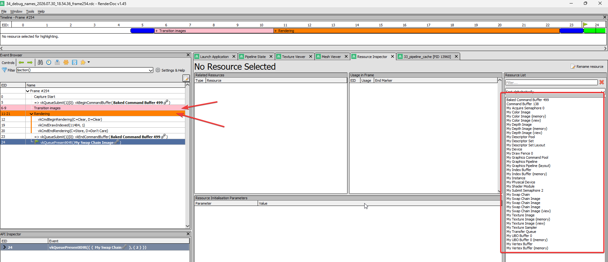

# 34 - Debug Names

Vulkan objects are handles - numbers or pointers the driver uses internally. When something goes wrong, the validation layers or a capture tool like [RenderDoc](./renderdoc.md) will tell you "buffer X has a problem", but X is just a raw handle value. You can't tell which buffer that is without cross-referencing handles with your own code. The `VK_EXT_debug_utils` extension lets you give each object a human-readable name, so error messages and tools show `"My Vertex Buffer"` instead of `0xabcd1234`. It also supports labelling sections of the command buffer with begin/end markers, making captures much easier to navigate.

The extension was already enabled in step 03 for the debug messenger. We just never used the naming part of it.

The full source for this step lives in [src/34_debug_names/main.odin](https://github.com/Hilderin/OdinVulkan/blob/main/src/34_debug_names/main.odin) and the new library file [libs/ovk/debug_names.odin](https://github.com/Hilderin/OdinVulkan/blob/main/libs/ovk/debug_names.odin).

---

## Objectives

- Add a reusable `ovk.set_debug_name` API that wraps `vkSetDebugUtilsObjectNameEXT`.
- Name every significant Vulkan object at creation time in `init_app`.
- Add `cmd_begin_debug_label` / `cmd_end_debug_label` wrappers for command buffer regions.
- Use labels in `record_command_buffer` to separate the image transitions from the render pass.

---

## Concepts

### Debug names are free at runtime

Calling `vkSetDebugUtilsObjectNameEXT` has near-zero cost. It stores a string in the driver's debug data structures, and when the validation layers or a capture tool query it, they get the name back. There is no performance impact on the rendering path. In a release build you can skip the calls entirely if you want, but even in debug the cost is negligible.

### What gets a name

Every Vulkan object type can be named: devices, instances, queues, buffers, images, pipelines, command buffers, you name it. The API takes an object type enum and a `u64` handle, so you can name anything you can get a handle for.

The `ovk` wrapper overloads `set_debug_name` per type so you never have to pass the enum or extract the handle yourself. The overloaded proc pattern in Odin lets all these functions share the same name and the compiler picks the right one based on the argument types:

```c
set_debug_name :: proc {
    set_debug_name_device,
    set_debug_name_instance,
    set_debug_name_buffer,
    set_debug_name_image,
    // ... one per type
}
```

### Command buffer labels

`vkCmdBeginDebugUtilsLabelEXT` and `vkCmdEndDebugUtilsLabelEXT` insert markers into the command stream. Tools like RenderDoc show them as expandable sections in the command buffer viewer, so you can collapse "Transition images" and jump straight to "Rendering". Each label has a name and a color, which helps visually separate regions.

---

## Implementation

### `libs/ovk/debug_names.odin`

The internal workhorse is `set_debug_name_internal`:

```c
set_debug_name_internal :: proc(device: vk.Device, object_handle: u64,
                                object_type: vk.ObjectType,
                                object_name: string) -> (err: Error) {
    cname := strings.clone_to_cstring(object_name)
    defer delete(cname)

    debug_info := vk.DebugUtilsObjectNameInfoEXT {
        sType        = .DEBUG_UTILS_OBJECT_NAME_INFO_EXT,
        objectHandle = object_handle,
        objectType   = object_type,
        pObjectName  = cname,
    }

    check(vk.SetDebugUtilsObjectNameEXT(device, &debug_info),
          "Failed to set the debug object name") or_return
    return
}
```

It converts the Odin `string` to a `cstring`, builds the `VkDebugUtilsObjectNameInfoEXT` struct, and calls the extension function. The `@(private = "file")` attribute keeps it internal - nobody outside this file needs to call it directly.

Each overload extracts the native handle from the ovk wrapper struct and dispatches to `set_debug_name_internal`. Dispatchable handles (device, instance, physical device, queue, command buffer) need `u64(uintptr(...))` because they're pointers internally. Non-dispatchable handles (buffer, image, etc.) just need `u64(...)` because they're already integer-like:

```c
// Non-dispatchable: straight u64 cast
set_debug_name_buffer :: proc(device: ^Device, buffer: ^Buffer, object_name: string) -> (err: Error) {
    set_debug_name_internal(device.vk_device, u64(buffer.vk_buffer), .BUFFER, object_name) or_return
    if buffer.vk_device_memory != 0 {
        memory_name := strings.concatenate({object_name, " (memory)"})
        defer delete(memory_name)
        set_debug_name_internal(device.vk_device, u64(buffer.vk_device_memory),
                                .DEVICE_MEMORY, memory_name) or_return
    }
    return
}

// Dispatchable: uintptr first
set_debug_name_queue :: proc(device: ^Device, queue: ^Queue, object_name: string) -> (err: Error) {
    return set_debug_name_internal(device.vk_device, u64(uintptr(queue.vk_queue)),
                                   .QUEUE, object_name)
}
```

Some overloads go further. `set_debug_name_buffer` and `set_debug_name_image` also name the associated `VkDeviceMemory`. `set_debug_name_graphics_pipeline` names the `VkPipelineLayout` too. This means one call handles the primary object and its most important sub-objects, without you having to think about it.

The command buffer label helpers are straightforward wrappers:

```c
cmd_begin_debug_label :: proc(command_buffer: ^Command_Buffer, label_name: string, color: color4) {
    cname := strings.clone_to_cstring(label_name)
    defer delete(cname)
    begin_info := vk.DebugUtilsLabelEXT {
        sType      = .DEBUG_UTILS_LABEL_EXT,
        pLabelName = cname,
        color      = color,
    }
    vk.CmdBeginDebugUtilsLabelEXT(command_buffer.vk_command_buffer, &begin_info)
}

cmd_end_debug_label :: proc(command_buffer: ^Command_Buffer) {
    vk.CmdEndDebugUtilsLabelEXT(command_buffer.vk_command_buffer)
}
```

They don't return errors because setting a label can't fail at the Vulkan level (it's a recording command, not a creation command). If you pass a nil command buffer you'll get a validation error or a crash, but that's the caller's responsibility.

### Naming objects in `init_app`

Objects created before the logical device (instance, window surface, physical device) can't be named at creation time because `vkSetDebugUtilsObjectNameEXT` needs a `VkDevice`. They get their name right after the device is created, in order of creation:

```c
ovk.set_debug_name(&app.device, "My Device") or_return
ovk.set_debug_name(&app.device, &app.instance, "My Instance") or_return
ovk.set_debug_name(&app.device, &app.window, "My Window Surface") or_return
ovk.set_debug_name(&app.device, &app.physical_device, "My Physical Device") or_return
ovk.set_debug_name(&app.device, &app.device.graphics_queue, "My Graphics Queue") or_return
ovk.set_debug_name(&app.device, &app.device.compute_queue, "My Compute Queue") or_return
ovk.set_debug_name(&app.device, &app.device.transfer_queue, "My Transfer Queue") or_return
```

After that, every object gets its name right after creation, before any further work is done with it. The swap chain images, fences, semaphores, and UBO buffers use `fmt.tprintf` to include an index in the name:

```c
for i in 0 ..< app.swap_chain.nb_frames_in_flight {
    ovk.set_debug_name(&app.device, &app.swap_chain.draw_fences[i],
                       fmt.tprintf("My Draw Fence {}", i)) or_return
    ovk.set_debug_name(&app.device, &app.swap_chain.acquire_semaphores[i],
                       fmt.tprintf("My Acquire Semaphore {}", i)) or_return
}
```

### Labelling the command buffer

In `record_command_buffer`, the recording is wrapped in two labelled sections:

```c
ovk.cmd_begin_debug_label(command_buffer, "Transition images", ovk.COLOR_PINK)
// ... three transition_image_layout calls ...
ovk.cmd_end_debug_label(command_buffer)

ovk.cmd_begin_debug_label(command_buffer, "Rendering", ovk.COLOR_ORANGE)
// ... begin rendering, bind pipeline, draw, end rendering ...
ovk.cmd_end_debug_label(command_buffer)
```

In a capture tool these two regions appear as collapsible blocks. The "Transition images" section contains the layout transitions for the three images. The "Rendering" section contains everything that happens during the render pass. The colors are defined in `color.odin` alongside the other colour constants.

---

## Results

The application runs exactly as before. No visible difference, same viking room, same rotation. The debug names and labels only matter when you look at the app through a debugger or a capture tool.

If you open a frame capture in [RenderDoc](./renderdoc.md) (see the [RenderDoc guide](./renderdoc.md) for how to install and capture):
- Every Vulkan object in the Resource Inspector shows its name instead of a raw handle.
- The swap chain images are listed as "My Swap Chain Image 0", "My Swap Chain Image 1", etc.
- The command buffer event browser shows the "Transition images" and "Rendering" labelled regions with the assigned colors.



If you're using Vulkan validation layers with `WARNING` or `ERROR` severity, any messages that reference a named object will include the name in the output. For example, instead of `Buffer 0x2468ace0 is destroyed but still referenced by command buffer 0x12345678`, you'll see `Buffer 'My Vertex Buffer' is destroyed but still referenced by command buffer 'My Graphics Command Buffer'`.

Validation layers should report no new warnings. If they do, the most likely cause is a mismatch between the object type enum and the actual handle (easy to get wrong when adding a new overload) or the `VK_EXT_debug_utils` extension not being enabled (it is, since step 03).

### If you see `VK_ERROR_EXTENSION_NOT_PRESENT`

This shouldn't happen because the extension was enabled in step 03 and validated since. But if you're copying this code to a new project and the instance creation fails, make sure `VK_EXT_debug_utils` is in the instance extension list. Without it, `vkSetDebugUtilsObjectNameEXT` and the command buffer label functions are not available.
