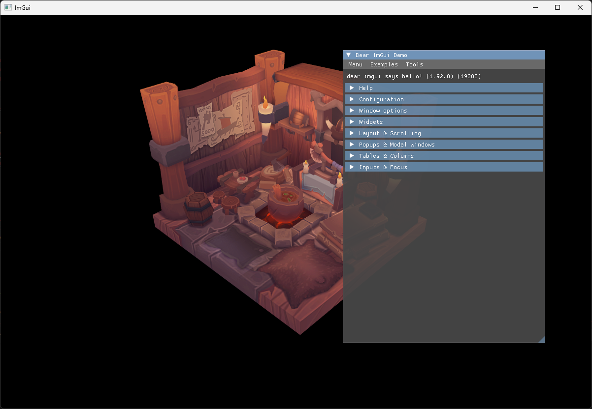

# 37 - ImGui

Since step 36, the app is a solid Vulkan foundation: a framework, clean synchronization, and a rotating textured model. What's missing is a way to see what's happening. So far the only debug output is the console. This step adds dear imgui, the immediate mode UI library, so we can build windows, buttons, sliders and text on top of the rendered scene. The demo window alone is worth it: it exercises every widget ImGui has, which doubles as a stress test for the integration.

The full source for this step lives in [src/37_imgui/main.odin](https://github.com/Hilderin/OdinVulkan/blob/main/src/37_imgui/main.odin) and the new library file is [libs/ovk/imgui.odin](https://github.com/Hilderin/OdinVulkan/blob/main/libs/ovk/imgui.odin). The vendored bindings live in [libs/imgui](https://github.com/Hilderin/OdinVulkan/tree/main/libs/imgui).

References:
- [Setting up IMGUI, Odin Vulkan Guide](https://capati.github.io/odin-vk-guide/drawing-with-compute/setting-up-imgui/) - the guide this step is based on, which uses the same binding and the same dynamic rendering approach.
- [Dear ImGui](https://github.com/ocornut/imgui) - the original C++ library.
- [odin-imgui](https://github.com/Capati/odin-imgui) - the Odin bindings.
- [Rebuilding the ImGui library](./imgui_build.md) - how to rebuild the C library for Windows and Linux.

---

## Objectives

- Vendor the dear imgui Odin bindings into `libs/imgui` and build their C library.
- Add `ovk` helpers to initialize, run and draw ImGui: `init_imgui`, `destroy_imgui`, `imgui_new_frame`, `cmd_draw_imgui`.
- Draw the ImGui demo window into the swapchain image, on top of the viking room, using dynamic rendering.

---

## Concepts

### ImGui is immediate mode

A regular GUI framework keeps a tree of widgets you create, update and destroy. ImGui works differently: every frame, you run the code that draws the UI. A button is a `if im.Button("Click") { ... }` call. If you don't call it for a frame, the button disappears. This sounds fragile, but it's exactly what a debug UI wants: the UI is always in sync with the code, there is no state to reconcile, and adding a slider takes one line.

The cost is that the UI is rebuilt every frame on the CPU. For a debug overlay that's a non-issue; the CPU time is trivial compared to the GPU work of a single frame.

### Three layers to initialize

ImGui is split in three parts that we initialize in order:

- The **core** context holds the global state: windows, widgets, style, fonts. `im.CreateContext()` creates it.
- The **platform backend** bridges the OS: it feeds ImGui the mouse and keyboard input and the window size. We use the GLFW backend.
- The **renderer backend** turns the UI into GPU draws. We use the Vulkan backend.

The core is backend-agnostic. If we switched to SDL tomorrow, the UI code would not change, only the platform backend would.

### The binding wraps a C library

`imgui.odin` is not a pure Odin implementation. It wraps the C API of dear imgui (generated by [dear_bindings](https://github.com/dearimgui/dear_bindings)) and links against a static library. That means vendoring the bindings is not enough: the C library has to be compiled once and placed next to the binding, where the `foreign import` in `imgui.odin` looks for it - `imgui_windows_x64.lib` on Windows, `libimgui_linux_x64.a` on Linux. Both are committed in the repo, so nothing has to be built to compile the project. Rebuilding them is only needed when the ImGui version changes; the procedure for both platforms is in [Rebuilding the ImGui library](./imgui_build.md).

The prebuilt library is only linked when ImGui is actually used. Odin does not pass unreferenced `foreign import` libraries to the linker, so every step that does not use ImGui (1 to 36) builds fine without the library.

### ImGui renders with its own pipeline

ImGui comes with its own vertex and fragment shaders, and the Vulkan backend builds a graphics pipeline for them at initialization. The pipeline needs to know the color format it renders into.

The framework does not use render passes: everything is dynamic rendering. The ImGui pipeline follows the same path. Instead of a render pass, the backend gets a `PipelineRenderingCreateInfo` with the swapchain color format, and `UseDynamicRendering` is set to true:

```c
pipeline_info := im_vk.PipelineInfo {
	PipelineRenderingCreateInfo = vk.PipelineRenderingCreateInfo {
		sType                   = .PIPELINE_RENDERING_CREATE_INFO,
		colorAttachmentCount    = 1,
		pColorAttachmentFormats = &imgui.swap_chain_format,
	},
	MSAASamples = {._1},
}
```

Two details matter here:

- The color format is the swapchain format, not the multisampled color format. ImGui draws into the swapchain image directly, after the geometry has been resolved into it.
- `MSAASamples` is `{._1}`. The swapchain image is single sampled, so ImGui's pipeline must be too. Giving it the multisample count would be a validation error at draw time.

### The swapchain image does double duty

The geometry pass renders into the multisampled color image and resolves it into the swapchain image (see `cmd_begin_rendering` in [libs/ovk/commands.odin](https://github.com/Hilderin/OdinVulkan/blob/main/libs/ovk/commands.odin)). After that pass ends, the swapchain image is still in `COLOR_ATTACHMENT_OPTIMAL` layout and contains the viking room.

ImGui then renders into that same image. `cmd_draw_imgui` (`libs/ovk/imgui.odin:145`) starts a second dynamic rendering pass on the swapchain image view, with `loadOp = .LOAD` so the geometry stays visible behind the UI. The image is never transitioned between the two passes, because both use `COLOR_ATTACHMENT_OPTIMAL`. Only when ImGui is done does the frame transition the image to `PRESENT_SRC_KHR`.

### ImGui chains GLFW callbacks

The GLFW backend needs input to work. With `install_callbacks = true`, it registers its own callbacks on the window (key, mouse, scroll, char, ...). GLFW only allows one callback per event type, so the backend saves the callbacks that were installed before it and chains to them.

That is why the order does not matter here. When `set_key_callback` installs its GLFW trampoline, it saves the callback that was already there - ImGui's, if ImGui initialized first - and chains to it (`src/37_imgui/main.odin:87`). And when ImGui initializes after the trampoline, it chains to the trampoline. Either way, both callbacks fire.

`ovk` chains its own callbacks the same way: `set_key_callback` and `set_framebuffer_size_callback` (`libs/ovk/glfw.odin`) keep the previously registered callback and run it first, so the callbacks fire in registration order, oldest first. The GLFW trampoline is installed only once and remembers the callback that preceded it, so no registration overwrites the callbacks other libraries installed.

---

## Implementation

### Vendoring the binding

The binding is a copy of [Capati/odin-imgui](https://github.com/Capati/odin-imgui), with the files the project needs: `imgui.odin`, `backends/glfw`, `backends/vulkan` and the `LICENSE`. The indentation was converted to tabs to satisfy the project's `-vet-tabs` flag.

The C library - `imgui_windows_x64.lib` on Windows, `libimgui_linux_x64.a` on Linux - is committed next to the binding in `libs/imgui`. Both were built from ImGui 1.92.8, matching the `VERSION` string in `imgui.odin`. Rebuilding them is a build-the-toolchain task, not a coding one: [Rebuilding the ImGui library](./imgui_build.md) has the exact premake5 commands, the pinned versions and the platform-specific build steps.

### libs/ovk/imgui.odin

The ovk wrapper keeps the integration behind the same style as the rest of the framework: an init that returns a struct, a destroy, and command helpers. The `ImGui` struct (`libs/ovk/imgui.odin:10`) stores what ovk owns: the device, the swapchain format and the descriptor pool. Everything else lives in ImGui's own context.

`init_imgui` (`libs/ovk/imgui.odin:29`) does the initialization in order:

1. `im.CHECKVERSION()` fails fast if the binary and the bindings disagree on the version.
2. A descriptor pool is created. ImGui pulls all its descriptors from one pool, so it must be big enough for the whole UI lifetime. The pool mirrors the one from the ImGui demo: 1000 of each descriptor type. That's generous on purpose - a pool that runs out throws a validation error in the middle of a frame, which is a terrible thing to debug.
3. `im.CreateContext()` creates the core context.
4. `im_glfw.InitForVulkan` initializes the platform backend. It takes the GLFW window handle from the ovk `Window` struct (`app.window.window_handle`).
5. `im_vk.LoadFunctions` resolves the Vulkan functions the backend needs, with a loader based on the instance - the same way the app loads them at instance creation. The loader is a small proc "c" that calls `vk.GetInstanceProcAddr` (`libs/ovk/imgui.odin:170`).
6. `im_vk.Init` initializes the renderer backend with the `InitInfo` built above. `MinImageCount` and `ImageCount` are set to the number of swapchain images, which is what the backend uses to size its internal per-frame buffers.

The swapchain format is stored on the `ImGui` struct so the pointer handed to the backend through `pColorAttachmentFormats` stays valid for the whole application lifetime. A pointer into `init_imgui`'s arguments would dangle as soon as the proc returns, and the backend keeps that pointer around.

`destroy_imgui` (`libs/ovk/imgui.odin:117`) shuts the layers down in reverse order: renderer, platform, core, then frees the descriptor pool. It must run before the logical device is destroyed.

`imgui_new_frame` (`libs/ovk/imgui.odin:135`) is the frame start. The order is fixed: platform first (it feeds the input), renderer second, core third. Calling it without a matching `im.Render()` later in the same frame makes ImGui assert on the next frame.

`cmd_draw_imgui` (`libs/ovk/imgui.odin:145`) records the UI draw. It builds a `RenderingInfo` with a single color attachment - the swapchain image view - and calls `im_vk.RenderDrawData` between `CmdBeginRendering` and `CmdEndRendering`. With dynamic rendering, the app is responsible for the pass boundaries; the backend only records the draw.

### src/37_imgui/main.odin

The app changes are small. The `App` struct gains an `imgui` field (`src/37_imgui/main.odin:45`), and `init_app` registers the Escape key callback right after the window creation (`src/37_imgui/main.odin:87`) so ImGui chains to it.

ImGui is initialized at the end of `init_app` (`src/37_imgui/main.odin:218`), once the swapchain and its format exist:

```c
app.imgui = ovk.init_imgui(
	{
		instance          = &app.instance,
		device            = &app.device,
		window            = &app.window,
		swap_chain_format = app.swap_chain.format,
		min_image_count   = u32(len(app.swap_chain.images)),
		image_count       = u32(len(app.swap_chain.images)),
	},
) or_return
```

In `destroy_app`, `ovk.destroy_imgui` runs right before the logical device is destroyed (`src/37_imgui/main.odin:248`).

The render loop (`src/37_imgui/run_app`) starts an ImGui frame after the swapchain image is acquired, builds the demo window, and renders it:

```c
ovk.imgui_new_frame()
im.ShowDemoWindow()
im.Render()
```

`imgui_new_frame` only runs when the image was actually acquired. If the swapchain had to be recreated, the frame is skipped entirely and the loop restarts, so ImGui never starts a frame that won't be rendered - that would trigger its assert.

The demo window is drawn inside `record_command_buffer`, right after the geometry pass ends and before the image transitions to present layout:

```c
ovk.cmd_draw_imgui(command_buffer, image.vk_image_view, swap_chain_extent)
```

`image` is the swapchain image, and `swap_chain_extent` is the render area. The timeline semaphore from step 36 is unchanged; only the console log that printed its counter was removed, since the demo window now fills that debugging role.

---

## Results

The app opens a 512x512 window showing the rotating viking room, with the ImGui demo window on top. The demo window is fully interactive: open the "Widgets" and "Demo" sections, drag the style editor, close and reopen the demo window. The viking room stays visible and rotating behind it, because the ImGui pass uses `loadOp = .LOAD`.



The console shows the usual startup messages and no new validation errors. If the validation layers complain about ImGui, the usual suspects are:

- `VUID-VkRenderingInfo-colorAttachmentCount-06053` or a layout mismatch: the swapchain image is not in `COLOR_ATTACHMENT_OPTIMAL` when `cmd_draw_imgui` runs. It must come after the geometry pass (which leaves it in that layout) and before the present transition.
- A multisample mismatch: the ImGui pipeline `MSAASamples` does not match the attachment. It must be `{._1}` because the swapchain image is single sampled.
- A link error mentioning `imgui_windows_x64.lib` or `libimgui_linux_x64.a`: the library is missing from `libs/imgui`. Rebuild it with the procedure in [Rebuilding the ImGui library](./imgui_build.md).
- The demo window ignores the keyboard but the mouse works: the app registered its key callback after `init_imgui`, replacing ImGui's. Move the callback registration before the ImGui init.

The window title bar shows the viking room's clear color only if ImGui fails silently. If the UI never appears but the app runs, check that `im.Render()` is called after `imgui_new_frame` in the loop, and that `cmd_draw_imgui` is recorded in the command buffer.
