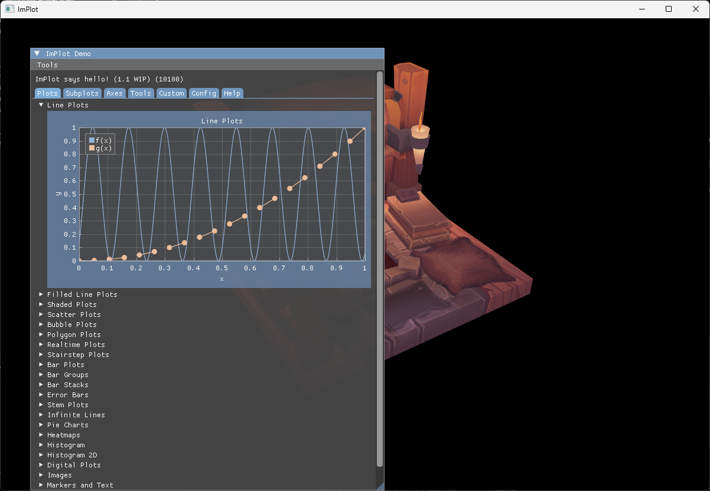

---
title: 38 - ImPlot
nav_order: 40
---

# 38 - ImPlot

ImGui gives us widgets, but plotting real data with it is painful: every chart is hand-drawn lines, axes, ticks and labels. ImPlot fixes that. It is a plotting library that sits on top of ImGui, in the same immediate mode spirit, and brings ready-made plots, subplots, drag tools, colormaps and a time axis. The demo window alone covers most of the API, so this step focuses on wiring ImPlot in and opening that demo.

The full source for this step lives in [src/38_implot/main.odin](https://github.com/Hilderin/OdinVulkan/blob/main/src/38_implot/main.odin), the ovk wrapper in [libs/ovk/implot.odin](https://github.com/Hilderin/OdinVulkan/blob/main/libs/ovk/implot.odin) and the binding in [libs/implot](https://github.com/Hilderin/OdinVulkan/tree/main/libs/implot).

References:
- [ImPlot](https://github.com/epezent/implot) - the original C++ library.
- [cimplot](https://github.com/cimgui/cimplot) - the C API of ImPlot, which the binding wraps.
- [Rebuilding the ImPlot library](./implot_build.md) - how to rebuild the C library for Windows and Linux.

---

## Objectives

- Vendor the ImPlot binding into `libs/implot` and build its C library.
- Create the ImPlot context alongside the ImGui context.
- Draw the ImPlot demo window on top of the viking room.

---

## Concepts

### ImPlot draws through ImGui

ImPlot has no renderer of its own. It computes points, axes and labels, then hands them to the current ImGui window's draw list. That is why this step needed almost no Vulkan work: the ImGui integration from step 37 already renders whatever ImGui records, and ImPlot plots are just ImGui draw commands. The viking room behind stays visible because the ImGui pass uses `loadOp = .LOAD`, exactly like the demo window before it.

### ImPlot has its own context

ImGui keeps global state (windows, widgets, style) in its context. ImPlot does the same, on top of ImGui: plot state, colormaps and the style live in an ImPlot context. `CreateContext` (`libs/implot/implot.odin`) creates one and makes it current. You can switch contexts with `SetCurrentContext`, but a single context for the whole app is the common case.

The contexts nest: an ImPlot context exists inside an ImGui frame. That is why the ImPlot context is created after `init_imgui` and destroyed before `destroy_imgui` in `destroy_app` (`src/38_implot/main.odin`). Creating it before ImGui exists would leave ImPlot without a host to draw into.

### The binding wraps a C library

Like `libs/imgui`, `implot.odin` is not a pure Odin implementation. It wraps the C API of ImPlot - [cimplot](https://github.com/cimgui/cimplot), the C binding generated from implot.h - and links against a static library. The library is compiled from `cimplot.cpp` plus the implot sources, once per platform, and dropped next to the binding: `implot_windows_x64.lib` on Windows, `libimplot_linux_x64.a` on Linux. Both are committed, so the project compiles out of the box. Rebuilding is only needed when upgrading; the procedure is in [Rebuilding the ImPlot library](./implot_build.md).

The binding is written by hand, not generated. ImPlot's public API is small enough that a curated binding beats an auto-generated one: the C API exposes every template variant of `PlotLine` for every integer type (S8, U8, S16, ...), and most of those are noise. The binding keeps the double, float and getter variants, which cover the realistic cases, and skips the internal API (ticks, axes internals, the `ImPool`/`ImVector` machinery). It follows the naming of `imgui.odin`: the `ImPlot_` prefix is stripped from functions, `ImPlot` from types, and flag types use the `Flags :: bit_set[Flag; i32]` pair convention (`libs/implot/implot.odin`).

---

## Implementation

### libs/implot

The vendored folder mirrors `libs/imgui`: `implot.odin`, the prebuilt static libraries and a `build/` folder with the rebuild scripts and their documentation. The `foreign import` block at the top of `implot.odin` selects the library per OS and architecture, and the C++ standard library is required on Linux and macOS, same as the ImGui binding.

The binding defines the types you pass around: `Point`, `Range`, `Rect` for plot coordinates (`libs/implot/implot.odin`), the `Spec` struct that tunes a plot item (`libs/implot/implot.odin`), the `Style` struct (`libs/implot/implot.odin`), and the enums for flags, colors, markers and colormaps. The shared ImGui types (`Vec2`, `Vec4`, `TextureRef`, `DrawList`, ...) are imported from the imgui package rather than redefined, so both bindings agree on layout.

### libs/ovk/implot.odin

The ovk wrapper is deliberately small, because ImPlot needs so little setup. It only owns the ImPlot context pointer:

```c
ImPlot :: struct {
	ctx: ^implot.Context,
}
```

`init_implot` (`libs/ovk/implot.odin`) creates the context and returns it through the ovk `Error` protocol, like the rest of the framework. `destroy_implot` (`libs/ovk/implot.odin`) destroys it and clears the pointer. There is no frame helper: ImPlot draws through ImGui's frame, so `imgui_new_frame` and `cmd_draw_imgui` already cover it.

### src/38_implot/main.odin

The changes over step 37 are minimal:

- `import implot "../../libs/implot"` (`src/38_implot/main.odin`).
- The `App` struct gains an `implot` field of type `ovk.ImPlot` (`src/38_implot/main.odin`).
- The window title becomes "ImPlot" (`src/38_implot/main.odin`).

In `init_app`, after `init_imgui`, the ImPlot context is created and becomes current:

```c
app.implot = ovk.init_implot() or_return
```

In `destroy_app`, the ImPlot context goes away before the ImGui one (`src/38_implot/main.odin`), because an ImPlot context lives inside the ImGui context:

```c
ovk.destroy_implot(&app.implot)
ovk.destroy_imgui(&app.imgui)
```

In the render loop, the demo window opens once per frame, right after the ImGui frame starts (`src/38_implot/main.odin`):

```c
ovk.imgui_new_frame()
implot.ShowDemoWindow(nil)
im.Render()
```

`ShowDemoWindow` takes an optional `bool*` to toggle visibility from the code; `nil` means the window cannot be closed programmatically, only through its own close button.

That is the whole integration. Every ImPlot call between `imgui_new_frame` and `Render` draws into the current ImGui frame, and `cmd_draw_imgui` renders it all in one pass.

---

## Results

The app opens a window showing the rotating viking room with the ImPlot demo window on top. The demo is worth spending a minute on: it groups the plots by theme - line and scatter plots, bar charts, histograms, heatmaps, pie charts, subplots, drag tools, colormaps - and every sample is interactive. Drag the crosshairs, zoom with the scroll wheel, double-click an axis to fit the data.



The console shows the usual startup messages and no new validation errors. Common issues at this step:

- A link error mentioning `implot_windows_x64.lib` or `libimplot_linux_x64.a`: the library is missing from `libs/implot`. Rebuild it with the procedure in [Rebuilding the ImPlot library](./implot_build.md).
- The app crashes on startup with an ImPlot assert: the ImPlot context was created before the ImGui context, or destroyed after it. Create ImPlot right after `init_imgui` and destroy it right before `destroy_imgui`.
- The plot area is blank but the window is there: the ImPlot calls happen outside an ImGui frame, or outside a `BeginPlot`/`EndPlot` pair. Every plot must start with `BeginPlot` and end with `EndPlot`, both inside the ImGui frame.
