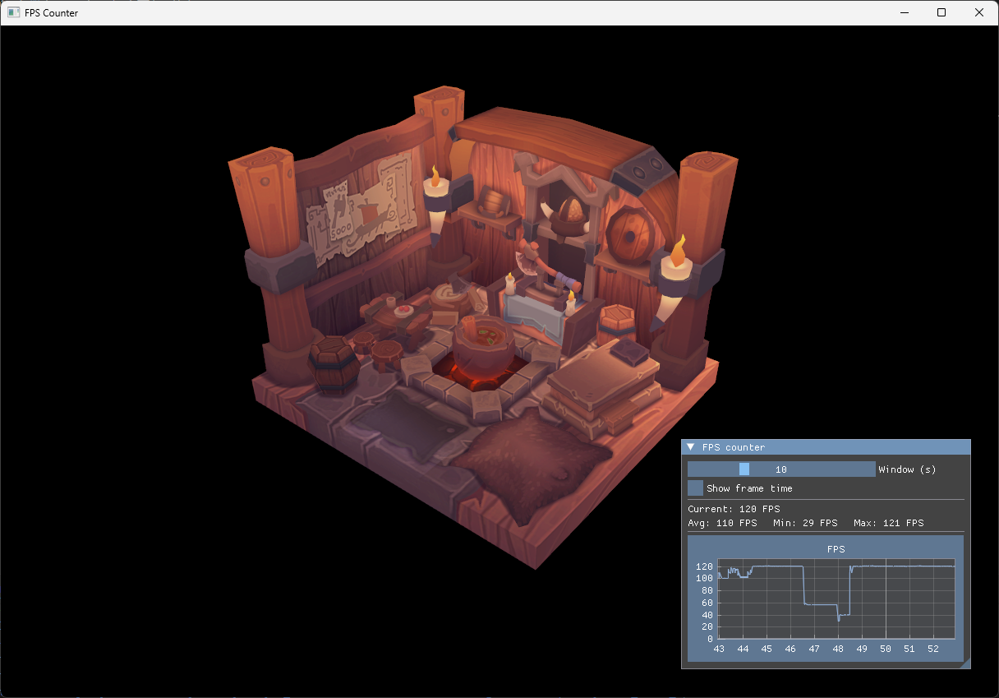

# 39 - FPS Counter

Step 38 wired ImPlot and opened its demo window. This step replaces the demo with something every graphics app eventually needs: an FPS counter and a scrolling graph of the frame rate over the last few seconds. The viking room is still there, rotating in the background; the performance overlay floats on top.

The full source for this step lives in [src/39_fps_counter/main.odin](https://github.com/Hilderin/OdinVulkan/blob/main/src/39_fps_counter/main.odin) and [src/39_fps_counter/fps_counter.odin](https://github.com/Hilderin/OdinVulkan/blob/main/src/39_fps_counter/fps_counter.odin).

---

## Objectives

- Measure the frame rate each frame, keep a rolling history and display it.
- Draw an ImGui window with the current FPS, the average/min/max over a configurable time window, and a scrolling ImPlot graph.
- Keep the FPS counter code in its own file (`fps_counter.odin`), not in `ovk`: the wrapper is a Vulkan framework, this is application logic.

---

## Concepts

### Smoothed FPS, not raw frame delta

The naive approach is `fps = 1.0 / (now - previous_now)`, measured with `glfw.GetTime()`. It works, but at high frame rates the per-frame delta is dominated by timer jitter: a 0.5 ms frame gives 2000 FPS, the next 0.6 ms frame gives 1666 FPS, and the graph is a wall of noise. Worse, the occasional 0.01 ms spike (Windows timer hiccup) pushes the Y-axis auto-range to 100000, crushing the real signal into an invisible flat line at the bottom.

ImGui already solves this. Its `IO.Framerate` field is a rolling average over ~60 frames, updated every frame after `imgui_new_frame`. It is smooth, stable, and good enough for a performance overlay. The counter reads `im.GetIO().Framerate` and pushes that into the history, so the graph shows a clean line around the real frame rate instead of a jittery mess.

### A ring buffer for the history

The history is a fixed-size array of `(time, fps)` pairs, used as a ring buffer. `head` is the next slot to write, and each push overwrites the oldest sample when the buffer is full. With `FPS_HISTORY_CAPACITY = 4096`, that is more than a minute of history at 60 FPS, plenty for a 60 second window. No allocation happens per frame: the array lives in the `Fps_History` struct, which lives in the `App` struct.

### PlotLineG and the getter callback

ImPlot can plot from two parallel arrays (`PlotLine_doublePtrdoublePtr`), but that means copying the visible samples out of the ring buffer into a contiguous buffer every frame. Instead, the step uses `PlotLineG`, which takes a getter callback. ImPlot calls the getter with an index, the getter maps that index to the ring buffer and returns the `Point`. No copy, no `make`/`delete` per frame.

The getter receives the `Fps_History` pointer as an opaque `rawptr` (`user_data`), casts it back, and computes the ring index from the plot index. The math is a modular arithmetic trick: the oldest visible sample sits at `(head - visible_count) mod capacity`, and each subsequent index advances by one. The `visible_count` field is set by `fps_history_stats` right before the plot call, so the getter and the stats agree on which samples are visible.

### The frame time toggle

The checkbox flips between FPS and frame time (milliseconds). The stored samples are always FPS, so the transform `1000 / fps` is applied in both the getter and the stats when `show_frame_time` is on. The Y-axis format and limits are recomputed each frame to match.

---

## Implementation

### src/39_fps_counter/fps_counter.odin

This file contains all the FPS counter logic. It is in the same package as `main.odin` (package `main`), so `main` just calls its three public procs: `fps_counter_init`, `fps_history_update` and `fps_counter_render`.

The `Fps_History` struct holds the ring buffer and the render state:


```c
Fps_History :: struct {
	samples:         [FPS_HISTORY_CAPACITY]implot.Point,
	head:            int,
	total:           int,
	window_seconds:  f32,
	show_frame_time: bool,
	current_fps:     f64,
	visible_count:   int,
}
```


`fps_history_update` reads ImGui's smoothed framerate and pushes a sample:

```c
fps_history_update :: proc(h: ^Fps_History, now: f64) -> f64 {
	io := im.GetIO()
	fps := f64(io.Framerate)
	h.current_fps = fps
	fps_history_push(h, now, fps)
	return fps
}
```

`fps_history_stats` walks the visible window backwards from the newest sample, computing the average, min and max. It also returns the count, which is stored in `h.visible_count` for the getter to use.

The getter maps the linear plot index to the ring buffer:

```c
fps_plot_getter :: proc(idx: i32, user_data: rawptr) -> implot.Point {
	h := (^Fps_History)(user_data)
	ring_index := (h.head - h.visible_count + int(idx) + FPS_HISTORY_CAPACITY) % FPS_HISTORY_CAPACITY
	point := h.samples[ring_index]
	if h.show_frame_time {
		point.y = 1000.0 / point.y
	}
	return point
}
```

`fps_counter_render` builds the ImGui window: a slider for the time window (2 to 30 seconds), a checkbox for the frame time toggle, the current FPS and stats, and the scrolling plot. The X-axis is locked to `[now - window, now]` with `.Always`, so the graph scrolls left as time advances. The Y-axis is `[0, max * 1.1]`, recomputed each frame.

### src/39_fps_counter/main.odin

The changes over step 38 are minimal:

- `import implot` is gone from `main.odin`; all ImPlot usage moved to `fps_counter.odin`.
- The `App` struct gains a `fps: Fps_History` field.
- `init_app` calls `fps_counter_init(&app.fps)` after the ImPlot context is created.
- The render loop replaces `implot.ShowDemoWindow(nil)` with `fps_counter_render(&app.fps, now)`.
- Each frame, before the ImGui frame, `glfw.GetTime()` provides the timestamp and `fps_history_update` pushes a sample.

---

## Results

The app opens with the viking room rotating behind a small "FPS counter" window in the top-left corner. The window shows the current FPS, the average/min/max over the visible window, and a scrolling graph. The slider changes the time window; the checkbox toggles between FPS and frame time in milliseconds.



The console shows the usual startup messages and no new validation errors. Common issues at this step:

- The graph frame and axes appear but no line is drawn: the `Spec` passed to `PlotLineG` was zeroed. The binding wrappers handle this by using a default `Spec` when the parameter is omitted, so this only happens if you pass a custom `Spec{}`. See "The Spec trap" in [step 38](./38_implot.md).
- The line is a flat invisible line at the bottom: the Y-axis range was crushed by an outlier spike. The smoothed framerate from `im.GetIO().Framerate` prevents this; if you switch back to raw `1.0 / delta`, the first few frames will spike to thousands of FPS and wreck the auto-range.