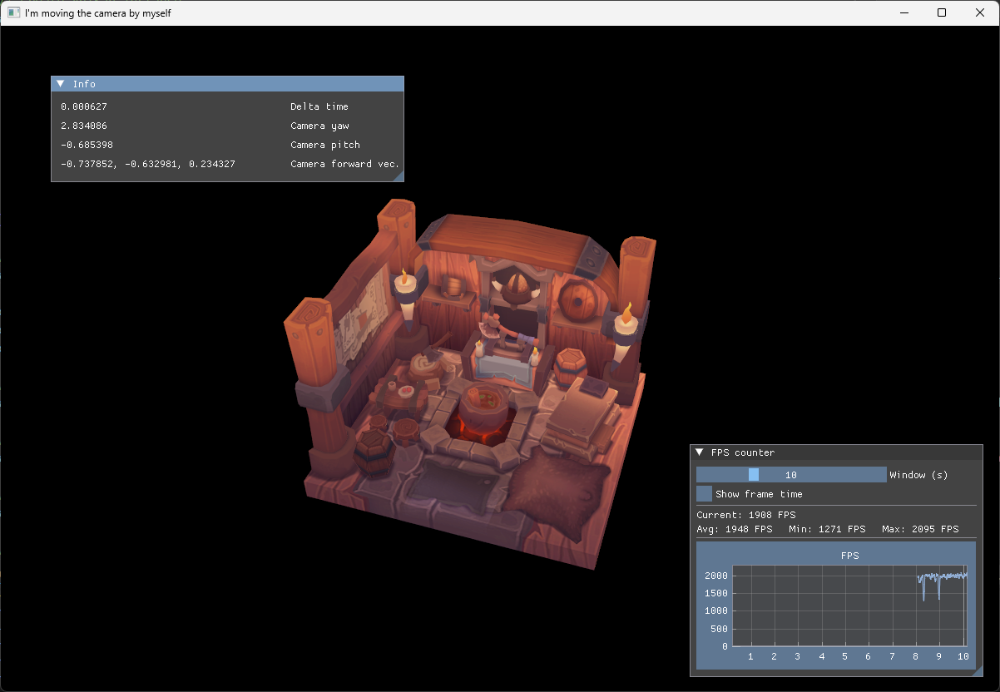

# 40 - Camera User Movement

Step 39 added the FPS counter, but the camera was still fixed in the scene. This step turns it into a small first-person camera: the keyboard moves it, the mouse rotates it, and the view is rebuilt every frame.

The full source for this step lives in [src/40_camera_user_movement/main.odin](https://github.com/Hilderin/OdinVulkan/blob/main/src/40_camera_user_movement/main.odin), [src/40_camera_user_movement/camera.odin](https://github.com/Hilderin/OdinVulkan/blob/main/src/40_camera_user_movement/camera.odin), and the input helpers are in [libs/ovk/glfw.odin](https://github.com/Hilderin/OdinVulkan/blob/main/libs/ovk/glfw.odin).

## What we want to prove

- Movement must be based on elapsed time, not on the number of frames rendered.
- A camera can be described with a position, a yaw and a pitch for this FPS-style movement.
- The camera needs three useful directions: forward, right and up.
- The view matrix is built from the camera position and forward direction.
- The world uses Y as its up axis, while the model asset was authored with Z as its up axis, so the model needs an axis conversion.
- Input callbacks should collect input and update the camera without mixing GLFW details into the camera code.

## What changed since step 39

The rendering setup is almost unchanged. The important differences are in `main.odin`:

- `App` now stores `delta_time`, the camera and the current state of the movement keys.
- The old fixed `matrix4_look_at` call is replaced by `get_camera_view_matrix`.
- The rotating model is replaced by a fixed Z-up to Y-up conversion matrix.
- GLFW key and cursor callbacks are registered for keyboard movement and freelook.
- The loop computes `delta_time` before updating the camera.

The camera itself lives in `camera.odin`, while the GLFW callback and input state stay in `main.odin`. This keeps the camera independent from the source of the input. A future gamepad or scripted camera could call the same camera procedures without pretending that its values came from a mouse.

## Coordinate systems

### Choosing our standard

Until now, most of the code could get away with using whatever axes the current example happened to use. That stops being practical once we can move a camera. From this step onward, we need one coordinate standard for the whole project. It determines how we place objects, move them, calculate their forward direction, build camera vectors, and interpret model data.

There is no single coordinate system used by every 3D tool. Some use Y as up, some use Z as up, and they do not all agree on which direction is forward. We need to choose one and keep it consistent instead of making every piece of code guess.

Our standard is:

- `+X` points to the right.
- `+Y` points up.
- `-Z` points forward from the camera.
- `+Z` points behind the camera.

The world up vector used by the camera is therefore:


```c
world_up := vec3{0.0, 1.0, 0.0}
```


The important distinction is that `+Y` is the up direction of the **world**, while `-Z` is the forward direction of the **camera** after the view transform. These are not contradictory. A camera can be Y-up and look toward `-Z`.

Here is the convention in one view:

```text
                         +Y (up)
                          |
                          |
                          o-------- +X (right)
                         /
                        /
                 +Z (back)
```

### Handedness

This convention is **right-handed**. The handedness is determined by the relationship between the axes, not by the fact that Y is up. Using the right-hand rule:

```text
+X cross +Y = +Z
```

So if the index finger points along `+X` and the middle finger points along `+Y`, the thumb points along `+Z`. The camera looks along the opposite direction on that same axis: `-Z`. In the diagram, `+Z` points behind the camera and `-Z` points in front of it.

It is easy to call this left-handed by looking only at the screen or at the word "forward". The sign matters: `+X` right, `+Y` up and `+Z` forward would be a different, left-handed convention. We use `-Z` forward, which is the familiar right-handed convention used by OpenGL-style camera systems and by Godot.

Vulkan does not force our world to be left-handed or right-handed. It defines the clip-space and normalized-device-coordinate rules that the projection matrix must follow, such as Vulkan's `[0, 1]` depth range. The application chooses its world convention, then model, view, projection, front-face and camera calculations must all agree with it.

### Other tools

These are the common defaults, although import settings and project settings can change the result for a particular asset:

| Tool or engine | Common 3D convention |
|---|---|
| Blender | Right-handed, Z-up. The default front direction is commonly described as `-Y`. |
| Maya | Right-handed, Y-up by default. |
| Unreal Engine | Left-handed, Z-up. `+X` is forward, `+Y` is right and `+Z` is up. |
| Unity | Left-handed, Y-up. `+Y` is up and `+Z` is the usual forward direction. |
| Godot | Right-handed, Y-up. In Godot 4, `-Z` is the usual forward direction. |

For a visual explanation of local, world, view and clip coordinate spaces, see [LearnOpenGL - Coordinate Systems](https://learnopengl.com/Getting-started/Coordinate-Systems).

### Converting the model

The `viking_room.obj` asset uses Z as its up axis, like Blender's usual scene convention. It does not match the Y-up standard we just chose. If we only change the camera, the room is rotated relative to the rest of the scene.

The model matrix applies the conversion before the view transform:


```c
z_to_y := la.matrix4_rotate(math.to_radians_f32(-90.0), vec3{1.0, 0.0, 0.0})
```


This rotation maps the asset's `+Z` direction to the world's `+Y` direction. The model is converted once conceptually, even though the matrix is currently created while updating the uniform buffer.

The complete transform is still the usual chain:

```text
model coordinates -> world coordinates -> camera coordinates -> clip coordinates
          model matrix       view matrix          projection matrix
```

## Delta time

The camera moves in the application loop, so the first question is how far it should move during one iteration. The answer must not be "one unit per frame". At 60 FPS that would be 60 units per second; at 144 FPS it would be 144 units per second.

The loop measures the elapsed time between two calls to `glfw.GetTime`:


```c
last_frame := glfw.GetTime()
for !ovk.window_should_close(&app.window) && app.running {
    now := glfw.GetTime()
    app.delta_time = f32(now - last_frame)
    last_frame = now

    ovk.poll_events()
    update_camera_movement(app)
}
```


`delta_time` is measured in seconds. If a frame takes 16 milliseconds, its value is approximately `0.016`. Movement uses:

```text
distance this frame = speed * delta_time
```

The current speed is `10.0` world units per second:


```c
app.camera.position += la.normalize(direction) * (10.0 * app.delta_time)
```


This makes movement approximately independent of the frame rate. A slower frame moves farther during that frame, and a faster frame moves a shorter distance.

There is another important detail here: `delta_time` is calculated before `poll_events`, but the input is applied after it. That means keyboard events received during this iteration affect the movement update for the same frame.

## The camera state

The camera only stores what it needs for this style of movement:


```c
Camera :: struct {
    position: vec3,
    yaw:      f32,
    pitch:    f32,
}
```


`position` is a point in world space. `yaw` rotates around the world Y axis, and `pitch` looks up or down. Both angles are stored in radians because the math library expects radians.

This is intentionally not a general-purpose orientation type. An FPS camera normally keeps the horizon level and does not roll, so two angles are enough for the movement we need here.

### Looking at a target

`camera_look_at` converts a target direction into the two angles:


```c
direction := la.normalize(target - camera.position)
camera.yaw = math.atan2(direction.z, direction.x)
camera.pitch = math.asin(direction.y)
```


The direction from the camera to the target is the vector `target - position`. Normalizing it removes the distance and leaves only its orientation.

For the horizontal direction, `atan2` is used instead of `atan`. It keeps the signs of both components and therefore distinguishes all four horizontal quadrants. `asin` extracts the vertical angle because the Y component of a normalized direction is `sin(pitch)`.

### Applying a rotation

The camera does not know that the values came from a mouse:


```c
camera_rotate :: proc(camera: ^Camera, yaw_delta, pitch_delta: f32) {
    camera.yaw += yaw_delta
    camera.pitch += pitch_delta

    limit := math.to_radians_f32(89.0)
    camera.pitch = math.clamp(camera.pitch, -limit, limit)
}
```


The mouse callback converts pixels into angle deltas before calling this procedure. The camera only receives an orientation change, so another input device could use it as well.

The pitch limit is just below 90 degrees. Looking exactly along `+Y` or `-Y` makes the forward vector parallel to the world up vector. The cross product used to calculate the right vector would then have zero length. Keeping the pitch below 90 degrees avoids that singular case and also keeps the FPS camera from flipping over.

## Camera direction vectors

The three vectors used by the camera are derived from yaw and pitch.

### Forward

The forward vector is:


```c
cos_pitch := math.cos(camera.pitch)
return vec3{
    math.cos(camera.yaw) * cos_pitch,
    math.sin(camera.pitch),
    math.sin(camera.yaw) * cos_pitch,
}
```


It helps to build this vector in two steps. First, `yaw` chooses a direction on the horizontal XZ plane. With no pitch, that direction is:

```text
horizontal.x = cos(yaw)
horizontal.z = sin(yaw)
```

Then `pitch` tilts that horizontal direction up or down. The Y component is `sin(pitch)`. The part that remains on the horizontal plane has length `cos(pitch)`, so both horizontal components use that factor:

```text
forward.x = cos(yaw) * cos(pitch)
forward.y = sin(pitch)
forward.z = sin(yaw) * cos(pitch)
```

Some simple values make the convention easier to check:

- `yaw = 0`, `pitch = 0` gives `(1, 0, 0)`, so forward is `+X`.
- `yaw = pi/2`, `pitch = 0` gives `(0, 0, 1)`, so forward is `+Z`.
- `pitch > 0` adds a positive Y component, so the camera looks up.
- `pitch < 0` adds a negative Y component, so the camera looks down.

The vector has length one by construction. The squared length is:

```text
cos²(pitch) * (cos²(yaw) + sin²(yaw)) + sin²(pitch)
= cos²(pitch) + sin²(pitch)
= 1
```

The actual values can still be very slightly different because of floating-point rounding, but no extra normalization is normally needed here.

### Right

The camera strafes along a horizontal right vector:


```c
get_camera_right_vector :: proc(camera: ^Camera) -> vec3 {
    return la.normalize(la.cross(get_camera_forward_vector(camera), vec3{0.0, 1.0, 0.0}))
}
```


The cross product gives a vector perpendicular to both inputs. With a forward direction of `(0, 0, -1)` and world up `(0, 1, 0)`, the result is `(1, 0, 0)`, which is the camera's right direction.

The order matters. `cross(forward, up)` gives right; reversing the operands would give left.

Even though `forward` is normalized, the cross product still needs to be normalized. The length of a cross product is `length(a) * length(b) * sin(angle)`. `forward` and `world_up` are not perpendicular when the camera is pitched up or down, so the right vector has a length of `cos(pitch)` instead of `1`. `la.normalize` brings it back to a unit vector before it is used for strafing.

### Up

The camera up vector is built from right and forward:


```c
get_camera_up_vector :: proc(camera: ^Camera) -> vec3 {
    return la.normalize(la.cross(get_camera_right_vector(camera), get_camera_forward_vector(camera)))
}
```


This is the camera's actual up direction after pitch. It is different from the world up vector when the camera looks up or down. The world up vector is used for vertical movement; the camera up vector is useful when building camera-relative effects or drawing debug axes.

### Combining movement

`update_camera_movement` adds the vectors for all currently held keys. W/S use forward, A/D use right, and E/Q use the world up vector:


```c
if app.move_forward {
    direction += forward
}
if app.move_backward {
    direction -= forward
}
if app.move_right {
    direction += right
}
if app.move_left {
    direction -= right
}
if app.move_up {
    direction += world_up
}
if app.move_down {
    direction -= world_up
}
```


The final direction is normalized before applying speed. Without this step, pressing W and D at the same time would move at `sqrt(2)` times the normal speed because two perpendicular unit vectors were added together.

The current controls are:

| Input | Action |
|---|---|
| W / S | Forward / backward |
| A / D | Strafe left / right |
| E / Q | Move up / down |
| Mouse | Freelook |
| Escape | Quit |

## The view matrix

The view matrix converts world coordinates into camera coordinates. It is not the camera's position and orientation copied directly into a matrix. It is the inverse transform: from the world back into the camera's point of view.

The code gives `matrix4_look_at` the camera position, a point one forward vector away, and the world up direction:


```c
get_camera_view_matrix :: proc(camera: ^Camera) -> mat4 {
    forward := get_camera_forward_vector(camera)
    return la.matrix4_look_at(
        camera.position,
        camera.position + forward,
        vec3{0.0, 1.0, 0.0},
    )
}
```


Conceptually, the look-at matrix builds three camera axes:

```text
right = normalize(cross(forward, world_up))
up    = cross(right, forward)
back  = -forward
```

Those axes become the rotation part of the view matrix. The translation part moves the world by `-camera.position`, expressed in the new camera axes. That is why moving the camera forward is equivalent to moving the world backward in the view transformation.

The uniform buffer now receives the three transforms:


```c
Uniform_Buffer_Object {
    model = z_to_y,
    view  = get_camera_view_matrix(camera),
    proj  = ovk.matrix4_perspective_vulkan(45_degrees, aspect, 0.1, 10.0),
}
```


The projection matrix has not changed conceptually since step 39. `matrix4_perspective_vulkan` still handles Vulkan's `[0, 1]` depth range and the Vulkan Y direction. The new work in this step is the view matrix and the model axis conversion.

## Input and mouse freelook

The keyboard callback does not move the camera immediately. It records whether a key is currently held:


```c
pressed := action != glfw.RELEASE

if key == glfw.KEY_W {
    app.move_forward = pressed
} else if key == glfw.KEY_A {
    app.move_left = pressed
}
```


The frame loop consumes those booleans in `update_camera_movement`. This is important because a callback is an event notification, not a frame update. It may receive a press once and a release much later, while the camera needs to move every frame in between.

The mouse callback stores the previous cursor position, calculates a pixel delta, and converts it to angle deltas:


```c
delta_x := f32(xpos - app.last_mouse_x)
delta_y := f32(ypos - app.last_mouse_y)

mouse_sensitivity := f32(0.0025)
camera_rotate(&app.camera, delta_x * mouse_sensitivity, -delta_y * mouse_sensitivity)
```


The Y delta is negated so moving the mouse up makes the camera look up. The first mouse event is ignored after storing its position; otherwise the camera could jump when the cursor is first captured.

`ovk.capture_mouse` hides and captures the cursor. Capturing means that the window keeps receiving mouse movement while the pointer is prevented from escaping to the edge of the screen. The cursor is invisible because the mouse is being used as a source of relative movement, not as a visible pointer selecting something in the UI. This lets the user keep turning the camera without running out of screen space. `ovk.set_cursor_pos_callback` follows the same callback-chaining pattern as the existing key callback. The application uses `ovk` for that GLFW plumbing, while the camera only deals with angles and vectors.

## Results

The window should show the viking room and the `Info` panel. The panel displays `delta_time`, yaw, pitch and the current forward vector. Moving the mouse should rotate the view without letting the cursor leave the window. W/S moves forward and backward, A/D strafes, and E/Q moves vertically.



The value of `delta_time` will vary slightly from frame to frame. That is normal. What should remain stable is the movement speed: the camera should cover roughly the same distance in one second on a 60 Hz display and on a faster display.

Common problems at this step:

- The camera moves faster when the frame rate increases: movement is probably missing `delta_time`.
- Diagonal movement is faster: normalize the combined direction after adding forward, right and up.
- The camera flips when looking straight up: keep the pitch below 90 degrees.
- The model appears on its side: the Z-up asset conversion is missing from the model matrix.
- The first mouse movement causes a large jump: initialize the previous cursor position on the first cursor event.
- Mouse movement stops reaching the application: check that the cursor callback is registered through `ovk` and that the callback user pointer is the `App` pointer.
