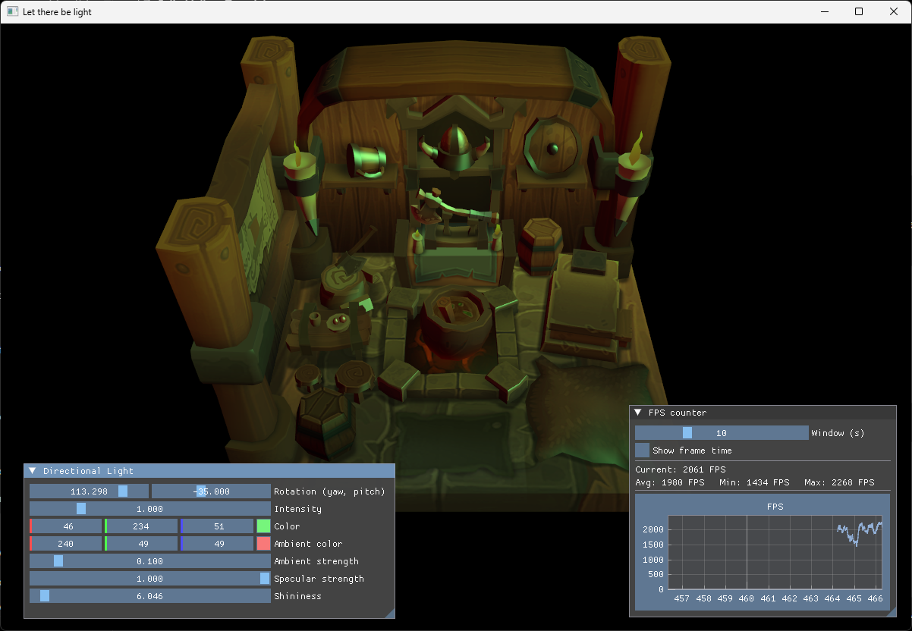
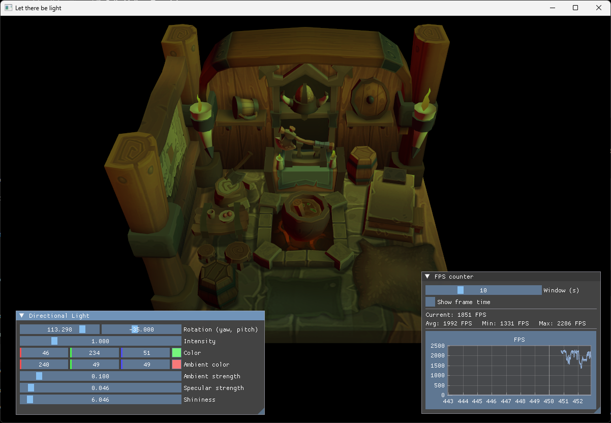
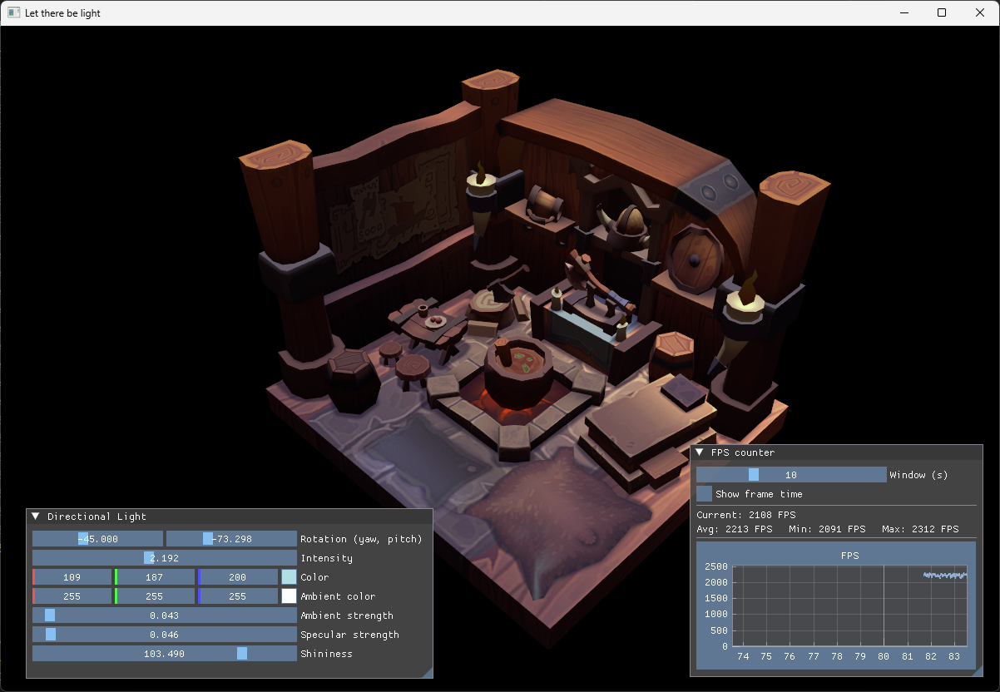

# 41 - Directional Light

The camera can move now, but the model still uses its texture without any real lighting. This step adds a directional light and a simple Phong shader. The light can be changed while the application is running, so it is also a useful way to see what the normal data is doing.

The full source for this step lives in [src/41_directional_light/main.odin](https://github.com/Hilderin/OdinVulkan/blob/main/src/41_directional_light/main.odin), [src/41_directional_light/directional_light.odin](https://github.com/Hilderin/OdinVulkan/blob/main/src/41_directional_light/directional_light.odin), and [src/41_directional_light/shader.slang](https://github.com/Hilderin/OdinVulkan/blob/main/src/41_directional_light/shader.slang). The model normal changes are in [libs/ovk/types.odin](https://github.com/Hilderin/OdinVulkan/blob/main/libs/ovk/types.odin) and [libs/ovk/model.odin](https://github.com/Hilderin/OdinVulkan/blob/main/libs/ovk/model.odin).

## What we want to prove

- A directional light can be described by a direction, a color, an intensity and the standard Phong strengths.
- Vertex normals need to travel from the model loader to the vertex shader and then to the fragment shader.
- A fragment shader can combine ambient, diffuse and specular terms to produce a basic Phong result.
- The camera position is needed for the specular term.
- ImGui can update lighting values directly in the application state.
- The camera capture needs an explicit toggle when the same window also contains an interactive UI.

## The light has no position

A point light needs a position because its direction changes from one fragment to another. A directional light represents something much farther away, such as the sun. Every fragment receives the same incoming direction, so the light only needs a direction.

The application stores the direction as yaw and pitch angles. The angles are in degrees because they are edited by sliders. The math code converts them to radians before calling the trigonometric functions:


```c
Directional_Light :: struct {
    rotation:          vec2,
    intensity:         f32,
    color:             vec3,
    ambient_color:     vec3,
    ambient_strength:  f32,
    specular_strength: f32,
    shininess:         f32,
}

get_directional_light_direction :: proc(light: ^Directional_Light) -> vec3 {
    yaw := math.to_radians_f32(light.rotation.x)
    pitch := math.to_radians_f32(light.rotation.y)
    cos_pitch := math.cos(pitch)

    return la.normalize(vec3{
        math.cos(yaw) * cos_pitch,
        math.sin(pitch),
        math.sin(yaw) * cos_pitch,
    })
}
```


The resulting vector describes the direction in which the light travels. In the fragment shader, `-lightDirection` is used as the vector from the surface toward the light. Keeping that convention explicit avoids the common mistake of getting a perfectly valid result with the light coming from the opposite side.

## Normals in the vertex data

The model loader already reads positions, colors and texture coordinates. A lit surface also needs a normal for each vertex. `ovk.Vertex` now contains:


```c
Vertex :: struct {
    pos:      vec3,
    color:    vec3,
    texCoord: vec2,
    normal:   vec3,
}
```


The OBJ loader reads the normal index from each face and stores the corresponding normal in the vertex data. The graphics pipeline describes it as a fourth vertex attribute:


```c
{binding = 0, location = 3, format = .R32G32B32_SFLOAT,
 offset = u32(offset_of(ovk.Vertex, normal))},
```


The order and offsets must agree in three places: the Odin `Vertex` struct, the Vulkan vertex attribute descriptions and the `VSInput` struct in the shader. If one of them is wrong, the shader will read unrelated bytes as the normal and the lighting will look random.

## Passing the light to the GPU

The existing uniform buffer contained the model, view and projection matrices. It now also contains the values required by the fragment shader:


```c
Uniform_Buffer_Object :: struct {
    model:           mat4,
    view:            mat4,
    proj:            mat4,
    light_direction: vec4,
    light_color:     vec4,
    ambient_color:   vec4,
    light_settings:  vec4,
    camera_position: vec4,
}
```


The `vec4` fields are intentional. They match `float4` in Slang and give the light values a simple, predictable four-float layout in the constant buffer. The unused fourth component is padding for the direction and color, while the camera position uses `w = 1.0` as a point.

The directional light color is multiplied by the intensity before it is copied to the mapped buffer. This controls the diffuse and specular contribution. Ambient lighting has its own color and is not multiplied by the directional intensity.

The three other values are packed into a `float4`-compatible field:


```c
light_settings: vec4,
```


Its components are `ambient_strength`, `specular_strength` and `shininess`. The fourth component is unused padding. `ambient_color` is stored separately because ambient light is not directional light.

The UBO is now read by both shader stages. The descriptor layout must say so:


```c
{binding = 0, descriptorType = .UNIFORM_BUFFER, descriptorCount = 1,
 stageFlags = {.VERTEX, .FRAGMENT}},
```


Leaving the binding as vertex-only makes Vulkan reject the graphics pipeline because the fragment shader also references `ubo`.

## Transforming the normal

The vertex shader calculates the world position and transforms the normal with the model matrix:


```c
float4 worldPosition = mul(ubo.model, float4(input.inPosition, 1.0));
output.pos = mul(ubo.proj, mul(ubo.view, worldPosition));
output.worldPosition = worldPosition.xyz;
output.normal = normalize(mul((float3x3)ubo.model, input.inNormal));
```


This model matrix currently only contains the Z-up to Y-up rotation, so transforming the normal with its upper-left 3x3 part is enough. If non-uniform scaling is added later, normals should use the inverse-transpose normal matrix instead. That is a small detail that does not matter for this step, but it matters as soon as models can be stretched.

## The Phong terms

The fragment shader uses three pieces of lighting:

- Ambient keeps surfaces from becoming completely black when the diffuse term is small. Its strength controls the amount of base light.
- Diffuse uses `dot(normal, toLight)`, so faces pointed toward the light are brighter.
- Specular uses the reflected light direction and the camera direction to create a highlight. Its strength controls the highlight intensity.
- Shininess is the Phong exponent. A low value creates a broad highlight; a high value creates a small, sharp highlight.

The core calculation is:


```c
float3 normal = normalize(vertIn.normal);
float3 toLight = normalize(-ubo.lightDirection.xyz);
float diffuse = max(dot(normal, toLight), 0.0);

float3 toCamera = normalize(ubo.cameraPosition.xyz - vertIn.worldPosition);
float3 reflected = reflect(-toLight, normal);
float specular = pow(max(dot(toCamera, reflected), 0.0), ubo.lightSettings.z)
               * ubo.lightSettings.y;
```


The final color uses the sampled texture as the surface albedo:


```c
float3 albedo = texture.Sample(vertIn.fragTexCoord).rgb * vertIn.color;
float3 ambient = albedo * ubo.lightSettings.x * ubo.ambientColor.rgb;
float3 lighting = ambient + albedo * diffuse * ubo.lightColor.rgb
                + specular * ubo.lightColor.rgb;
return float4(lighting, 1.0);
```


The ambient value is a separate scene contribution. It uses `ambient_color` and `ambient_strength`, so setting the directional `intensity` to zero removes the diffuse and specular terms but leaves the ambient light visible. This is the more useful behavior when the two types of light are edited independently.

These names are the usual Phong terminology. `ambient_strength` and `specular_strength` are user-friendly multipliers. `shininess` is also called the specular exponent or Phong exponent, and it controls the size of the highlight rather than its overall brightness.

For a visual explanation of the ambient, diffuse and specular components, see [LearnOpenGL - Basic Lighting](https://learnopengl.com/Lighting/Basic-Lighting).

## Editing the light with ImGui

The render loop exposes the three values directly:


```c
im.Begin("Directional Light")
im.SliderFloat2("Rotation (yaw, pitch)", &app.directional_light.rotation, -180.0, 180.0)
im.SliderFloat("Intensity", &app.directional_light.intensity, 0.0, 5.0)
im.ColorEdit3("Color", &app.directional_light.color)
im.ColorEdit3("Ambient color", &app.directional_light.ambient_color)
im.SliderFloat("Ambient strength", &app.directional_light.ambient_strength, 0.0, 1.0)
im.SliderFloat("Specular strength", &app.directional_light.specular_strength, 0.0, 1.0)
im.SliderFloat("Shininess", &app.directional_light.shininess, 1.0, 128.0)
im.End()
```


The UBO is updated after the UI has been built, so changes made by a slider are visible in the same frame. The light itself stays application code in `directional_light.odin`; it does not belong in `ovk`, which contains Vulkan and windowing helpers rather than scene-specific behavior.

## Camera capture toggle

The FPS camera captures the mouse for freelook, but a captured and hidden cursor cannot interact with ImGui. Camera control is therefore disabled by default. Press `F1` to toggle it:

| Input | Action |
|---|---|
| F1 | Enable or disable camera movement and mouse capture |
| W / S | Forward / backward |
| A / D | Strafe left / right |
| E / Q | Move up / down |
| Mouse | Freelook while camera control is enabled |
| Escape | Quit |

When control is disabled, the cursor is made visible and the keyboard and cursor callbacks stop changing the camera. Movement flags are also cleared when toggling, so a key held during the transition cannot leave the camera moving unexpectedly. The first mouse event after re-enabling capture is ignored to avoid a jump.

## Results

The viking room is now textured and lit by a directional light and a separate ambient contribution. The panel lets you change its direction, intensity, color, ambient color, ambient strength, specular strength and shininess while the application is running. Setting intensity to zero removes direct lighting but leaves the ambient color visible. Start with camera control disabled, use the sliders, then press `F1` if you want to inspect the scene from another angle.







Common problems at this step:

- The model is completely absent: check the validation output for a graphics pipeline creation error. The UBO descriptor must be visible to both vertex and fragment stages.
- The model is black with a non-zero intensity: check the normal vertex offset, vertex stride and the normal attribute location.
- The light appears to come from the opposite direction: check whether the shader uses `-ubo.lightDirection` when building `toLight`.
- Intensity zero makes the model completely black: ambient lighting should use `ubo.ambientColor`, not `ubo.lightColor`.
- The specular highlight is too wide or too small: adjust `shininess`; it is an exponent, so its visual response is not linear.
- The sliders cannot be used: press `F1` to release the captured cursor. Camera control starts disabled in this step.
