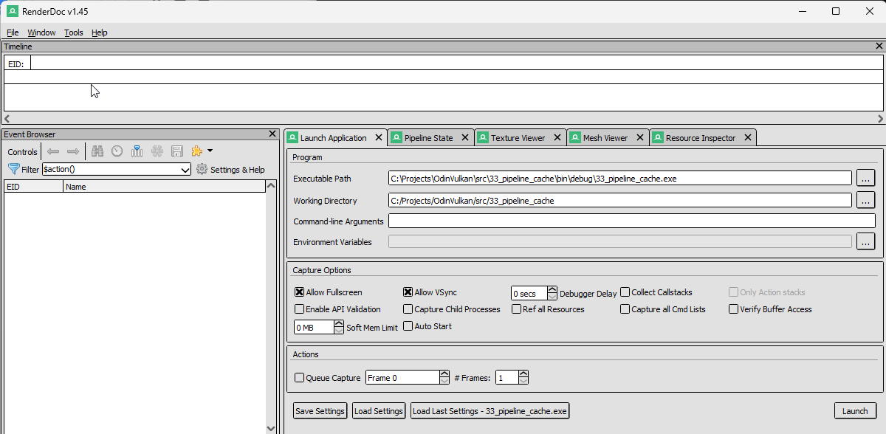
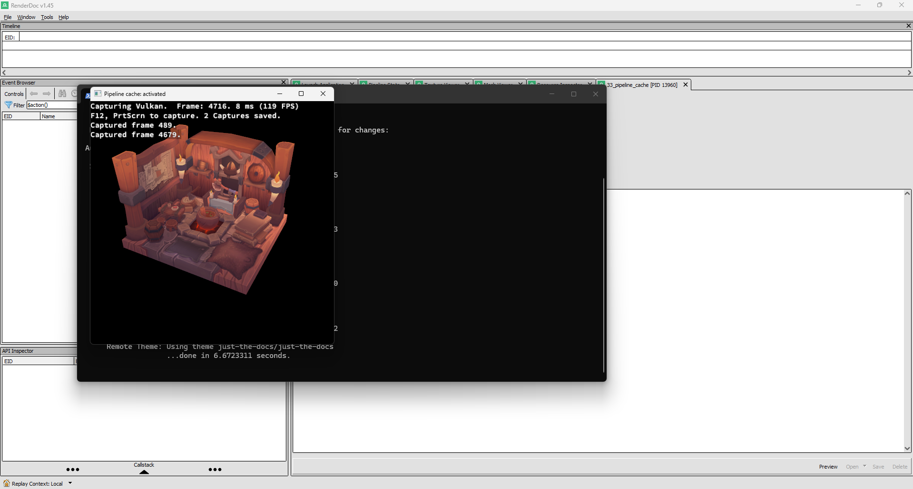
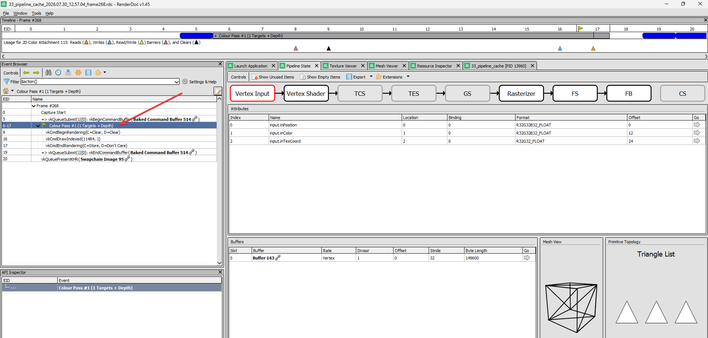
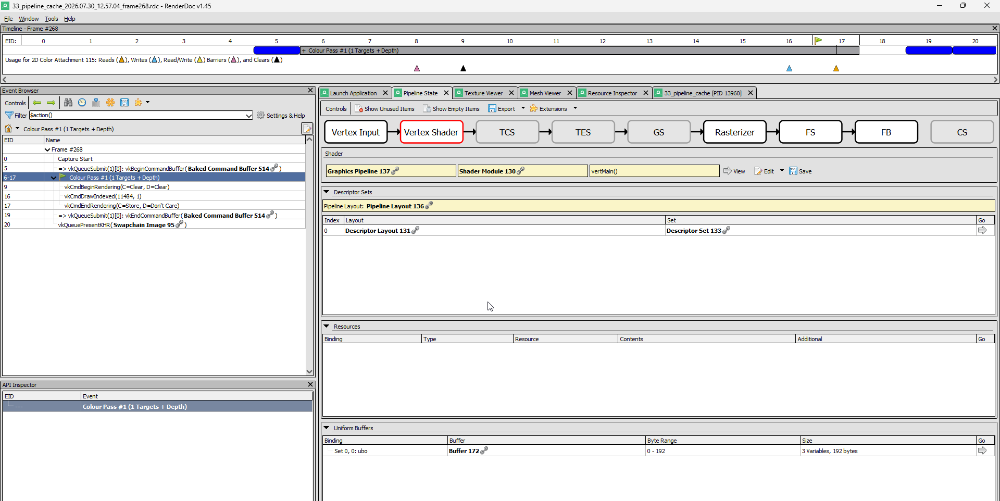
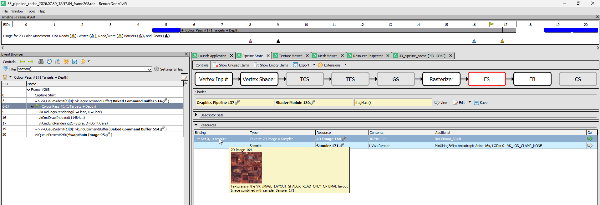
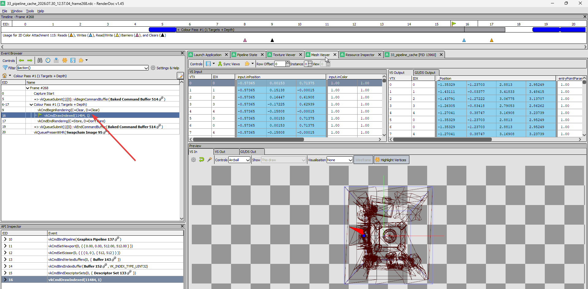

# RenderDoc

RenderDoc is a free, open-source GPU debugger. Think of it as a debugger for your graphics pipeline: you can capture a single frame of your application, then inspect every draw call, every shader, every buffer, and every pipeline state.

RenderDoc is not required, but the moment something doesn't render the way you expect, it will save you hours of head-scratching.

- Official site: <https://renderdoc.org>
- Documentation: <https://renderdoc.org/docs/index.html>
- How to debug a shader in RenderDoc: <https://renderdoc.org/docs/how/how_debug_shader.html>


**Note on performance:** RenderDoc is a GPU debugger, not a profiler. When you have RenderDoc attached (even before capturing), your frame rate will drop. This is normal - it adds overhead per draw call. Don't use it to measure performance, use it to understand what's happening.

Also note that RenderDoc captures everything on the GPU side, including the work from other GPU-using applications that might be running at the same time.


## Installation

### Windows

1. Go to [renderdoc.org](https://renderdoc.org) and download the Windows installer.
2. Run the installer. The default options are fine.
3. Launch RenderDoc from the Start menu.

That's it. RenderDoc integrates directly with Vulkan via the Vulkan layer mechanism - it injects itself without modifying your executable.

### Linux

Most distributions have a RenderDoc package. Pick your poison:

- Debian / Ubuntu:
  ```
  sudo apt install renderdoc
  ```
- Fedora / RHEL:
  ```
  sudo dnf install renderdoc
  ```
- Arch:
  ```
  sudo pacman -S renderdoc
  ```

If the package is too old for your taste, grab a prebuilt AppImage from [renderdoc.org](https://renderdoc.org).

The Vulkan layer is installed automatically alongside the package. If you ever need to check (or toggle) it manually, the configuration file lives at `~/.local/share/renderdoc/vk_layer_settings.txt`.

### macOS

RenderDoc runs on macOS under MoltenVK (the Vulkan-on-Metal translation layer). Not all features are available, but basic capture and shader inspection work.

Download the macOS build from [renderdoc.org](https://renderdoc.org), drag it to Applications.

Note that macOS code signing may block the first launch. If you get a security warning, go to **System Settings > Privacy & Security** and click "Open Anyway".


## Quick start: capturing a frame

The goal is simple: start your application through RenderDoc, press F12 to capture the current frame, then inspect what happened.

### Launching the application from RenderDoc

From RenderDoc's main window, click the **Launch Application** tab (the green play icon). Fill in:

- **Executable path:** path to your project's executable, e.g. `C:/Projects/OdinVulkan/src/33_pipeline_cache/bin/debug/33_pipeline_cache.exe`
- **Working Directory:** set this to the **source root** of your step, *not* the `bin/debug/` folder. For `33_pipeline_cache`, that would be `C:/Projects/OdinVulkan/src/33_pipeline_cache`. This is important because our Odin projects load textures and shaders relative to the source root.
- **Command-line arguments:** leave empty unless your app needs some.

Here is what it looks like:



Click **Launch**. Your application starts as usual, but with a small RenderDoc overlay in the corner (usually a green "F12" indicator).

### Capturing a frame

Once your application is running, press **F12** (or the Print Screen key, depending on configuration). RenderDoc captures the current frame. The application pauses briefly while the capture is written, then continues.

You should see the capture appear in RenderDoc's capture list:



Double-click the capture to open it.


## Exploring a capture

The capture window is where you'll spend most of your time. Here are the key panels and how to use them.

### Event Browser (left panel)

This is the list of every Vulkan command executed during the captured frame, in order. The key entries to look for:

- **`vkCmdDraw` / `vkCmdDrawIndexed`** - an actual draw call. Click one to see what was drawn.
- **Color Pass** entries (boundary markers from the "Color Pass" region) - useful for seeing the full render pass at once.
- **`vkCmdDispatch`** - a compute dispatch.

Always look for the **`vkCmdDraw...`** entries. If you don't see any, your application isn't issuing draw calls (or the capture was taken at the wrong moment).

### Pipeline State

The Pipeline State tab is the control panel of the GPU. It shows every piece of state that the graphics pipeline uses at the selected draw call.

To get meaningful information:

1. **In the Event Browser, click on a Color Pass entry** (or directly on a `vkCmdDraw...` entry).
2. Open the **Pipeline State** tab.

You will see sections for:
- **Vertex Input** - the vertex buffer bindings, vertex attribute formats, and strides. This is where you check that your vertex data layout matches your shader's input declaration.



- **Shader** - the actual GLSL/SPIR-V source of the vertex, fragment (and if applicable, geometry, tessellation, compute) shaders used for this draw. You can step through the shader line by line to debug your math.




- **Rasterizer** - culling mode, front face, depth bias, etc.
- **Depth / Stencil** - depth test, stencil operations.
- **Color Blend** - blend state for each attachment.

### Mesh Viewer

The Mesh Viewer shows you the vertex data as it's sent to the GPU. To use it:

1. In the **Event Browser**, click on a **`vkCmdDraw`** or **`vkCmdDrawIndexed`** entry.
2. In the bottom panel, switch to the **Mesh Viewer** tab.
3. You should see your vertex buffer data rendered as a 3D preview.



If the Mesh Viewer is empty or shows nothing, check the Pipeline State tab to make sure your vertex input bindings match what the shader expects (see above).

### Texture Viewer

Click on any texture resource in the Pipeline State or Resource Browser to open it in the Texture Viewer. This lets you inspect the actual pixel content of a texture at any point during the frame - after loading, after a compute shader pass, before blending, etc.

The Texture Viewer supports swizzling, mip level and array slice selection, and zoom-to-pixel inspection.


## Tips and tricks

- **Working Directory matters.** If your textures don't load, RenderDoc may still capture, but the screen will be black or the app may crash on startup. Always check the **Working Directory** field in the Launch Application dialog.

- **Capture early, capture often.** You don't need to wait for your application to be fully rendering. You can capture as soon as the window opens - even if it's just showing a clear color - and work your way forward.

- **Use the overlay to confirm capture.** The small RenderDoc overlay in your application window shows "F12" and a counter. If you don't see it, RenderDoc isn't attached.

- **The Mesh Viewer works only on a `vkCmdDraw` selection.** If you have nothing selected, or you have a non-draw command selected, the Mesh Viewer will be empty.

- **Pipeline State depends on the right selection.** Select a `vkCmdDraw` or a Color Pass entry to see the full pipeline state. Selecting a memory barrier or a buffer update will show a near-empty state - that's expected.

- **Compare captures.** RenderDoc lets you save captures to disk (`File > Save Capture`) and load them later (`File > Open Capture`). Use this to compare "before" and "after" of a change you made.

- **The API inspector panel** (bottom-right by default) shows the exact Vulkan call that triggered the selected event, with all parameters. It's the fastest way to see what you're actually passing to a function - especially useful when you suspect a `pNext` chain is wrong or a structure has garbage in a field.

- **Replay with different hardware.** You can take a capture on one machine and replay it on another (even with a different GPU vendor) for comparison. This is invaluable for tracking down driver-specific bugs or differences in precision/behavior.

- **Shader debugging.** In the Pipeline State > Shader tab, click "Debug" on a shader stage. RenderDoc will step through the shader execution for a specific pixel or vertex, showing you intermediate values at each line. This is the closest thing to putting a breakpoint inside a shader.

- **RenderDoc can capture compute dispatches too.** If you're working on compute shaders (step `28_compute_shader` and later), clicking on a `vkCmdDispatch` entry will show you the compute pipeline state and let you debug your compute shader.

- **If you're on Windows with the C/C++ debugger extension** (cppvsdbg), you can launch RenderDoc from VSCode's Run and Debug view if you set it up as a debug configuration. Or just launch from RenderDoc directly - it's simpler.
